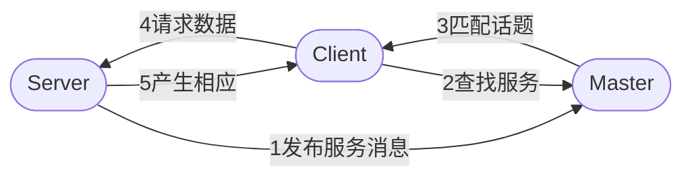
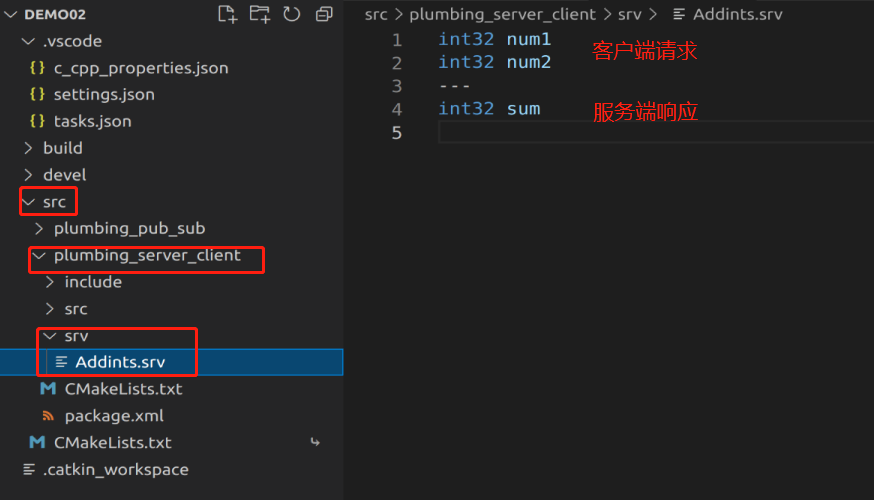
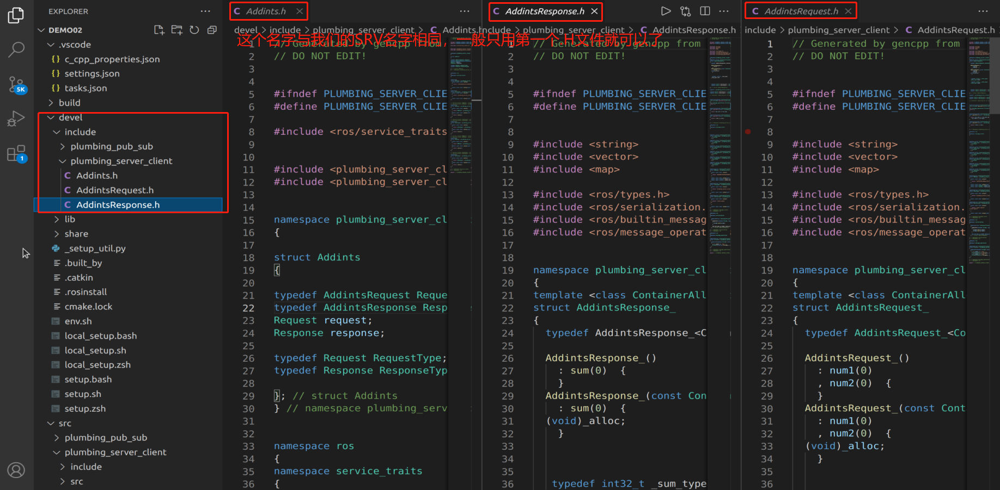

# 第二章 ROS的通信机制（重点）

## 第二节 服务通信

服务通信时基于**请求响应**模式的，是一种应答机制。也就是一个节点A向另外一个节点B发送请求，B接收处理请求并产生相应结果返回给A。比如下面的应用场景：

>机器人巡逻过程中，控制系统分析传感器数据发现可疑物体或人... 此时需要拍摄照片并留存。

在上述场景中，就使用到了服务通信。一个节点需要向相机节点发送拍照请求，相机节点处理请求，并返回处理结果。

与上述应用类似的，服务通信更适用于对实时性有要求、具有一定逻辑处理的应用场景。

### 2.2.1 理论模型

模型中包含3个角色：

* Master    ---> 管理者
* Server    ---> 服务端
* Client    ---> 客户端

框图：



其主要流程如下：

1. 服务端注册自身信息；
2. 客户端请求服务；
3. 管理者匹配话题，并把服务端的地址给客户端；
4. 客户端与客户端建立连接，请求数据；
5. 服务端产生相应。

注意：

1. 保证顺序，客户端发起请求时，服务端必须已启动。
2. 客户端和服务端都可以存在多个。
   
关注点：

1. 流程已经被封装了，直接调用就可以了；
2. 话题；
3. 服务端；
4. 客户端；
5. 数据载体。

### 2.2.1 一个案例

需求：编写服务通信，客户端提交两个整数至服务端，服务端求和并响应结果到客户端。

1. 为案例创建一个功能包：

这个不多介绍了。

2. 在功能包下创建一个`srv`文件夹，并在其中创建`xxx.srv`文件。



3. 修改配置文件：

在`package.xml`中添加`srv`（也是`msg`）相关的编译依赖和执行依赖：

```xml
<build_depend>message_generation</build_depend>
<exec_depend>message_runtime</exec_depend>
```
在`CMakeLists.txt`中添加`srv`相关配置：

```xml
find_package(catkin REQUIRED COMPONENTS
  roscpp
  rospy
  std_msgs
  message_generation
)
# 需要加入 message_generation,必须有 std_msgs
add_service_files(
  FILES
  AddInts.srv
)
generate_messages(
  DEPENDENCIES
  std_msgs
)
```

4. 编译文件

编译后在(.../工作空间/devel/include/包名/xxx.h)路径下会自动生成一些中间文件。



到这里，我们自定义的一个`srv`就完成了。

5. 编写服务端节点

```cpp
#include "ros/ros.h"
#include "plumbing_server_client/Addints.h"

/* 
    服务端实现：解析客户端提交的数据，并运算再产生响应
        1. 包含头文件；
        2. 初始化ROS节点；
        3. 创建节点句柄；
        4. 创建一个服务对象；
        5. 处理请求并产生相应；
        6. spin()
*/
bool doNums(plumbing_server_client::Addints::Request &request,
            plumbing_server_client::Addints::Response &response)
{
    // 1. 处理请求
    int num1 = request.num1;
    int num2 = request.num2;
    ROS_INFO("收到的数据是:num1 = %d, num2 = %d", num1, num2);
    // 2. 组织响应
    int sum = num1 + num2;
    response.sum = sum;
    ROS_INFO("求和结果是：sum = %d", sum);

    return true;
}

int main(int argc, char *argv[])
{   
        setlocale(LC_ALL,"");
        // 2. 初始化ROS节点；
        ros::init(argc,argv,"Heishui"); // 节点名称需要保证唯一
        // 3. 创建节点句柄；
        ros::NodeHandle nh;
        // 4. 创建一个服务对象；
        ros::ServiceServer server = nh.advertiseService("Addints",doNums);
        ROS_INFO("服务器启动");
        // 5. 处理请求并产生相应；

        // 6. spin()
        ros::spin();
    return 0;
}
```

