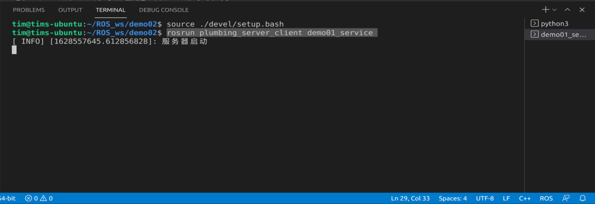

# 第二章 ROS的通信机制（重点）

## 第二节 服务通信

服务通信时基于**请求响应**模式的，是一种应答机制。也就是一个节点A向另外一个节点B发送请求，B接收处理请求并产生相应结果返回给A。比如下面的应用场景：

>机器人巡逻过程中，控制系统分析传感器数据发现可疑物体或人... 此时需要拍摄照片并留存。

在上述场景中，就使用到了服务通信。一个节点需要向相机节点发送拍照请求，相机节点处理请求，并返回处理结果。

与上述应用类似的，服务通信更适用于对实时性有要求、具有一定逻辑处理的应用场景。

### 2.2.1 理论模型

模型中包含3个角色：

* Master    ---> 管理者
* Server    ---> 服务端
* Client    ---> 客户端

框图：


其主要流程如下：

1. 服务端注册自身信息；
2. 客户端请求服务；
3. 管理者匹配话题，并把服务端的地址给客户端；
4. 客户端与客户端建立连接，请求数据；
5. 服务端产生相应。

注意：

1. 保证顺序，客户端发起请求时，服务端必须已启动。
2. 客户端和服务端都可以存在多个。
   
关注点：

1. 流程已经被封装了，直接调用就可以了；
2. 话题；
3. 服务端；
4. 客户端；
5. 数据载体。

### 2.2.2 一个案例

需求：编写服务通信，客户端提交两个整数至服务端，服务端求和并响应结果到客户端。

### 2.2.3 编写 srv 文件

1. **为案例创建一个功能包：**

这个不多介绍了。

2. **在功能包下创建一个`srv`文件夹，并在其中创建`xxx.srv`文件。**


3. **修改配置文件：**

在`package.xml`中添加`srv`（也是`msg`）相关的编译依赖和执行依赖：

```xml
<build_depend>message_generation</build_depend>
<exec_depend>message_runtime</exec_depend>
```
在`CMakeLists.txt`中添加`srv`相关配置：

```xml
find_package(catkin REQUIRED COMPONENTS
  roscpp
  rospy
  std_msgs
  message_generation
)
# 需要加入 message_generation,必须有 std_msgs
add_service_files(
  FILES
  AddInts.srv
)
generate_messages(
  DEPENDENCIES
  std_msgs
)
```

4. **编译文件：**

编译后在(.../工作空间/devel/include/包名/xxx.h)路径下会自动生成一些中间文件。


到这里，我们自定义的一个`srv`就完成了。

### 2.2.4 编写服务端节点

5. **编写服务端节点：**

```cpp
#include "ros/ros.h"
#include "plumbing_server_client/Addints.h"

/* 
    服务端实现：解析客户端提交的数据，并运算再产生响应
        1. 包含头文件；
        2. 初始化ROS节点；
        3. 创建节点句柄；
        4. 创建一个服务对象；
        5. 处理请求并产生相应；
        6. spin()
*/
bool doNums(plumbing_server_client::Addints::Request &request,
            plumbing_server_client::Addints::Response &response)
{
    // 1. 处理请求
    int num1 = request.num1;
    int num2 = request.num2;
    ROS_INFO("收到的数据是:num1 = %d, num2 = %d", num1, num2);
    // 2. 组织响应
    int sum = num1 + num2;
    response.sum = sum;
    ROS_INFO("求和结果是：sum = %d", sum);

    return true;
}

int main(int argc, char *argv[])
{   
        setlocale(LC_ALL,"");
        // 2. 初始化ROS节点；
        ros::init(argc,argv,"Heishui"); // 节点名称需要保证唯一
        // 3. 创建节点句柄；
        ros::NodeHandle nh;
        // 4. 创建一个服务对象；
        ros::ServiceServer server = nh.advertiseService("Addints",doNums);
        ROS_INFO("服务器启动");
        // 5. 处理请求并产生相应；

        // 6. spin()
        ros::spin();
    return 0;
}
```

6. **修改`CMakeLists.txt`：**

老生常谈的修改方式，把节点和功能包添加到`CMakeList.txt`


7. **编译 + 运行：**

`ctrl` + `shift` + `B` 编译。然后运行节点。

首先`roscore`

然后打开一个新的终端，运行服务端节点：

```
source ./devel/setup.bash 
rosrun plumbing_server_client demo01_service 
```



8. **使用ROS指令来接收服务：**

首先，右击`terminal`将其页面分割成两个，方便我们同时查看客户端和服务端。


然后，在新的`terminal`中输入:

```
source ./devel/setup.bash 
rosservice call Addints [tab]
```

上面的代码中`Addints`是我命名的服务端节点，输入完按键盘上的`tab`键自动补齐，然后就出现了我们的请求服务端是需要输入的两个数字。


终端里可以的两个数字可以自行修改（Ubuntu的终端不能直接用鼠标点，需要用键盘的左右方向键）


**看到这个，我们就可以确定服务端编写成功！**

### 2.2.5 编写客户端节点

9. **编写用户端：**

对照着服务端进行编写就可以了：

```cpp
#include "ros/ros.h"
#include "plumbing_server_client/Addints.h"

/* 
    客户端：提交两个整数，并处理相应的结果。

        1. 包含头文件；
        2. 初始化ROS节点；
        3. 创建节点句柄；
        4. 创建一个客户端对象；
        5. 提交请求并处理响应； 
*/

int main(int argc, char *argv[])
{
    setlocale(LC_ALL,"");
    //     2. 初始化ROS节点；
    ros::init(argc,argv,"Dabao");
    //     3. 创建节点句柄；
    ros::NodeHandle nh;
    //     4. 创建一个客户端对象；
    ros::ServiceClient client = nh.serviceClient<plumbing_server_client::Addints>("Addints");
    //     5. 提交请求并处理响应； 
    plumbing_server_client::Addints ai;
    //     5-1. 组织请求
    ai.request.num1 = 100;
    ai.request.num2 = 200;
    //     5-2. 处理响应
    bool flag = client.call(ai);
    if (flag)
    {
        ROS_INFO("响应成功！");
        // 获取结果
        ROS_INFO("两数之和是：%d",ai.response.sum);
    }
    else
        ROS_INFO("处理失败！");
    return 0;
}
```

10. **修改`CMakeLists.txt`：**
    
11. **编译 + 运行：**

这里之间放运行结果：


### 2.2.5 优化客户端节点

1. **要让命令输入的时候可以传参，就要用到`main()`括号中的`argc, argv`了那么我们在客户端主函数体的最前面写入：**

```cpp
// 优化实现，获取命令中的参数：
    if(argc != 3)
    {
        ROS_INFO("提交的参数数量不正确！");
        return 1;
    }
```

这一部分是要求命令必须传入3个参数，否则之间就返回了。着三个参数分别是： 节点名，`num1`和`num2`。

写完后，我们把后面的组织请求处修改一下：

```cpp
//     5-1. 组织请求
ai.request.num1 = atoi(argv[1]);
ai.request.num2 = atoi(argv[2]);
```

让请求的`ai`的两个值分别传入两个参数。

我们输入下次命令，看一下结果：

```
rosrun plumbing_server_client demo01_client 1 5
```
和
```
rosrun plumbing_server_client demo01_client
```


2. **我们之前说过，在服务通信的方式中，一定要先启动服务器，但是有时我们使用`launch` 启动一堆节点的时候，先后顺序也许就不对了，为了避免之间报错，我们需要再次优化客户端节点**

在ROS中，有2个函数可以做到让客户端启动后挂起，等待服务器启动。
```cpp
//     函数1
client.waitForExistence();
//     函数2
ros::service::waitForService("服务器的节点名称");
```

这两个函数选择其中一个就可以了，位置是放在判断响应之前。那么这个完整的服务器函数就如下：
```cpp
#include "ros/ros.h"
#include "plumbing_server_client/Addints.h"

/* 
    客户端：提交两个整数，并处理相应的结果。

        1. 包含头文件；
        2. 初始化ROS节点；
        3. 创建节点句柄；
        4. 创建一个客户端对象；
        5. 提交请求并处理响应； 

    实现参数的动态提交：
        1. 格式： rosrun xxx xxx 12 32
        2. 节点执行时，需要获取命令中的参数，并组织进 request

    问题：
        如果先启动客户端，那么就会请求异常
    需求：
        如果先启动客户端，不要直接抛出异常，而是挂起，等在服务器启动后再正常请求
    解决：
        ROS中的内置函数可以让客户端启动后挂起，等待服务器启动。
*/

int main(int argc, char *argv[])
{
    setlocale(LC_ALL,"");
    // 优化实现，获取命令中的参数：
    if(argc != 3)
    {
        ROS_INFO("提交的参数数量不正确！");
        return 1;
    }

    //     2. 初始化ROS节点；
    ros::init(argc,argv,"Dabao");
    //     3. 创建节点句柄；
    ros::NodeHandle nh;
    //     4. 创建一个客户端对象；
    ros::ServiceClient client = nh.serviceClient<plumbing_server_client::Addints>("Addints");
    //     5. 提交请求并处理响应； 
    plumbing_server_client::Addints ai;
    //     5-1. 组织请求
    ai.request.num1 = atoi(argv[1]);
    ai.request.num2 = atoi(argv[2]);
    //     5-2. 处理响应
    //     调用判断服务器状态的函数
    //     函数1
    //client.waitForExistence();
    //     函数2
    ros::service::waitForService("Addints");
    bool flag = client.call(ai);
    if (flag)
    {
        ROS_INFO("响应成功！");
        // 获取结果
        ROS_INFO("两数之和是：%d",ai.response.sum);
    }
    else
        ROS_INFO("处理失败！");
    return 0;
}
```

当我们先启动客户端后启动服务端的结果是：


