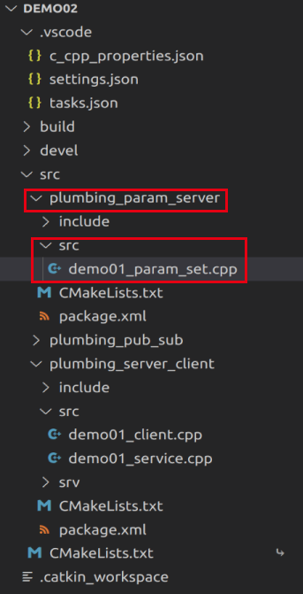
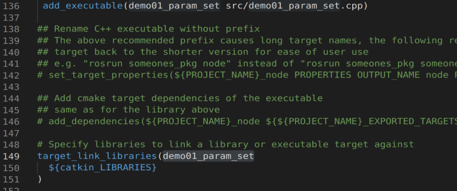
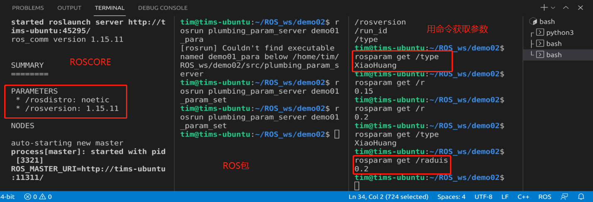

# 第二章 ROS的通信机制（重点）

## 第三节 参数服务器

参数服务器在ROS中主要用于实现不同节点之间的数据共享。参数服务器相当于是独立于所有节点的一个公共容器，可以将数据存储在该容器中，被不同的节点调用，当然不同的节点也可以往其中存储数据，关于参数服务器的典型应用场景如下:

导航实现时，会进行路径规划，比如: 全局路径规划，设计一个从出发点到目标点的大致路径。本地路径规划，会根据当前路况生成时时的行进路径

上述场景中，全局路径规划和本地路径规划时，就会使用到参数服务器：

路径规划时，需要参考小车的尺寸，我们可以将这些尺寸信息存储到参数服务器，全局路径规划节点与本地路径规划节点都可以从参数服务器中调用这些参数
参数服务器，一般适用于存在数据共享的一些应用场景。

### 2.3.1 参数服务器理论模型

模型中包含3个角色：

* Master    ---> 管理者
* Talker    ---> 发布方
* Listener  ---> 获取方

框图：


其主要流程如下：

1. Talker 设置参数

Talker 通过 RPC 向参数服务器发送参数(包括参数名与参数值)，ROS Master 将参数保存到参数列表中。

2. Listener 获取参数

Listener 通过 RPC 向参数服务器发送参数查找请求，请求中包含要查找的参数名。

3. ROS Master 向 Listener 发送参数值

ROS Master 根据步骤2请求提供的参数名查找参数值，并将查询结果通过 RPC 发送给 Listener。

参数可使用的类型：

* 32-bit integers

* booleans

* strings

* doubles

* iso8601 dates （日期/时间格式）

* lists

* base64-encoded binary data

* 字典 （双列表格）

### 2.2.2 一个案例

需求:实现参数服务器参数的增删改查操作。

实现增改需求可以通过两个API来完成：
* ros::NodeHandle

* ros::param

具体操作：

1. 创建功能包


2. 新建节点文件
```cpp
#include "ros/ros.h"

    /* 
        需要实现参数的新增和修改：
        需求：首先设置机器人的共享参数，类型、半径（0.15m）
             再修改半径（0.2m）
        实现：
            ros::NodeHandle
                setParam
            ros::param
                set
    */

int main(int argc, char *argv[])
{
    // 初始化ros节点
    ros::init(argc,argv,"set_param_c");

    // 创建ROS节点句柄
    ros::NodeHandle nh;
    // 参数增加-------------------------
    // 方案1：nh
    nh.setParam("type","XiaoHuang");
    nh.setParam("raduis",0.15);
    // 方案2：ros::param
    ros::param::set("name","XiaoBai");
    ros::param::set("r",0.15);
    // 参数修改-------------------------
    // 方案1：nh
    nh.setParam("raduis",0.2);
    // 方案2：ros::param
    ros::param::set("r",0.2);
    return 0;
}
```
3. 修改`CMakeList.txt`



4. 编译并运行


运行需要用到3个终端

1号终端
```
roscore
```

2号终端
```
source ./devel./setup.bash
rosrun plumbing_param_server demo01_para
```

3号终端，首先来查看一下我们有哪些参数名称
```
rosparam list
```
然后用`rosparam <参数名称>`来获取具体的参数值



