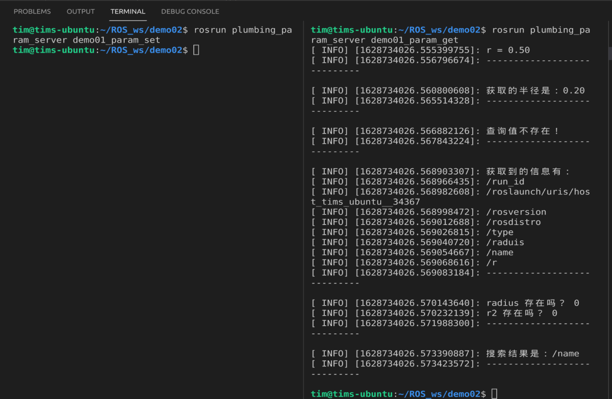
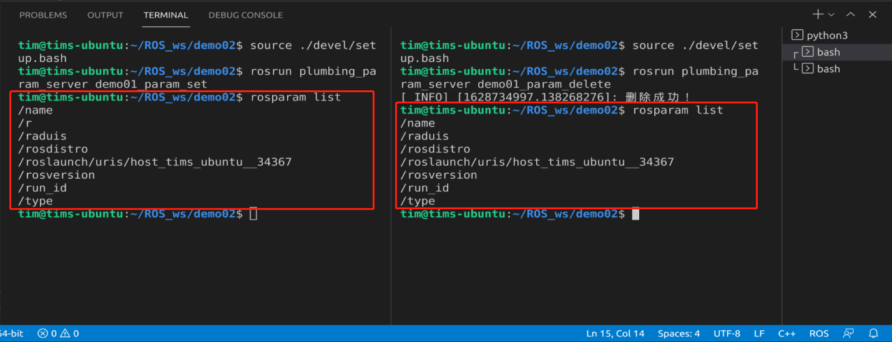
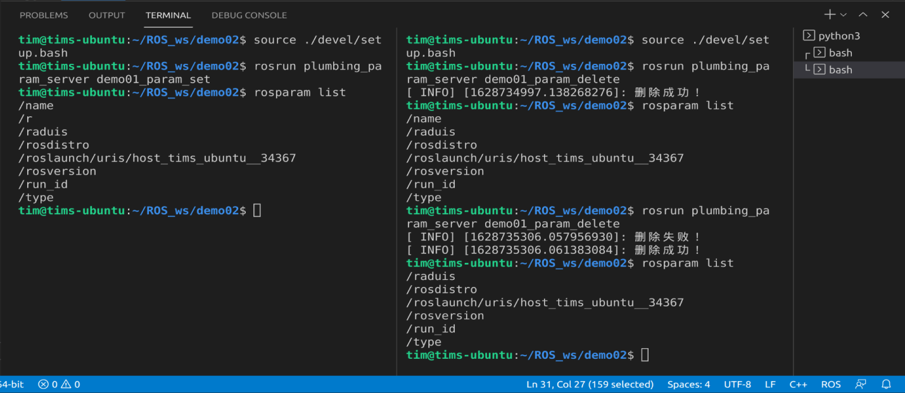

# 第二章 ROS的通信机制（重点）

## 第三节 参数服务器

参数服务器在ROS中主要用于实现不同节点之间的数据共享。参数服务器相当于是独立于所有节点的一个公共容器，可以将数据存储在该容器中，被不同的节点调用，当然不同的节点也可以往其中存储数据，关于参数服务器的典型应用场景如下:

导航实现时，会进行路径规划，比如: 全局路径规划，设计一个从出发点到目标点的大致路径。本地路径规划，会根据当前路况生成时时的行进路径

上述场景中，全局路径规划和本地路径规划时，就会使用到参数服务器：

路径规划时，需要参考小车的尺寸，我们可以将这些尺寸信息存储到参数服务器，全局路径规划节点与本地路径规划节点都可以从参数服务器中调用这些参数
参数服务器，一般适用于存在数据共享的一些应用场景。

### 2.3.1 参数服务器理论模型

模型中包含3个角色：

* Master    ---> 管理者
* Talker    ---> 发布方
* Listener  ---> 获取方

框图：


其主要流程如下：

1. Talker 设置参数

Talker 通过 RPC 向参数服务器发送参数(包括参数名与参数值)，ROS Master 将参数保存到参数列表中。

2. Listener 获取参数

Listener 通过 RPC 向参数服务器发送参数查找请求，请求中包含要查找的参数名。

3. ROS Master 向 Listener 发送参数值

ROS Master 根据步骤2请求提供的参数名查找参数值，并将查询结果通过 RPC 发送给 Listener。

参数可使用的类型：

* 32-bit integers

* booleans

* strings

* doubles

* iso8601 dates （日期/时间格式）

* lists

* base64-encoded binary data

* 字典 （双列表格）

### 2.2.2 一个案例

需求:实现参数服务器参数的增删改查操作。

### 2.2.3 添加和修改

实现增改需求可以通过两个API来完成：
* ros::NodeHandle

* ros::param

具体操作：

1. 创建功能包


2. 新建节点文件
```cpp
#include "ros/ros.h"

    /* 
        需要实现参数的新增和修改：
        需求：首先设置机器人的共享参数，类型、半径（0.15m）
             再修改半径（0.2m）
        实现：
            ros::NodeHandle
                setParam
            ros::param
                set
    */

int main(int argc, char *argv[])
{
    // 初始化ros节点
    ros::init(argc,argv,"set_param_c");

    // 创建ROS节点句柄
    ros::NodeHandle nh;
    // 参数增加-------------------------
    // 方案1：nh
    nh.setParam("type","XiaoHuang");
    nh.setParam("raduis",0.15);
    // 方案2：ros::param
    ros::param::set("name","XiaoBai");
    ros::param::set("r",0.15);
    // 参数修改-------------------------
    // 方案1：nh
    nh.setParam("raduis",0.2);
    // 方案2：ros::param
    ros::param::set("r",0.2);
    return 0;
}
```
3. 修改`CMakeList.txt`


4. 编译并运行


运行需要用到3个终端

1号终端
```
roscore
```

2号终端
```
source ./devel./setup.bash
rosrun plumbing_param_server demo01_para
```

3号终端，首先来查看一下我们有哪些参数名称
```
rosparam list
```
然后用`rosparam <参数名称>`来获取具体的参数值


### 2.2.4 查询

5. 创建一个新的`cpp`文件，用于编写搜索节点，我这里的文件名称是`demo01_param_get.cpp`

6. 修改`CMakeList.txt`


7. 编写节点文件的框架

```cpp
#include "ros/ros.h"
/*
    演示参数查询

*/
int main(int argc, char *argv[])
{
    // 设置编码
    setlocale(LC_ALL,"");
    // 初始化节点
    ros::init(argc,argv,"get_param_C");
    // 创建节点句柄
    ros::NodeHandle nh;

 return 0;   
}
```

8. 可用的查询函数：

在 roscpp 中提供了两套 API 实现参数操作

(1) `ros::NodeHandle`

* `param(键,默认值) `
            存在，返回对应结果，否则返回默认值

* `getParam(键,存储结果的变量)`
            存在,返回 true,且将值赋值给参数2
            若果键不存在，那么返回值为 false，且不为参数2赋值

* `getParamCached键,存储结果的变量)`--提高变量获取效率
            存在,返回 true,且将值赋值给参数2
            若果键不存在，那么返回值为 false，且不为参数2赋值

* `getParamNames(std::vector<std::string>)`
            获取所有的键,并存储在参数 vector 中 

* `hasParam(键)`
            是否包含某个键，存在返回 true，否则返回 false

* `searchParam(参数1，参数2)`
            搜索键，参数1是被搜索的键，参数2存储搜索结果的变量

(2) `ros::param` ----- 与 NodeHandle 类似

具体方法如下:

在`main()`中逐个添加以下内容：

```cpp
    // 1. param
    double r = nh.param("r",0.5);
    ROS_INFO("r = %.2f",r);
    // 利用nh.param是直接查看是否有这个输入的键，有则输出参数服务器里的值，
    // 没有的话会输出我们初始化的值
```

```cpp
    // 2. getParam
    double r2 = 0.0;
    bool result = nh.getParam("r",r2);
    if (result)
        ROS_INFO("获取的半径是：%.2f",r2);
    else
        ROS_INFO("查询值不存在！");
    // 功能与1类似，但是会返回一个布尔值，
    // 参数服务器对应键的值会被储存到第二个输入的参数中
```

```cpp
    // 3. getParamCached(先找缓存区，再看RPC)，性能比getParam高，功能与getParam类似。
    double r3 = 0.0;
    bool result2 = nh.getParamCached("ra",r3);
    if (result2)
        ROS_INFO("获取的半径是：%.2f",r3);
    else
        ROS_INFO("查询值不存在！");
    ROS_INFO("----------------------------\n");
    // getParamCached 与 2 类似
```

```cpp
    // 4. getParamNames
    std::vector<std::string> param_names1;
    nh.getParamNames(param_names1);
    ROS_INFO("获取到的信息有：");
    for (auto &&name : param_names1)
    {
        ROS_INFO("%s",name.c_str());        
    }
    ROS_INFO("----------------------------\n");
    // getParamNames 将会遍历所有的参数服务器中的键名
```

```cpp
    // 5. hasParam(键)
    bool flag1 = nh.hasParam("radius");
    bool flag2 = nh.hasParam("r2");
    ROS_INFO("radius 存在吗？ %d",flag1);
    ROS_INFO("r2 存在吗？ %d",flag2);
    // 功能是查询是否存在对应的键名，存在则返回1, 不存在返回0。
```

```cpp
    // 6. searchParam
    std::string key;
    nh.searchParam("name",key);
    ROS_INFO("搜索结果是：%s",key.c_str());
    // 搜索对应的键名，并且返回其名称。
```

9. 将以上内容添加到`main()`后，编译输出：


10. API2 与上面的方法类似，函数名称也类似，这里不再演示。

### 2.2.5 删除

11. 编写删除节点

```cpp
#include "ros/ros.h"

/* 
    演示参数的删除：

    实现：
        ros::NodeHandle
            deleteParam()
        ros::param
            del()

*/
int main(int argc, char *argv[])
{
    setlocale(LC_ALL,"");
    ros::init(argc,argv,"Delete");
    ros::NodeHandle nh;

    bool flag1 = nh.deleteParam("r");
    if (flag1)
        ROS_INFO("删除成功！");
    else
        ROS_INFO("删除失败！");
    // 删除：NodeHandle ----------------------
    // 删除：ros::param ----------------------

    return 0;
}
```

12. 修改`CMakeList.txt`

13. 编译、运行



从红框里可以出键`/r`已经被删除了

14. 另外一种删除方法：
```cpp
// 删除：ros::param ----------------------
    bool flag2 = ros::param::del("name");
    if (flag2)
        ROS_INFO("删除成功！");
    else
        ROS_INFO("删除失败！");
```

15. 运行结果：
    


在第二次运行节点的时候，先输出了删除失败，后输出删除成功。这是因为前面一个`/r`，在第一次运行的时候已经被删除了，所以返回的布尔值是0，随后成功删除`/name`。


