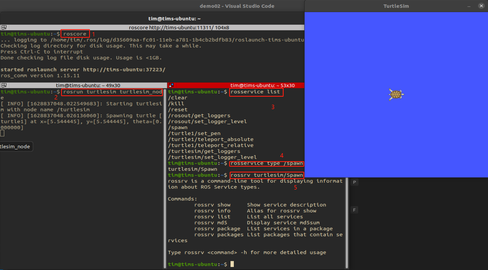
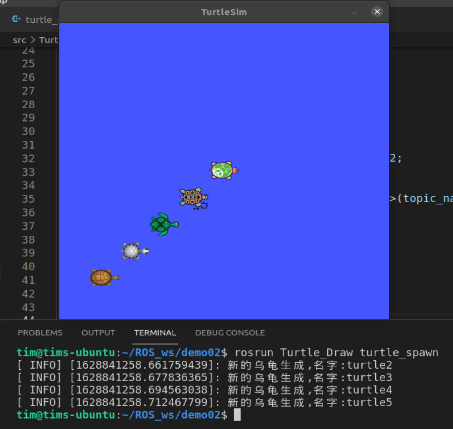
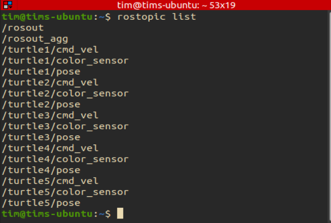
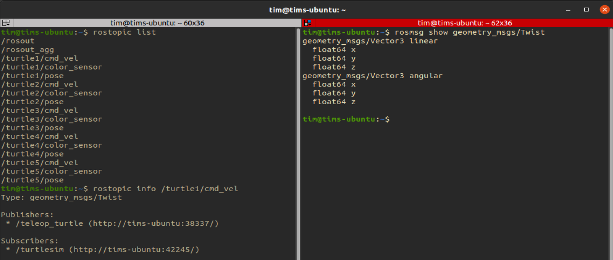
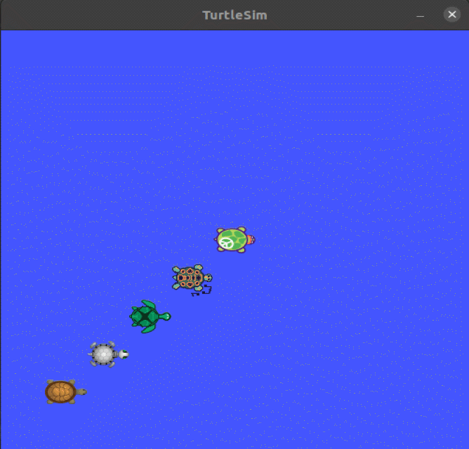
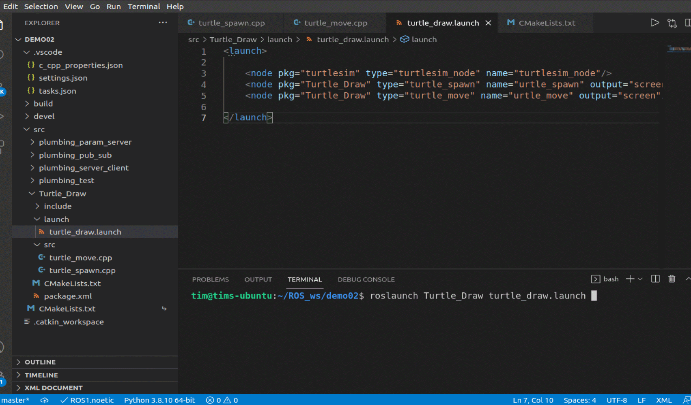

# 第二章 ROS的通信机制

## 第四节 小海龟控制器

这一节是对之前的内容的一次练习，使用话题通信，服务通信和参数服务器对海归模拟器`turtlesim`进行自定义的控制。

**<font color = orange>需求：</font>**

在海归模拟器中生成5只小海龟，并且控制海归在模拟器中画出5个圆。

### 4.1 生成多只海龟

首先在终端中打开`roscore`和`turtlesim_node`节点。

然后使用ros的指令，查找与生成海龟相关的消息类型或者服务类型。

通过下面的指令获取到了服务类型：
```
rosservice list
rosservice type <service>
rossrv show <srv>
rosservice call <service> <tab>
```



我们发现想要生成一只小海龟需要输入以下参数：

```cpp
float32 x       // 海龟的 x 坐标
float32 x       // 海龟的 y 坐标
float32 theta   // 海龟的朝向角度
string name     // 海龟的名字
```

然后通过:
```
rostopic echo /turtle1/pose
```

获取到了中间那个小海龟的位姿信息;
```
x: 5.544444561004639
y: 5.544444561004639
theta: 0.0
linear_velocity: 0.0
angular_velocity: 0.0
```

获取到类型后就可以开始创建我们所需要的功能包了

我们要为功能包添加的依赖有：
```
roscpp rospy std_msgs turtlesim geometry_msgs
```

其中`turtlesim`是4.1中就需要的一个依赖，它包含了我们所需要的srv信息。而`geometry_msgs`是以后需要的依赖

创建后就可以开始写代码了：

代码如下：

```cpp
/* 
需求：
    生成5只小乌龟，
    小乌龟之间的间距相同
    

实现：
    通过命令行查询到，生成小乌龟使用了：服务通讯
    turtlesim_node自动生成的小乌龟处在（5.54，5.54）
    通过获取的消息信息可知，生成小乌龟需要使用以下的输入参数：

    float32 x
    float32 y
    float32 theta
    string name
            
*/

#include "ros/ros.h"
#include "turtlesim/Spawn.h"

int main(int argc, char *argv[])
{
    setlocale(LC_ALL,"");
    ros::init(argc,argv,"turtle_spawn");
    ros::NodeHandle nh;

    // 创建 service 的客户端
    ros::ServiceClient client = nh.serviceClient<turtlesim::Spawn>("/spawn");
    // 等待服务启动：
    ros::service::waitForService("/spawn");

    std::string str1 = "turtle";
    // 发送请求：
    for (int i = 0; i < 5; i++)
    {
        std::string str2 = std::to_string(i+1);
        std::string turtle_name = str1 + str2;
        turtlesim::Spawn spawn;
        spawn.request.x = 5.54 - i;
        spawn.request.y = 5.54 - i;
        spawn.request.theta = 0;
        spawn.request.name = turtle_name;
        bool flag = client.call(spawn);

    // 处理响应结果
        if (flag)
        {
            ROS_INFO("新的乌龟生成,名字:%s",spawn.response.name.c_str());
        } else {
            ROS_INFO("乌龟生成失败！！！");
        }
    }

    return 0;
}
```

完成后修改`CMakeList.txt`，然后编译，运行：

```
1. roscore
```

```
2. rosrun turtlesim turtlesim_node 

```

```
3. source ./devel./setup.bash
   rosrun Turtle_Draw turtle_spawn
```



很好，我们成功生成了5只小乌龟。


### 4.2 控制海龟画圆

在创建画圆节点之前，我们先用`rostopic`看一看创建了5只海龟后我们都有哪些话题在运行：



原来我们在用`spawn`创建小海龟的时候，函数自动帮我们生成了很多话题。每一个海龟都有`color_sensor`, `pose`, `cmd_vel`。这为我们控制小海龟画圆创造了很大的便捷。

OK，接下来再查看话题中的消息类型：

```
1. rostopic info /turtle1/cmd_vel
```

```
2. rosmsg show geometry_msgs/Twist
```

通过查看，我们知道了，要控制海龟，其消息类型如下：
```
geometry_msgs/Vector3 linear
  float64 x
  float64 y
  float64 z
geometry_msgs/Vector3 angular
  float64 x
  float64 y
  float64 z
```



接下来开始写代码：

```cpp
/*
    需求：让5只海龟画圆

    实现：对每一个海龟循环发布运动信息，消息类型是：

    geometry_msgs/Vector3 linear
    float64 x
    float64 y
    float64 z
    geometry_msgs/Vector3 angular
    float64 x
    float64 y
    float64 z
*/
#include "ros/ros.h"
#include "geometry_msgs/Twist.h"

int main(int argc, char *argv[])
{
    setlocale(LC_ALL,"");
    ros::init(argc,argv,"turtle_move");
    ros::NodeHandle nh;
    // 创建消息列
    geometry_msgs::Twist msg[5];
    // 创建发布者对象列
    ros::Publisher pub[5];

    // 分别为5只海龟设置控制
    for (int i = 0; i < 5; i++)
    {
        std::string str1 = "/turtle";
        std::string str2 = "/cmd_vel";
        std::string str3 = std::to_string(i+1);
        std::string topic_name = str1 + str3 + str2;

        // 创建发布者对象
        pub[i] = nh.advertise<geometry_msgs::Twist>(topic_name,100);
        // 组织消息
        
        msg[i].linear.x = 1.0;
        msg[i].linear.y = 0.0;
        msg[i].linear.z = 0.0;

        msg[i].angular.x = 0.0;
        msg[i].angular.y = 0.0;
        msg[i].angular.z = 1.0;

        //设置发送频率
        ros::Rate r(1);

    }

    //循环发送
    while (ros::ok())
    {
        for (int j = 0; j < 5; j++)
            pub[j].publish(msg[j]);

        ros::spinOnce();
    }
return 0;
}
```

写好后配置、编译、运行，结果如下：



### 4.3 创建一个launch file


至此，功能基本实现了。最后一步写一个`launch file`一次性启动所有节点。

首先在功能包下创建一个`launch`文件夹，文件夹下创建`xxx.launch`文件。

我们要启动的节点有：

* turtlesim_node
* turtle_spawn
* turtle_move

`launch file`的内容如下：

```xml
<launch>
    
    <node pkg="turtlesim" type="turtlesim_node" name="turtlesim_node"/>
    <node pkg="Turtle_Draw" type="turtle_spawn" name="urtle_spawn" output="screen"/>
    <node pkg="Turtle_Draw" type="turtle_move" name="urtle_move" output="screen"/>

</launch>
```


运行结果如下：



