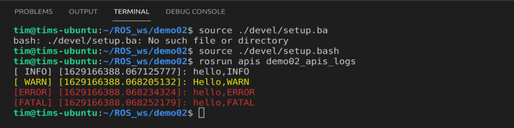

# 第三章 ROS 通信中常用的 API

## 3.1

### 3.1.1 初始化

**函数：**

```cpp
ros::init(argc,argv,"节点名称".[opt]);
```

**作用：**

初始化 ROS 节点

**参数：**

|参数名称| 作用|
|-       |  -  |
|argc    |封装实参个数(n+1)|
|argv    |封装参数的数组   |
|name    |为节点命名（唯一性）|
|options |节点启动选项|

返回值：void

**使用：**

1. argc yu argv 的使用
   
如果按照ROS中的特定格式传入实参，那么ROS可以加以使用，比如可以用来设置全局参数、给节点重命名...

传递全局参数：

```
rosrun [包名] [节点名] _[参数名]:=[参数值]
```

2. options 的使用
   
节点名称需要保证唯一性，会导致一个问题，同一个节点不能重复启动。当一个重复的节点被启动两次，第二次启动会导致第一次节点的`shutdown`。但是有些特定的场景下，一个节点需要被启动多次，并且要可以正常运行。这时，我们就需要使用`options`。使用方法，在调用函数的时候输入：

```cpp
ros::init(argc,argv,"节点名",ros::init_options::AnonymousName);
```

这样在创建ROS节点时，会在用户自定义的节点名称后缀随机数，从而避免重名问题。

### 3.1.2 话题对象

**函数：**

```cpp
ros::NodeHandle nh;

nh.advertise<>("topic",queue_size,latch);
```

**作用：**

创建发布者对象。

**模板：**

被发布对象的类型

**参数：**

|参数名称| 作用|
|-       |  -  |
|topic    |话题名称|
|queue_size   |队列长度  |
|latch（可选）  |默认为false，如果是true，会保存发布方的最后一个消息，并且新的订阅对象连接到发布方时，发布方会将这条消息发布给订阅者|

**使用：**

`latch` 设置为`true`的作用：

以静态地图发布为例，方案1：可以使用固定频率发送地图数据，但是效率低；方案2： 可以将地图发布对象的 `latch` 设置为 `true`，并且发布方只发送一次数据，每当订阅者连接时，将地图数据发送给订阅者（只发送一次），从而提高了数据的发送效率。

```cpp
nh.advertise<std::String>("House",10,true);
```

这样将发布方的最后一个数据发送给订阅节点。

### 3.1.3 回旋函数(这里我直接抄了老师的笔记)

1. spinOnce()
   
```cpp
/**
 * \brief 处理一轮回调
 *
 * 一般应用场景:
 *     在循环体内，处理所有可用的回调函数
 * 
 */
ROSCPP_DECL void spinOnce();
```

1. spin()
   
```cpp
/** 
 * \brief 进入循环处理回调 
 */
ROSCPP_DECL void spin();
```

3. 二者比较
相同点:二者都用于处理回调函数；

不同点:ros::spin() 是进入了循环执行回调函数，而 ros::spinOnce() 只会执行一次回调函数(没有循环)，在 ros::spin() 后的语句不会执行到，而 ros::spinOnce() 后的语句可以执行。

### 3.1.3 时间

需求：

演示时间相关操作，获取当前时间 + 设置指定时刻

实现：

   1. 准备（头文件、节点初始化、NodeHandle 创建...）
   2. 获取当前时间
   3. 设置指定时刻
   4. 设置持续时间
   5. 时间之间的运算

```cpp
#include "ros/ros.h"

/*
    需求1：
        演示时间相关的操作：获取当前时刻 + 设定制定时刻

    实现：
        1. 准备（头文件、节点初始化、NodeHandle创建...）
        2. 获取当前时刻
        3. 设置指定时刻

    需求2：
        让程序执行中停顿 5 秒钟

    实现：
        1. 创建持续时间对象；
        2. 休眠。

    需求3：
        对时间进行运算。
    
    实现：
        1. ros::Time 之间的减法
        2. ros::Duration  之间的加减
        3. Time 与 Duration 之间的加减

    需求4：
        每隔1秒，在控制台输出一段文本。
    
    实现：
        1. 利用ros::rate() 学过了
        2. 利用定时器
            创建： nh.createTimer()
            参数1： 时间间隔
            参数2： 回调函数（时间事件 TimerEvent）
            参数3： 是否只执行一次
            参数4： 是否自动启动（默认是true，如需手动启动使用 timer.start())

            定时器启动后： ros::spin()

*/

// 回调函数
void cb(const ros::TimerEvent& event)
{
    ROS_INFO("-----------------");
    ROS_INFO("函数被调用的时刻:%.2f",event.current_real.toSec());
}

int main(int argc, char *argv[])
{
    // 1. 准备
    setlocale(LC_ALL,"");
    ros::init(argc,argv,"Hello_time");
    ros::NodeHandle nh; // 与时间相关的函数必须有NodeHandle

    // 2. 获取当前时刻
    // now 函数会将当前时刻封装并返回
    // 当前时刻：是指 now 被调用执行的那一刻
    // 参考系： 1970年01月01日 00：00：00 中国是：GMT+8
    // 输出为距离参考系的时间
    ros::Time right_now = ros::Time::now();
    ROS_INFO("当前时刻：%.2f",right_now.toSec());
    ROS_INFO("当前时刻：%d",right_now.sec);
    

    // 3. 设置指定时刻
    ros::Time t1(20,312345678);
    ROS_INFO("t1 = %.2f",t1.toSec());

    // 持续时间
    ROS_INFO("---持续时间---");
    ros::Time start = ros::Time::now();
    ROS_INFO("开始休眠");

    // 设置睡眠时间
    ros::Duration(4).sleep();
    ros::Time end = ros::Time::now();
    ROS_INFO("休眠结束，共%.2f秒", end.toSec()-start.toSec());


    // 时间之间的运算
    ROS_INFO("---时间运算---");
    ros::Time now = ros::Time::now();
    ros::Duration du1(10);
    ros::Duration du2(20);
    ROS_INFO("当前时刻:%.2f",now.toSec());
    
    //1.time 与 duration 运算
    ros::Time after_now = now + du1;
    ros::Time before_now = now - du1;
    ROS_INFO("当前时刻之后:%.2f",after_now.toSec());
    ROS_INFO("当前时刻之前:%.2f",before_now.toSec());

    
    //2.duration 之间相互运算
    ros::Duration du3 = du1 + du2;
    ros::Duration du4 = du1 - du2;
    ROS_INFO("du3 = %.2f",du3.toSec());
    ROS_INFO("du4 = %.2f",du4.toSec());

    //PS: time 与 time 不可以相加运算
    // ros::Time nn = now + before_now;//异常
    ros::Duration du5 = now - before_now;
    ROS_INFO("时刻相减:%.2f",du5.toSec());

    // 定时器
    ROS_INFO("---定时器---");
    // ros::Timer createTimer(ros::Duration period,     // 设置间隔时间
    //          const ros::TimerCallback &callback,     // 回调函数 -- 封装业务
    //          bool oneshot = false,                   // 是否是一次性
    //          bool autostart = true)                  // 自动回调

    // ros::Timer timer = nh.createTimer(ros::Duration(1),cb);
    // ros::Timer timer = nh.createTimer(ros::Duration(1),cb,true);
    ros::Timer timer = nh.createTimer(ros::Duration(1),cb,false,false);
    timer.start(); //手动启动定时器

    ros::spin();

    return 0;
}

```

### 3.1.4 其他函数

1. 节点状态判断（一般在循环体中使用）

```cpp
ros::ok
```

2. 关闭节点（一般在条件体中使用）

```cpp
ros::shotdown()
```

3. 日志类的函数

```cpp
#include "ros/ros.h"

int main(int argc, char *argv[])
{
    setlocale(LC_ALL,"");
    ros::init(argc,argv,"logs");
    ros::NodeHandle nh;

    ROS_DEBUG("hello,DEBUG"); //不会输出
    ROS_INFO("hello,INFO"); //默认白色字体
    ROS_WARN("Hello,WARN"); //默认黄色字体
    ROS_ERROR("hello,ERROR");//默认红色字体
    ROS_FATAL("hello,FATAL");//默认红色字体
    return 0;
}
```

程序输出：




