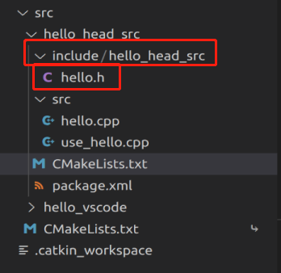
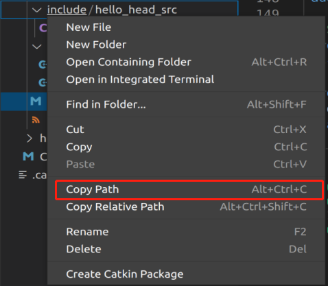
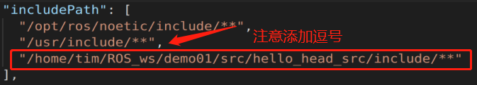
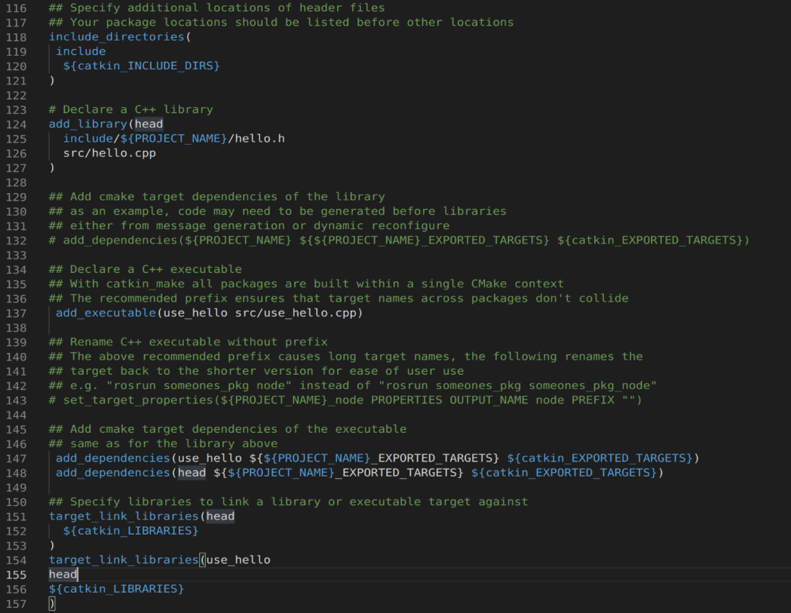

## 3.2 ROS中的头文件与源文件

此节的目的是为创建大型工程做准备

这里分别介绍两种使用头文件与源文件的代码封装方式：

1. 设置头文件，可执行文件作为源文件；
2. 分别设置头文件，源文件与可执行文件。

下面分别使用两个例子来演示：

### 3.2.1 设置头文件，可执行文件作为源文件

这部分内容总共分3步：
1. 编写头文件；
2. 编写可执行文件(同时也是源文件)；
3. 编辑配置文件并执行。

需要学习者提前掌握相关C++知识。

如果缺乏C++相关的知识可以查阅我的C++学习日志专栏:
[博客园](https://www.cnblogs.com/Alexbeast-CN/category/2015942.html)
[知乎](https://www.zhihu.com/column/c_1393941805063299072)
[Github](https:github.com/Alexbeast-CN/Notes2Cpp)


1. 编写头文件：
在功能包下的 include/功能包名 目录下新建头文件: hello.h，示例内容如下:


然后开始编写头文件：

```cpp
#ifndef _HELLO_H
#define _HELLO_H

namespace hello_ns{

class HelloPub {

public:
    void run();
};

}

#endif
```

如何配置`c_cpp_properties.json`文件中的`includepath`属性，将刚才头文件的路径复制进去，防止后面再包含的时候编译器抛出异常。




2. 编写可执行文件(同时也是源文件)；

在`src`目录下新建`hello.cpp`文件：

```cpp
#include "ros/ros.h"
#include "test_head/hello.h"

namespace hello_ns {

void HelloPub::run(){
    ROS_INFO("自定义头文件的使用....");
}

}

int main(int argc, char *argv[])
{
    setlocale(LC_ALL,"");
    ros::init(argc,argv,"test_head_node");
    hello_ns::HelloPub helloPub;
    helloPub.run();
    return 0;
}
```
3. 编辑配置文件并执行。

与之前`CMakeLists.txt`的配置不同的是，本次的配置添加头文件相关的配置：

```
include_directories(
include
  ${catkin_INCLUDE_DIRS}
)
```

可执行配置文件配置方式与之前一致:

```
add_executable(hello src/hello.cpp)

add_dependencies(hello ${${PROJECT_NAME}_EXPORTED_TARGETS} ${catkin_EXPORTED_TARGETS})

target_link_libraries(hello
  ${catkin_LIBRARIES}
)
```

最后编译执行：

输出: 
```
[ INFO] [1629340364.149575292]: 自定义头文件的使用....
```

### 3.2.2 分别设置头文件，源文件与可执行文件

这个方法相对于上一个方法，在`CMakeList.txt`内的配置较为复杂。

这部分内容总共分4步：

1. 编写头文件；
2. 编写源文件；
3. 编写可执行文件；
4. 编辑配置文件并执行。

1. 编写头文件(与上一个方法的内容相同)

```cpp
#ifndef _HAHA_H
#define _HAHA_H

namespace hello_ns {

class My {

public:
    void run();

};

}

#endif
```

2. 编写源文件（即方案 1 中的函数，这里作为另外一个文件放在与主函数相同的目录下）
`c_cpp_properties.json`方面的配置与上面相同。

然后在`src`目录下创建`hello.cpp`文件：

```cpp
#include "test_head_src/haha.h"
#include "ros/ros.h"

namespace hello_ns{

void My::run(){
    ROS_INFO("hello,head and src ...");
}

}
```

3. 编写可执行文件（即主函数）

```cpp
#include "ros/ros.h"
#include "test_head_src/haha.h"

int main(int argc, char *argv[])
{
    ros::init(argc,argv,"hahah");
    hello_ns::My my;
    my.run();
    return 0;
}
```

4. 编辑配置文件并执行。

学过 C++ 的同学都知道， 对于多个文件，我们需要为文件创建链接。下面对于 `CMakeList.txt` 的配置主要目的也是为编译器添加多个文件的链接。

头文件与源文件相关的配置内容如下：

```
include_directories(
include
  ${catkin_INCLUDE_DIRS}
)

## 声明C++库
add_library(head
  include/test_head_src/haha.h
  src/haha.cpp
)

add_dependencies(head ${${PROJECT_NAME}_EXPORTED_TARGETS} ${catkin_EXPORTED_TARGETS})

target_link_libraries(head
  ${catkin_LIBRARIES}
)
```


可执行文件配置基本上还是老三样，唯一不同的地方是创建了链接库，将源文件所在的库与可执行文件创建了链接。

```
add_executable(use_head src/use_head.cpp)

add_dependencies(use_head ${${PROJECT_NAME}_EXPORTED_TARGETS} ${catkin_EXPORTED_TARGETS})

#此处需要添加之前设置的 head 库
target_link_libraries(use_head
  head
  ${catkin_LIBRARIES}
)
```

弄完后，`CMakeList.txt`就是下面的样子：



一点建议：英文好的同学有空可以多读读`CMakeList`文件的注释，对于以后创建工程会很有帮助。