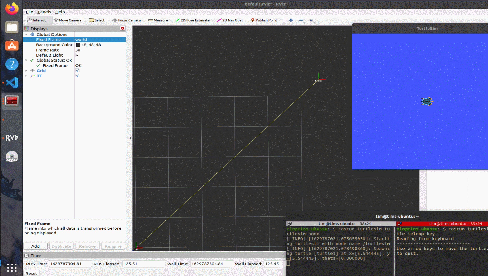
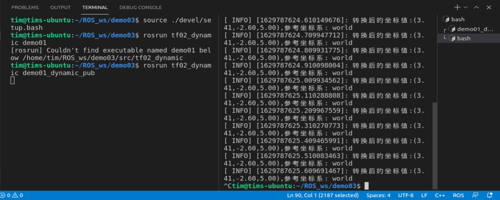

# 第五章：ROS常用组件

## 5.2 动态TF坐标变换

之前演示了相对静止的两个坐标之间的发布订阅方式。接下来看看动态关系的坐标之间的发布和订阅关系。由于 ROS 对于机器人学内容的大量封装，静态坐标变换和动态坐标变换文件之间的差别不是很大。

下面将用一个例子来演示动态坐标变换：

**需求：**

启动 turtlesim_node,该节点中窗体有一个世界坐标系(左下角为坐标系原点)，乌龟是另一个坐标系，键盘控制乌龟运动，将两个坐标系的相对位置动态发布。

**需求分析：**

* 乌龟本身不但可以看作坐标系，也是世界坐标系中的一个坐标点

* 订阅 turtle1/pose,可以获取乌龟在世界坐标系的 x坐标、y坐标、偏移量以及线速度和角速度

* 将 pose 信息转换成 坐标系相对信息并发布

下面我们来实现这个需求：

首先创建一个功能包，其依赖为： `tf2、tf2_ros、tf2_geometry_msgs、roscpp rospy std_msgs geometry_msgs、turtlesim`

### 5.2.1 发布方节点

```cpp
#include "ros/ros.h"
#include "turtlesim/Pose.h"
// 用来发布动态坐标
#include "tf2_ros/transform_broadcaster.h"
// 我们使用到的信息类型
#include "geometry_msgs/TransformStamped.h"
// 用于将欧拉角转换为四元数
#include "tf2/LinearMath/Quaternion.h"

/*
    发布方：需要订阅乌龟的为姿信息，转换成相对于世界坐标系的坐标关系，并发布。

    准 备：
        话题：/turtle1/pose
        消息：turtlesim/Pose

    流程：
        1. 包含头文件；
        2. 初始化；
        3. 创建订阅对象，订阅 /turtle1/pose;
        4. 回调函数处理订阅的消息: 将位姿信息转换成坐标相对关系并发布（关注）
        5. spin（）

*/

// 4. 回调函数处理订阅的消息: 将位姿信息转换成坐标相对关系并发布（关注）
void doPose(const turtlesim::Pose::ConstPtr & pose)
{
    // 获取位姿信息，转换成坐标系相对关系（核心），并发布
    // a. 创建TF一个发布对象
    // 与静态发布的主要区别就在于下面的这个语句。
    static tf2_ros::TransformBroadcaster pub;
    // b. 组织被发布的数据
    geometry_msgs::TransformStamped ts;
    {
        ts.header.frame_id = "world";
        ts.header.stamp = ros::Time::now();
        ts.child_frame_id = "turtle1";

        // 坐标系偏移量设置
        ts.transform.translation.x = pose->x;
        ts.transform.translation.y = pose->y;
        ts.transform.translation.z = 0;
        // 坐标系四元数
        /*
            位姿信息中没有四元数，但是有一个偏航角度
            已知乌龟是 2D 的，没有翻滚和俯仰角，所以
            可以得出乌龟的欧拉角为： 0 0 theta
        */
       tf2::Quaternion qtn;
       qtn.setRPY(0, 0, pose->theta);
       ts.transform.rotation.x = qtn.getX();
       ts.transform.rotation.y = qtn.getY();
       ts.transform.rotation.z = qtn.getZ();
       ts.transform.rotation.w = qtn.getW();
    }
    
    // c. 发布
    pub.sendTransform(ts);
}

int main(int argc, char *argv[])
{
    // 2. 初始化；
    setlocale(LC_ALL,"");
    ros::init(argc,argv,"dynamic_pub");
    ros::NodeHandle nh;
    // 3. 创建订阅对象，订阅 /turtle1/pose;
    ros::Subscriber sub = nh.subscribe("turtle1/pose",100,doPose);
    // 4. 回调函数处理订阅的消息: 将位姿信息转换成坐标相对关系并发布（关注）
    // 5. spin（）
    ros::spin();

    return 0;
}
```

**代码说明：**

这里虽然是一个发布方节点，但其实最关节的地方在于订阅乌龟的位姿信息。创建订阅对象后建立一个回调函数`doPose`。回调函数中传入的参数是一个指向乌龟的位姿信息的指针（因为乌龟的位姿信息是一个结构体）。然后将位姿信息转换成可以被`tf2`识别的信息结构（用`Quaternion`做转换）。最后利用`pub.sendTransform(ts);`将消息循环发布出去。


**程序演示：**

首先在命令行开一个`roscore`
然后打开乌龟的 GUI 和 控制器

```
rosrun turtlesim turtlesim_node 
rosrun turtlesim turtle_teleop_key 
```

然后开启发布方节点，此时什么都不会显示。接下来打开一个 RVIZ 的仿真器。（直接在命令行输入 rviz 就可以打开），在 RVIZ 的 GUI 中设置 `Fiexed Frame` 为 `world` 然后点击 `add` 添加一个 `TF` 就可以了。





### 5.2.2 订阅方节点

这个订阅方目前有无对于程序的功能性上没有什么影响。并且动态的订阅方与静态几乎没有什么区别。下面直接放代码。

```cpp
#include "ros/ros.h"
#include "tf2_ros/transform_listener.h"
#include "tf2_ros/buffer.h"
#include "geometry_msgs/PointStamped.h"
#include "tf2_geometry_msgs/tf2_geometry_msgs.h"
/*
    订阅方：订阅发布的坐标系相对关系，传入一个坐标点，调用 tf 实现转换

    流程：
        1. 包含头文件；
        2. 初始化（编码，节点，NodeHandle）
        3. 创建订阅对象； --> 订阅坐标系相对关系
        4. 组织一个座标点数据；
        5. 转化算法，调用tf内置实现；
        6. 最后输出。
*/

int main(int argc, char *argv[])
{
    // 2. 初始化（编码，节点，NodeHandle）
    setlocale(LC_ALL,"");
    ros::init(argc,argv,"Static_sub");
    ros::NodeHandle nh;
    // 3. 创建订阅对象； --> 订阅坐标系相对关系
    // 3-1. 创建一个 buffer 缓存
    tf2_ros::Buffer buffer;
    // 3-2. 创建一个监听对象（将订阅的数据缓存到 buffer）
    tf2_ros::TransformListener listener(buffer);
    // 4. 组织一个座标点数据；
    geometry_msgs::PointStamped ps;
    // 参考的坐标系
    ps.header.frame_id = "turtle1";
    // 时间辍
    ps.header.stamp = ros::Time(0.0);
    ps.point.x = 2.0;
    ps.point.y = 3.0;
    ps.point.z = 5.0;

    // 休眠
    // ros::Duration(2).sleep();
    // 5. 转化算法，调用tf内置实现；
    ros::Rate rate(10);
    while(ros::ok())
    {
        // 核心代码 -- 将 ps 转换成相对于 base_link 的坐标点
        geometry_msgs::PointStamped ps_out;
        /*
            调用了 buffer 的转换函数 transform
            参数1：被转化的座标点
            参数2：目标坐标系
            返回值：输出的坐标点

            PS1：调用时必须包含头文件 tf2_geometry_msgs/tf2_geometry_msgs.h
            PS2: 运行时存在的问题，抛出异常 base_link 不存在
                 原因： 订阅数据是一个耗时操作，可能在调用 transform 转换函数时，
                        坐标系的相对关系还没订阅到，因此出现异常
                 解决：
                       方案1：在调用转换函数前，执行休眠；
                       方案2： 进行异常处理(建议使用)。


        */

       try
       {
           
        ps_out =  buffer.transform(ps,"world");
        // 6. 最后输出
        ROS_INFO("转换后的坐标值:(%.2f,%.2f,%.2f),参考坐标系: %s",
                        ps_out.point.x,
                        ps_out.point.y,
                        ps_out.point.z,
                        ps_out.header.frame_id.c_str()
                        );
       }
       catch(const std::exception& e)
       {
        //    std::cerr << e.what() << '\n';
        ROS_INFO("异常消息：%s",e.what());
       }
       
       
        rate.sleep();
        ros::spinOnce();
    }

    return 0;
}

```

不再说明，直接给出演示：

