# 第五章：ROS常用组件

## 5.5 图形化界面RQT

相对于之前的纯命令行操作，QRT功能真的不要太爽。具体有多爽呢，下面听我娓娓道来。

### 5.5.1 启动和安装RQT

一般来说我们都有RQT，没有的话可以通过，下面的代码来安装RQT。

```
$ sudo apt-get install ros-noetic-rqt
$ sudo apt-get install ros-noetic-rqt-common-plugins
```

启动RQT有两只方式：

方式1:`rqt`

方式2:`rosrun rqt_gui rqt_gui`

然后就会打开一个空白的窗口：

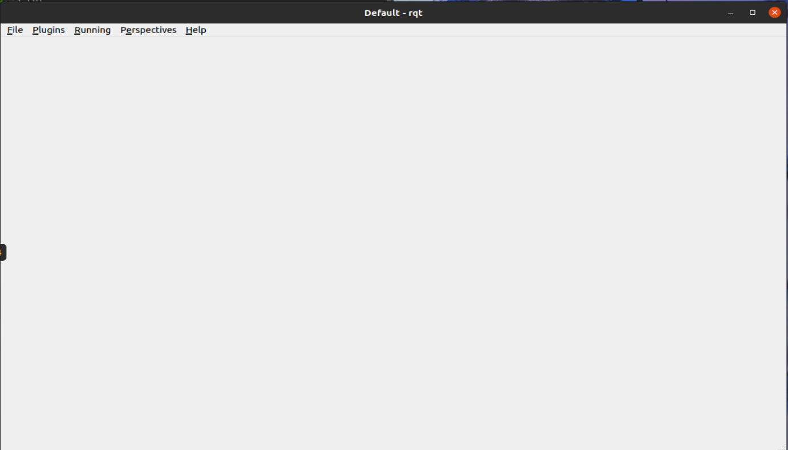

然后这个窗口中最重要的地方就是 `plugins`功能，其中包括了很多我们之前用过的功能性插件：

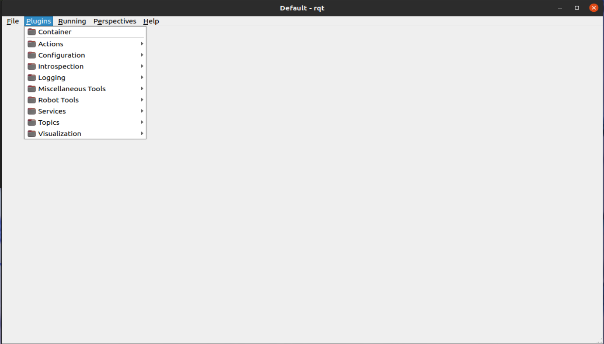

下面会挑几个重要的插件来详细讲解。

### 5.5.2 Introspection

这个插件实际上就是 `RQT_Graph`。使用方法：

打开一个例子，就以ROS官方给出的小乌龟跟随器为例。

```
roslaunch turtle_tf2 turtle_tf2_demo_cpp.launch
```

然后点`nodegraph`就可以打开节点关系图，在红色方框的位置可以选择要查看的是只有节点还是节点和话题都查看。

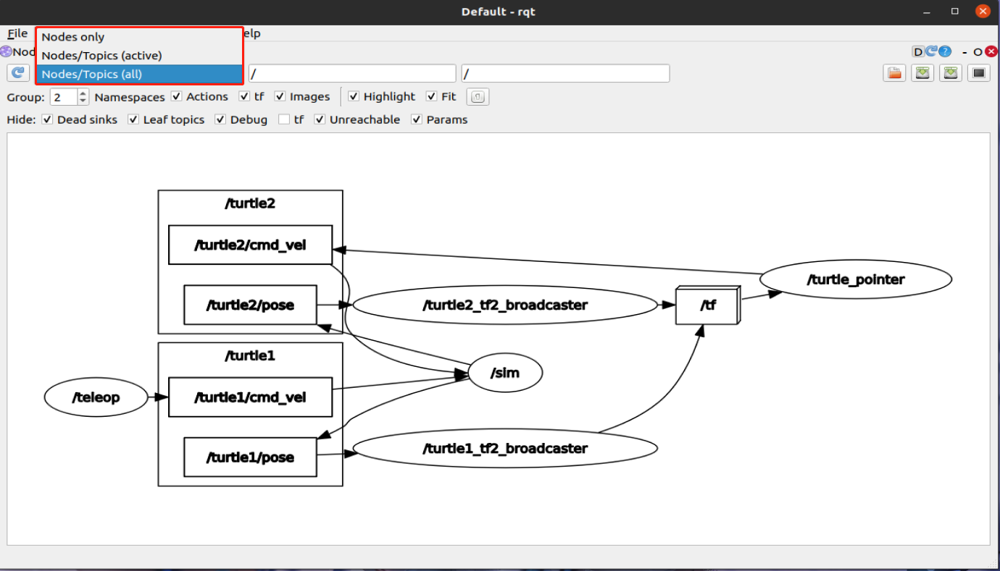

在上图中，椭圆的是节点，方框是话题，立方是工具。然后通过箭头指名节点、话题、工具之间的关系。

### 5.5.3 Logging

这个是日志文件，其中比较有用的（我会用的）是 `bag` 和 `console`。

1. bag

`rosbag` 是一个记录工具，可以针对话题来记录其所作的操作。下面还是以乌龟跟随器作为演示。

打开`bag`

点击录制按键 ：
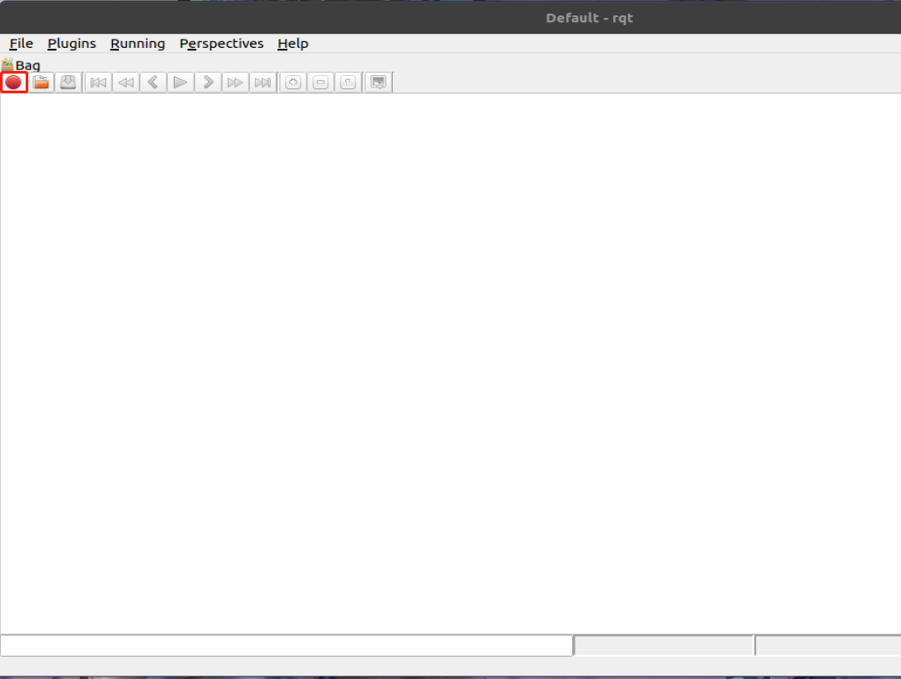

选择想要录制操作的话题（也可以通过`From Nodes`来选择想要录制的节点）：

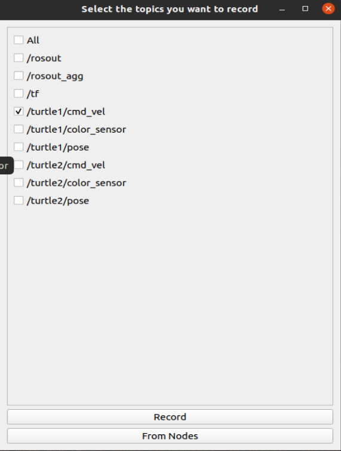

这里想要录制控制乌龟控制话题。

然后点击`record`，再为`bag`选择一个路径。然后录制就开始了。我们对乌龟随便操作一下，然后直接 × 掉窗口以结束录制。

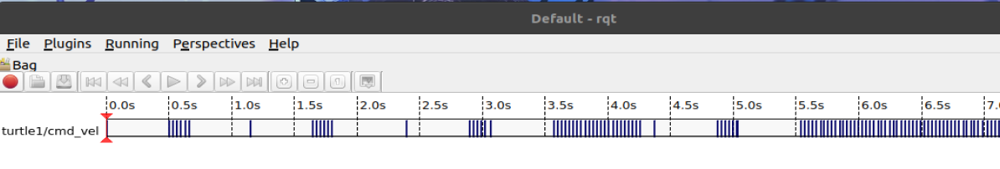

当我们操作乌龟的时候，就会看见进度条上又蓝色的痕迹，表示在这个时间点上我们对于话题有所操作。

然后，我们可以通过命令来查看我们录制的文件：

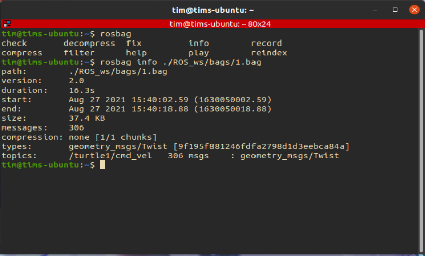

并且我们也可以通过`rqt`对于之前的操作进行回放，操作方法是，先点击文件夹图标。

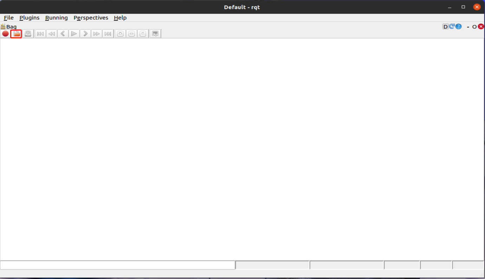

然后找到我们之前记录的文件，打开，进度条会再次出现。之前我们只需要点击播放按键和右击进度条，勾选`publish`，就可以将之前记录的数据回复出来：

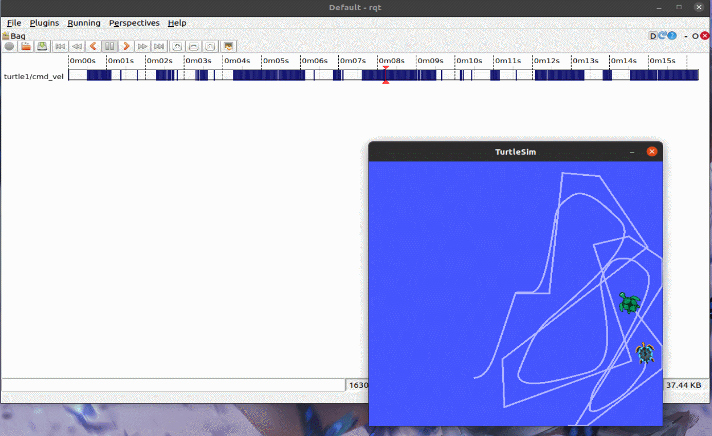

2. console

在这里，我们可以查看到系统发出来的日志。

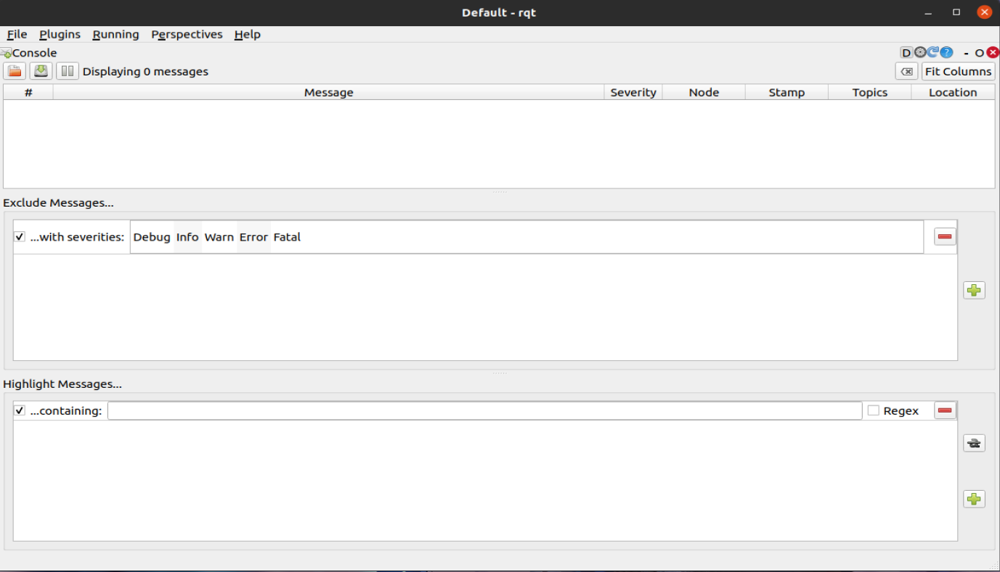

还是以乌龟跟随为例子：

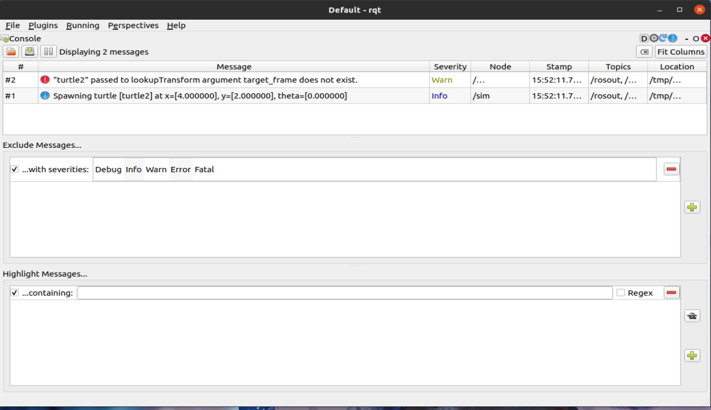

### 5.5.4 Miscellaneous Tools

这里可以开启一个控制台，比如 `py console` 

然后我可以写一些py的代码：

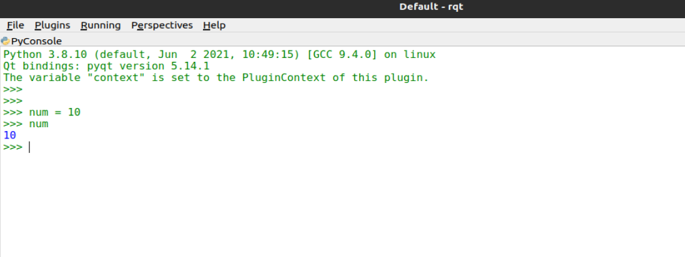


### 5.5.5 Robot Tools

这里有很多很有用的工具，但是目前还没有学习到，所以先留坑。


### 5.5.6 Services

这个就很清楚，就是服务通信。打开以后我们可以选择想要控制的服务。

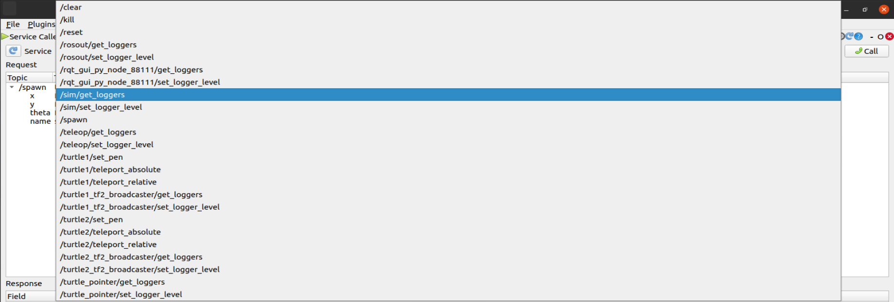

这里我们选择一个最明显的例子: `/spwan`

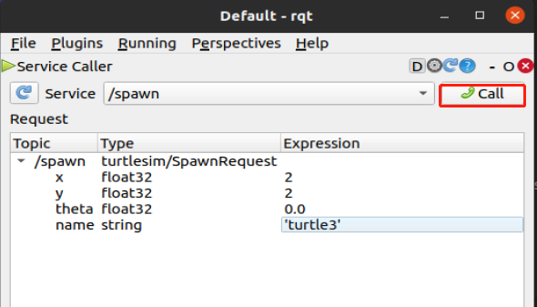

设置完参数后，点击电话就可以提供服务，生成一只新的乌龟。

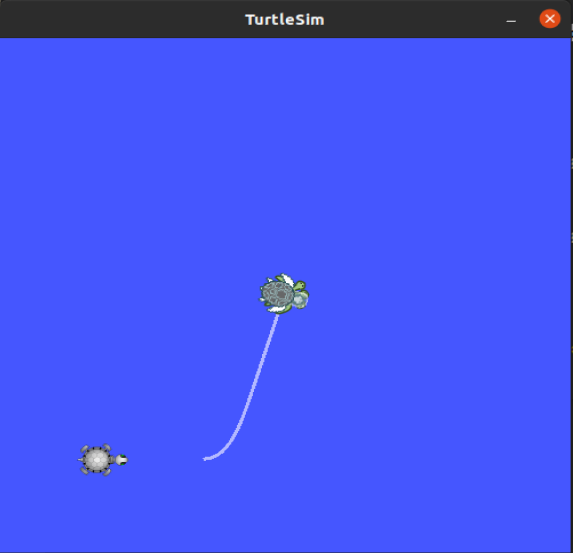

### 5.5.7 Messages、Topic

这个与 Service 类似，可以自行探索

### 5.5.8 Visualization

1. TF trees

这个也可以简单的查看到打开系统的 TF 关系。以乌龟跟随器为例。

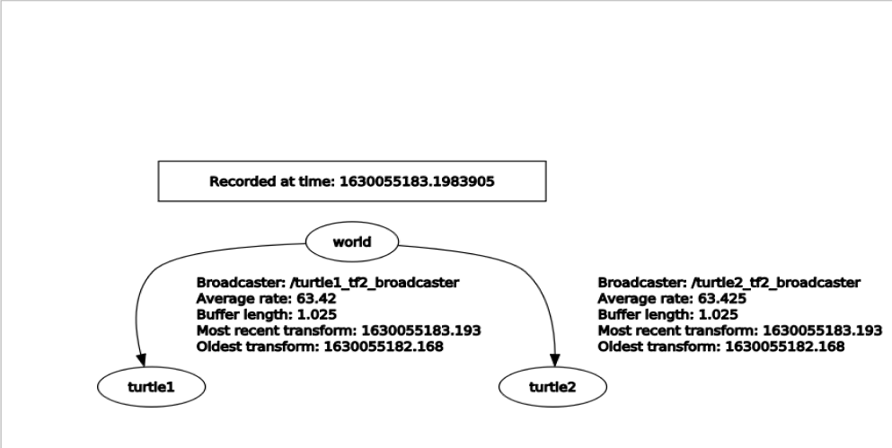

2. Rviz

这个就不在这里展示了，以后仿真的时候机会多多。

3. Pose view

还不会用，留坑

4. Plot 

可以通过`Topic` 来绘制话题下的消息内容随时间的变换。比如：在乌龟跟随器下，添加`/turtle1/pose.x`（输入完以后点加号），就可以查看乌龟的位姿信息。

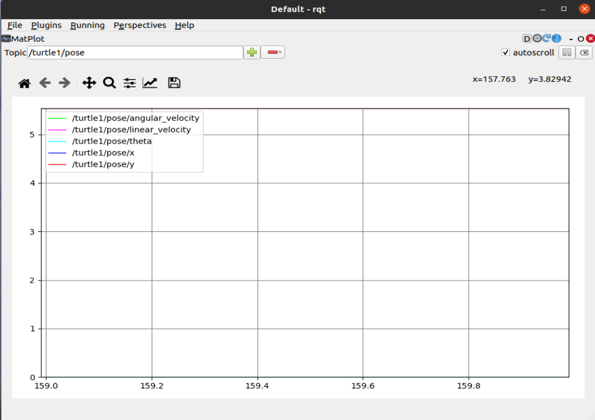

然后动一下乌龟：

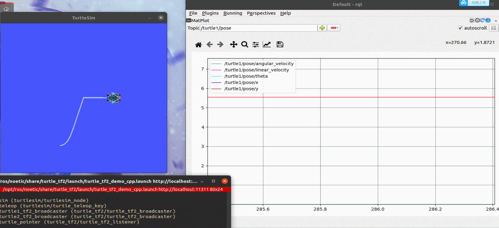

当然这个是可以记录下图表信息的，但是这个功能相当于截图，只能保存瞬时的图标值。

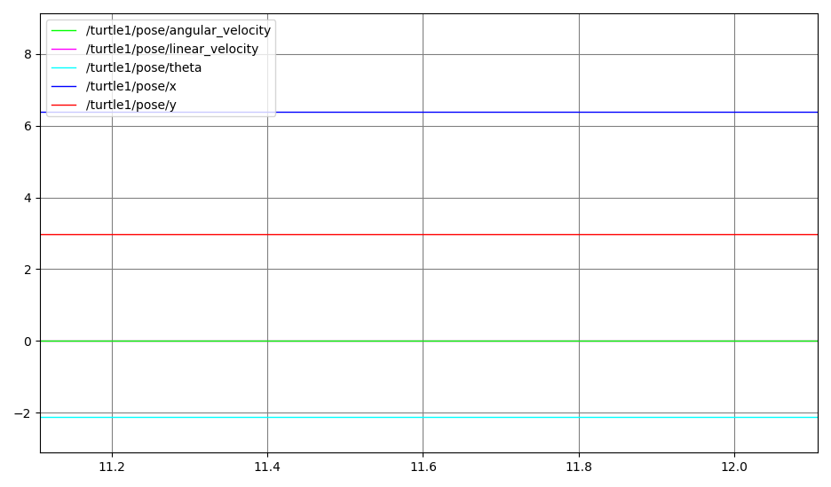

5. nevigation

还不会用，留坑。

