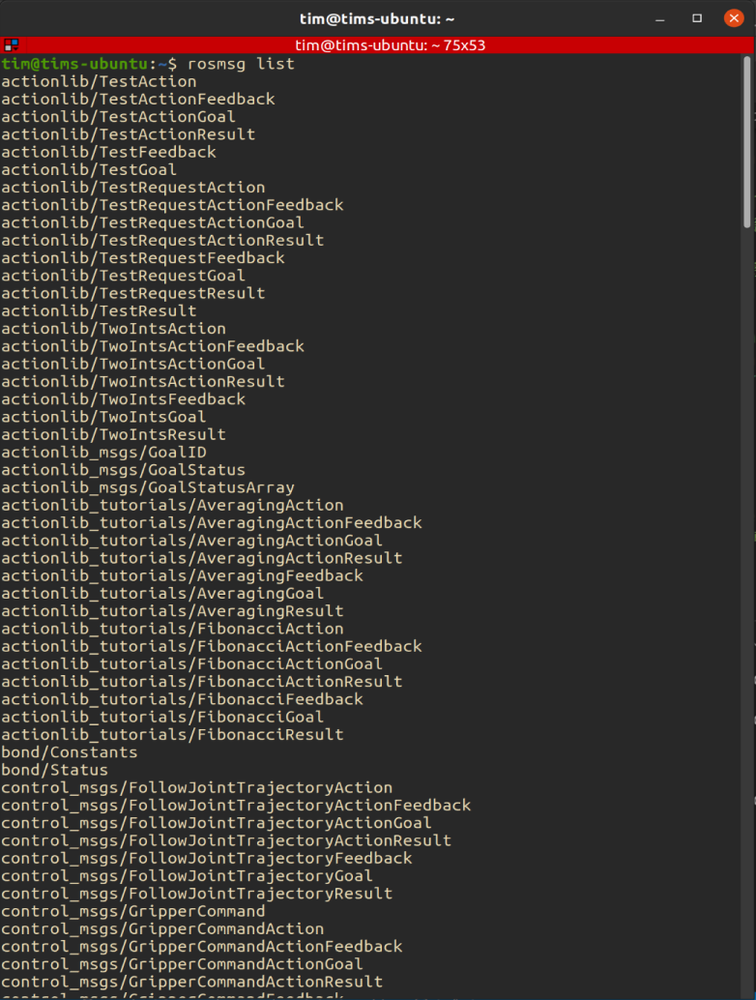
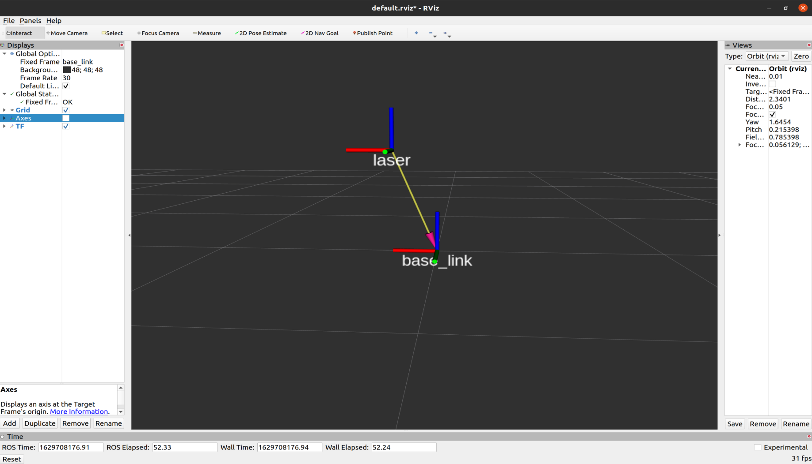
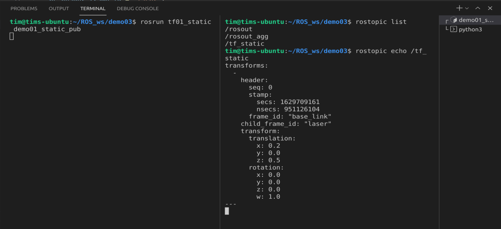
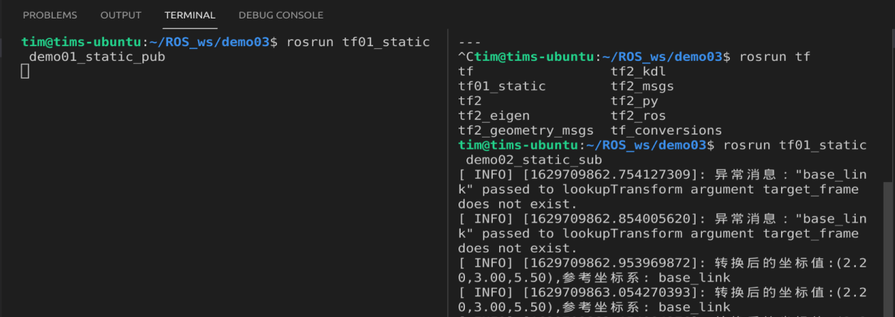

# 第五章：ROS常用组件

## 5.1 TF坐标变换

概念性的东西赵老师的讲义写的非常的清楚，这里就不再重复了。讲义链接如下：

[赵老师的讲义](http://www.autolabor.com.cn/book/ROSTutorials/di-5-zhang-ji-qi-ren-dao-hang/51-tfzuo-biao-bian-huan.html)

下面用一个例子来演示 TF 的使用方法。

例程需求：
    创建一个发布者节点，发布两个坐标系以及他们之间的空间变换关系
    创建一个接收者节点，用来接收并打印变换后的坐标数据
    两个节点之间的话题消息使用 geometry_msgs


重点学习内容：
    了解节点消息的内容
    学习创建节点过程中使用的库
### 5.1.1 坐标 msg 消息

通过命令行输入:

```
rosmsg list
```

我们可以从返回值中看到 ROS 系统中封装的消息都有哪些。



返回的消息类型非常的多，但是大概被分成了下面的几类：

* actionlib
* bond
* control_msgs
* control_manager_msgs
* dynamic_reconfigure
* gazebo_msgs
* geometry_msgs
* map_msgs
* nac_msgs
* sensor_msgs
* shape_msgs
* std_msgs
* tf2_msgs
* trajectory_msgs
* turtle
* visualization_msgs
...

英文比较好的同学应该大体能知道这些消息类型分别是用来做什么的。我们这里所需要的是传递两个坐标系之间的关系和坐标与点的关系，所以要用的 `msgs` 应该属于 `geometry_msgs`。具体来说应该是`geometry_msgs/TransformStamped`和`geometry_msgs/PointStamped`。

然后通过`rosmsg info geometry_msgs/TransformStamped`查看消息的中包含的内容：

```
std_msgs/Header header                     #头信息
  uint32 seq                                #|-- 序列号
  time stamp                                #|-- 时间戳
  string frame_id                            #|-- 坐标 ID
string child_frame_id                    #子坐标系的 id
geometry_msgs/Transform transform        #坐标信息
  geometry_msgs/Vector3 translation        #偏移量
    float64 x                                #|-- X 方向的偏移量
    float64 y                                #|-- Y 方向的偏移量
    float64 z                                #|-- Z 方向上的偏移量
  geometry_msgs/Quaternion rotation        #四元数
    float64 x                                
    float64 y                                
    float64 z                                
    float64 w
```

从上面的消息内容中我们可以看到，消息中可以包含其他的消息内容，并且将其重命名。

然后我们再通过：`rosmsg info geometry_msgs/PointStamped`查看另外一个消息的内容：

```
命令行键入:rosmsg info geometry_msgs/PointStamped

std_msgs/Header header                    #头
  uint32 seq                                #|-- 序号
  time stamp                                #|-- 时间戳
  string frame_id                            #|-- 所属坐标系的 id
geometry_msgs/Point point                #点坐标
  float64 x                                    #|-- x y z 坐标
  float64 y
  float64 z
```

### 5.1.2 静态坐标变换的发布者节点

**需求说明：**

现有一机器人模型，核心构成包含主体与雷达，各对应一坐标系，坐标系的原点分别位于主体与雷达的物理中心，已知雷达原点相对于主体原点位移关系如下: x 0.2 y0.0 z0.5。当前雷达检测到一障碍物，在雷达坐标系中障碍物的坐标为 (2.0 3.0 5.0),请问，该障碍物相对于主体的坐标是多少？

在RVIZ看起来就是这样：




那么要实现这个效果，我们需要发布相关消息。首先创建一个新的功能包，包的依赖为： `tf2、tf2_ros、tf2_geometry_msgs、roscpp rospy std_msgs geometry_msgs`

然后配置编译文件，这里就不再演示了。

代码如下：
```cpp
#include "ros/ros.h"
// 用于广播静态变换的库
#include "tf2_ros/static_transform_broadcaster.h"
// 用于储存空间位置消息内容的库
#include "geometry_msgs/TransformStamped.h"
// 用于计算坐标变换的库
#include "tf2/LinearMath/Quaternion.h"

/*
    需求：发布坐标系之间的相对关系

    流程：
        1. 包含头文件；
        2. 初始化（设置编码，节点初始化，创建节点句柄）；
        3. 创建发布对象；
        4. 组织被发布的消息；
        5. 发布数据；
        6. spin();
*/

int main(int argc, char *argv[])
{
        // 2. 初始化（设置编码，节点初始化，创建节点句柄）；
        setlocale(LC_ALL,"");
        ros::init(argc,argv,"static_pub");
        ros::NodeHandle nh;
        // 3. 创建发布对象；
        tf2_ros::StaticTransformBroadcaster pub;
        // 4. 组织被发布的消息；
        geometry_msgs::TransformStamped tfs;
        tfs.header.stamp = ros::Time::now();
        tfs.header.frame_id = "base_link";    // 相对坐标系关系中被参考的那一个
        tfs.child_frame_id = "laser";
        tfs.transform.translation.x = 0.2;
        tfs.transform.translation.y = 0.0;
        tfs.transform.translation.z = 0.5;

        // 需要根据欧拉角转换
        tf2::Quaternion qtn;        // 创建四元数对象
        // 向该对象设置欧拉角，这个对象可以将欧拉角转化成四元数
        qtn.setRPY(0.0, 0.0, 0.0);  // 欧拉角的单位是弧度
        tfs.transform.rotation.x = qtn.getX();
        tfs.transform.rotation.y = qtn.getY();
        tfs.transform.rotation.z = qtn.getZ();
        tfs.transform.rotation.w = qtn.getW();
        
        // 5. 发布数据；
        pub.sendTransform(tfs);
        // 6. spin();
        ros::spin();
    
    return 0;
}
```

代码中的注释非常的清楚，这里就不多介绍了。展示一些结果：



想要生成RIVZ的的图像，在命令行中输入 `rviz` 然后设置Fixed Frame 为 base_link，点击左下的 add 按钮，在弹出的窗口中选择 TF 组件，即可显示坐标关系。

### 5.1.3 静态坐标变换的接收者节点

代码中的注释非常明确，所以直接看代码。

代码如下：

```cpp
#include "ros/ros.h"
// 坐标接收者库
#include "tf2_ros/transform_listener.h"
// 缓存库
#include "tf2_ros/buffer.h"
// 坐标里点的消息库
#include "geometry_msgs/PointStamped.h"
// 坐标转换的库
#include "tf2_geometry_msgs/tf2_geometry_msgs.h"
/*
    订阅方：订阅发布的坐标系相对关系，传入一个坐标点，调用 tf 实现转换

    流程：
        1. 包含头文件；
        2. 初始化（编码，节点，NodeHandle）
        3. 创建订阅对象； --> 订阅坐标系相对关系
        4. 组织一个座标点数据；
        5. 转化算法，调用tf内置实现；
        6. 最后输出。
*/

int main(int argc, char *argv[])
{
    // 2. 初始化（编码，节点，NodeHandle）
    setlocale(LC_ALL,"");
    ros::init(argc,argv,"Static_sub");
    ros::NodeHandle nh;
    // 3. 创建订阅对象； --> 订阅坐标系相对关系
    // 3-1. 创建一个 buffer 缓存
    tf2_ros::Buffer buffer;
    // 3-2. 创建一个监听对象（将订阅的数据缓存到 buffer）
    tf2_ros::TransformListener listener(buffer);
    // 4. 组织一个座标点数据；
    geometry_msgs::PointStamped ps;
    ps.header.frame_id = "laser";
    ps.header.stamp = ros::Time::now();
    ps.point.x = 2.0;
    ps.point.y = 3.0;
    ps.point.z = 5.0;

    // 休眠
    // ros::Duration(2).sleep();
    // 5. 转化算法，调用tf内置实现；
    ros::Rate rate(10);
    while(ros::ok())
    {
        // 核心代码 -- 将 ps 转换成相对于 base_link 的坐标点
        geometry_msgs::PointStamped ps_out;
        /*
            调用了 buffer 的转换函数 transform
            参数1：被转化的座标点
            参数2：目标坐标系
            返回值：输出的坐标点

            PS1：调用时必须包含头文件 tf2_geometry_msgs/tf2_geometry_msgs.h
            PS2: 运行时存在的问题，抛出异常 base_link 不存在
                 原因： 订阅数据是一个耗时操作，可能在调用 transform 转换函数时，
                        坐标系的相对关系还没订阅到，因此出现异常
                 解决：
                       方案1：在调用转换函数前，执行休眠；
                       方案2： 进行异常处理(建议使用)。


        */

       try
       {
           
        ps_out =  buffer.transform(ps,"base_link");
        // 6. 最后输出
        ROS_INFO("转换后的坐标值:(%.2f,%.2f,%.2f),参考坐标系: %s",
                        ps_out.point.x,
                        ps_out.point.y,
                        ps_out.point.z,
                        ps_out.header.frame_id.c_str()
                        );
       }
       catch(const std::exception& e)
       {
        //    std::cerr << e.what() << '\n';
        ROS_INFO("异常消息：%s",e.what());
       }
       
       
        rate.sleep();
        ros::spinOnce();
    }

    return 0;
}

```

最终的效果为：



值得注意的点是在刚刚启动接收者节点时发出的异常警告： base_link 不存在
原因： 订阅数据是一个耗时操作，可能在调用 transform 转换函数时，坐标系的相对关系还没订阅到，因此出现异常

解决： 
       方案1：在调用转换函数前，执行休眠；
       方案2： 进行异常处理(建议使用)。