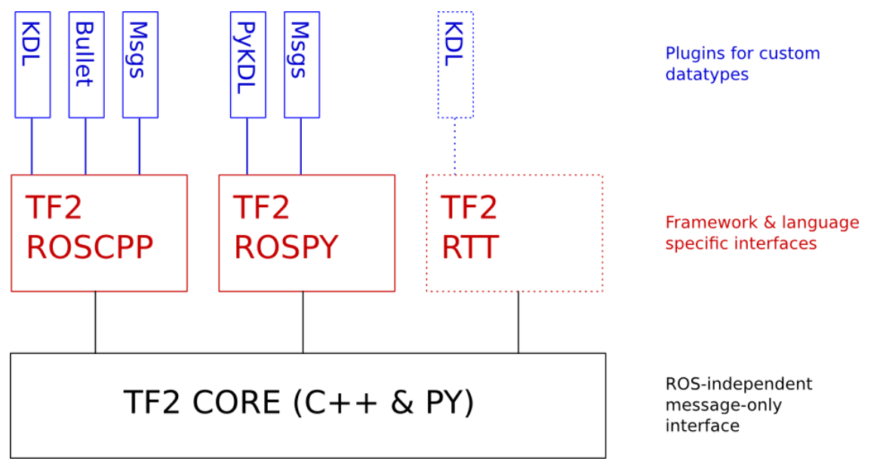

# 第五章：ROS常用组件

前面的内容讲完之后，似乎还有一些晕，因为之前的例程中，有太多的函数，我们只是看到老师带我用了，但实际上我们并没有一个很好的 feel。 那么我觉得有必要看一下 tf2 的官方 document 和 库文件。

## 5.3 TF 的概念性认识


这个是 ROS 的官方文件给出来的，tf2 的设计理念。

1. 总览



图中蓝色的部分表示的是 TF2 可以使用的插件和自定义的数据格式。对于 Cpp 来说有 KD， Bullet 和 Msgs。 前两个目前我都没有接触过，暂时先挖个坑，等接触了再深入了解，最后一个 Msgs 我们都很熟悉，这个就是我们 ROS 中最常见的消息，这说明 TF2 是依赖 Msgs 来完成其功能的。然后看褐色部分，这个是 TF2 可以使用的语言，和 ROS 没差。最后黑色部分是 TF2 的核心，再次说明了 TF2 对于 消息的依赖。

2. 设计目标

2.1 一个分布式的系统

优势：很小的延迟

实现方式： TF2 通过在用户端节点广播大量的带有时间戳的数据，并在另一端接收，并重组数据。两者之间不需要进行同步，数据也可以式无需的。

>我的解读: 我们之前的例子中使用过的一个 TF2 的 API ：`buffer.lookupTransform("turtle2","turtle1",ros::Time(0))`，这个 API 可以让缓存 `buffer` 查找两个坐标系发布的时间相隔最近的数据，用这个的方式来近似的同步两个坐标系发布的数据。

2.2 只在使用坐标系时转换数据

优势：高效，简化计算

2.3 支持通过时间戳查询数据，而不仅是当前时间的数据

优势：降低处理数据的延迟

实现方式：让接口类将所有转换的数据储存在内存中，并在有请求时运行遍历树。

>我的解读：这里说的是 `buffer`，我们在创建订阅者之前会先创建一个 `buffer`，让数据都先在内存中缓存，在从缓存中读取数据。

2.4 只需要知道坐标系的名称即可以处理数据

优势：便于开发

实现：使用字符串 `frame_ids` 作为唯一标识符。

>我的解读：这是我觉得 TF2 中最好的一个功能。对于这个功能的解读需要先从`frame`的消息类型来看起。
>坐标的消息类型 `geometry_msgs/TransformStamped`，其消息内容为：
```
std_msgs/Header header                     #头信息
  uint32 seq                                #|-- 序列号
  time stamp                                #|-- 时间戳
  string frame_id                           #|-- 坐标 ID
string child_frame_id                    #子坐标系的 id
geometry_msgs/Transform transform        #坐标信息
  geometry_msgs/Vector3 translation        #偏移量
    float64 x                                #|-- X 方向的偏移量
    float64 y                                #|-- Y 方向的偏移量
    float64 z                                #|-- Z 方向上的偏移量
  geometry_msgs/Quaternion rotation        #四元数
    float64 x                                
    float64 y                                
    float64 z                                
    float64 w
```
>这个消息内容分为三个部分：头信息，子坐标ID，坐标变换信息。所以对于一个坐标消息来说，实际上是声明了两个坐标，一个基坐标，一个子坐标。对于基坐标来说，它除了名字外，不需要再定义其他任何的东西。以后的操作过程会有一步通过`frame id`来对应坐标系的步骤。而子坐标则需要通过坐标消息类型来定义每时每刻它相对基坐标的偏移和角度。这样对应开发者来说，就可以使用`frame id`来对应每一个真实的坐标关系。

2.5 系统不需要提前了解配置，并且可以即时进行重新配置

优势：适用于任何配置的通用系统

实现：使用有向树结构。在评估变换时，它允许快速遍历（n 阶，其中 n 是树的深度）。它可以通过重新定义链接来重新配置。除了为每个链接维护一个排序的数据链表外，它不需要对数据结构进行任何结构验证或维护。

2.6 线程安全接口

优势：可用于多线程

实现：围绕每一个帧的数据储存进行互斥。`frame_id`查找映射周围的互斥体。每一个都时单独锁定和解锁的，都不同阻止另一个。

2.7 多机器人支持

优势：可与具有相同或者相似配置的多个机器人一起使用

实现：为每一个机器人使用类似于命名空间的`tf_prefix`


## 5.4 TF2 的库

这里只对之前受用过的TF2 的内容进行解释。即使用`ctrl + 左键`进入对象查看其库中的说明。

1. `tf2_ros::StaticTransformBroadcaster`
   
首先`tf2_ros`是一个命名空间，`StaticTransformBroadcaster`是此命名空间下的一个类。

```cpp
/** \brief This class provides an easy way to publish coordinate frame transform information.  
 * It will handle all the messaging and stuffing of messages.  And the function prototypes lay out all the 
 * necessary data needed for each message.  */

class StaticTransformBroadcaster{
public:
  /** \brief Constructor (needs a ros::Node reference) */
  StaticTransformBroadcaster();

  /** \brief Send a TransformStamped message
   * The stamped data structure includes frame_id, and time, and parent_id already.  */
  void sendTransform(const geometry_msgs::TransformStamped & transform) {
    sendTransform(std::vector<geometry_msgs::TransformStamped>({transform}));
  }

  /** \brief Send a vector of TransformStamped messages
   * The stamped data structure includes frame_id, and time, and parent_id already.  */
  void sendTransform(const std::vector<geometry_msgs::TransformStamped> & transforms);

private:
  /// Internal reference to ros::Node
  ros::NodeHandle node_;
  ros::Publisher publisher_;
  tf2_msgs::TFMessage net_message_;

};
```

此类中的函数有：

```cpp
// 用于发送消息，消息类型是上面介绍过的。
void sendTransform(const geometry_msgs::TransformStamped & transform)
// 还有一个重载
// 可以用来发送一列消息
void sendTransform(const std::vector<geometry_msgs::TransformStamped> & transforms);
```

作用是为了便捷的发布一个空间坐标变换信息。

2. `geometry_msgs::TransformStamped` 

这就是上面讲过的那个消息类型，这里不再多说。

3. `tf2::Quaternion`

`tf2` 命名空间下的 `Quaternion` 类
```cpp
/**@brief The Quaternion implements quaternion to perform linear algebra rotations in combination with Matrix3x3, Vector3 and Transform. */
class Quaternion : public QuadWord {
```
常用的函数为`setRPY();`，作用是将欧拉角转换为四元数，和 `getX()`（X，Y，Z，W 四元数各一个），作用是获取四元数的值。
>库里东西太多了，看眼花了，先放这两个吧


4. `tf2_ros::Buffer`

`tf2_ros`命名空间下的`Buffer`类。用于缓存数据
   
```cpp
namespace tf2_ros
{

  /** \brief Standard implementation of the tf2_ros::BufferInterface abstract data type.
   *
   * Inherits tf2_ros::BufferInterface and tf2::BufferCore.
   * Stores known frames and optionally offers a ROS service, "tf2_frames", which responds to client requests
   * with a response containing a tf2_msgs::FrameGraph representing the relationship of known frames.
   */
  class Buffer: public BufferInterface, public tf2::BufferCore
  {
  public:
    using tf2::BufferCore::lookupTransform;
    using tf2::BufferCore::canTransform;

    /**
     * @brief  Constructor for a Buffer object
     * @param cache_time How long to keep a history of transforms
     * @param debug Whether to advertise the tf2_frames service that exposes debugging information from the buffer
     * @return 
     */
    Buffer(ros::Duration cache_time = ros::Duration(BufferCore::DEFAULT_CACHE_TIME), bool debug = false);
```

其内容比较多，暂时先看这个 `Buffer`，作用是创建一个缓存对象。

5. `buffer.transform`

```cpp
/** \brief Transform an input into the target frame.
   * This function is templated and can take as input any valid mathematical object that tf knows
   * how to apply a transform to, by way of the templated math conversions interface.
   * For example, the template type could be a Transform, Pose, Vector, or Quaternion message
   * type (as defined in geometry_msgs).
   * \tparam T The type of the object to transform.
   * \param in The object to transform.
   * \param target_frame The string identifer for the frame to transform into.
   * \param timeout How long to wait for the target frame. Default value is zero (no blocking).
   * \return The transformed output.
   */
  template <class T>
    T transform(const T& in,
		const std::string& target_frame, ros::Duration timeout=ros::Duration(0.0)) const
  {
    T out;
    return transform(in, out, target_frame, timeout);
  }
```

`transform()`函数使用了模板，函数的作用是将输入的信息，转换为输入参数坐标中的信息。此函数的输入参数1 和 输出值的类型相同，第二个参数是目标坐标系的名称。

6. `geometry_msgs::PointStamped`

这时一个消息类型，用来表示点的消息。其内容为：

```
std_msgs/Header header                    #头
  uint32 seq                                #|-- 序号
  time stamp                                #|-- 时间戳
  string frame_id                           #|-- 所属坐标系的 id
geometry_msgs/Point point                #点坐标
  float64 x                                    #|-- x y z 坐标
  float64 y
  float64 z
```

7. `tf2_ros::TransformBroadcaster`

看起来与 1 差不多，实际上也是差不多。

```cpp
/** \brief This class provides an easy way to publish coordinate frame transform information.  
 * It will handle all the messaging and stuffing of messages.  And the function prototypes lay out all the 
 * necessary data needed for each message.  */
class TransformBroadcaster{
public:
  /** \brief Constructor (needs a ros::Node reference) */
  TransformBroadcaster();

  /** \brief Send a StampedTransform 
   * The stamped data structure includes frame_id, and time, and parent_id already.  */
  //  void sendTransform(const StampedTransform & transform);

  /** \brief Send a vector of StampedTransforms 
   * The stamped data structure includes frame_id, and time, and parent_id already.  */
  //void sendTransform(const std::vector<StampedTransform> & transforms);

  /** \brief Send a TransformStamped message
   * The stamped data structure includes frame_id, and time, and parent_id already.  */
  void sendTransform(const geometry_msgs::TransformStamped & transform);

  /** \brief Send a vector of TransformStamped messages
   * The stamped data structure includes frame_id, and time, and parent_id already.  */
  void sendTransform(const std::vector<geometry_msgs::TransformStamped> & transforms);

private:
  /// Internal reference to ros::Node
  ros::NodeHandle node_;
  ros::Publisher publisher_;

};
```

8. `buffer.lookupTransform()`

作用是来获取两个坐标系之间的变换关系。参数1 为 目标坐标系 参数2 为 原坐标系，函数的返回值是坐标系变换关系的消息类型。

```cpp
/** \brief Get the transform between two frames by frame ID.
   * \param target_frame The frame to which data should be transformed
   * \param source_frame The frame where the data originated
   * \param time The time at which the value of the transform is desired. (0 will get the latest)
   * \return The transform between the frames
   *
   * Possible exceptions tf2::LookupException, tf2::ConnectivityException,
   * tf2::ExtrapolationException, tf2::InvalidArgumentException
   */
  geometry_msgs::TransformStamped 
    lookupTransform(const std::string& target_frame, const std::string& source_frame,
		    const ros::Time& time) const;

  /** \brief Get the transform between two frames by frame ID assuming fixed frame.
   * \param target_frame The frame to which data should be transformed
   * \param target_time The time to which the data should be transformed. (0 will get the latest)
   * \param source_frame The frame where the data originated
   * \param source_time The time at which the source_frame should be evaluated. (0 will get the latest)
   * \param fixed_frame The frame in which to assume the transform is constant in time. 
   * \return The transform between the frames
   *
   * Possible exceptions tf2::LookupException, tf2::ConnectivityException,
   * tf2::ExtrapolationException, tf2::InvalidArgumentException
   */

  geometry_msgs::TransformStamped
    lookupTransform(const std::string& target_frame, const ros::Time& target_time,
		    const std::string& source_frame, const ros::Time& source_time,
		    const std::string& fixed_frame) const;
```

