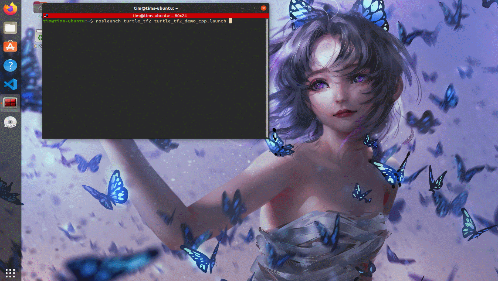
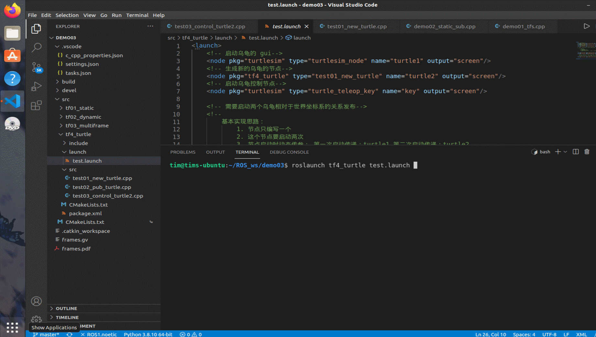

# 第五章：ROS常用组件

## 5.4 TF2 的综合性案例

本节要做的内容是小海龟跟随器。效果就是在海龟GUI中生成两个小海龟，一个海龟可以被键盘控制移动，另外一个海龟将跟随第一个海龟。这个其实也是 ROS 里内置的一个 demo。通用的查看方法是：

先下载：
```
sudo apt-get install ros-$ROS_DISTRO-turtle-tf2 ros-$ROS_DISTRO-tf2-tools ros-$ROS_DISTRO-tf
```

需要将`$ROS_DISTRO`，替换为自己的 ROS 版本，比如 `neotic`。

然后运行 demo:

```
roslaunch turtle_tf2 turtle_tf2_demo_cpp.launch
```

效果是：


### 5.4.1 案例流程分析

1. 我们要生成两只小乌龟。这需要用到 `rosservice` 的 `spwan` 并且通过传参确定其出生位置
2. 创建两只乌龟关于世界坐标系的坐标消息。这需要通过 `geometry_msgs/TransformStamped`发布动态坐标消息。
3. 将随动小乌龟的坐标位置转换为可控小乌龟坐标系上。这需要通过`lookupTransform`来计算两者之间的坐标转换。
4. 赋予随动小乌龟运动能力。小乌龟的运动是通过订阅话题`/turtle/cmd_vel`实现的，此话题下的消息`geometry_msgs/Twist`为直接控制小乌龟运行的数据类型。因此通过修改`geometry_msgs/Twist`来控制乌龟的随动。

### 5.4.2 案例实现流程

1. 写一个可以生成两只乌龟的节点文件

这个之前就做过了，所以不多解释，只讲一下其参数：`x = 1, y = 2, theta = 3.1415926, name = "turtle2"`。

```cpp
/* 
    创建第二只小乌龟
 */
#include "ros/ros.h"
#include "turtlesim/Spawn.h"

int main(int argc, char *argv[])
{

    setlocale(LC_ALL,"");

    //执行初始化
    ros::init(argc,argv,"create_turtle");
    //创建节点
    ros::NodeHandle nh;
    //创建服务客户端
    ros::ServiceClient client = nh.serviceClient<turtlesim::Spawn>("/spawn");

    ros::service::waitForService("/spawn");
    turtlesim::Spawn spawn;
    spawn.request.name = "turtle2";
    spawn.request.x = 1.0;
    spawn.request.y = 2.0;
    spawn.request.theta = 3.1415926;
    bool flag = client.call(spawn);
    if (flag)
    {
        ROS_INFO("乌龟%s创建成功!",spawn.response.name.c_str());
    }
    else
    {
        ROS_INFO("乌龟2创建失败!");
    }

    ros::spin();

    return 0;
}
```

2. 创建可以发布乌龟相对世界坐标系的坐标

也是之前的案例，但是需要改动的一些地方是，这里需要说明的地方是，之前只做了一个坐标系相对于世界坐标系的消息发布。但这里我们需要发布两只小乌龟的消息，为了提高代码的复用性，这里选择用参数来实现。两次使用的过程中，唯一不同的地方就是乌龟坐标的名称，因此将这里的作为变量，用参数赋值。实际代码如下：

```cpp
#include "ros/ros.h"
#include "turtlesim/Pose.h"
// 用来发布动态坐标
#include "tf2_ros/transform_broadcaster.h"
// 我们使用到的信息类型
#include "geometry_msgs/TransformStamped.h"
// 用于将欧拉角转换为四元数
#include "tf2/LinearMath/Quaternion.h"

/*
    发布方：需要订阅乌龟的为姿信息，转换成相对于世界坐标系的坐标关系，并发布。

    准 备：
        话题：/turtle1/pose
        消息：turtlesim/Pose

    流程：
        1. 包含头文件；
        2. 初始化；
        3. 创建订阅对象，订阅 /turtle1/pose;
        4. 回调函数处理订阅的消息: 将位姿信息转换成坐标相对关系并发布（关注）
        5. spin（）

*/

// 声明变量接收传递的参数
std::string turtle_name;

// 4. 回调函数处理订阅的消息: 将位姿信息转换成坐标相对关系并发布（关注）
void doPose(const turtlesim::Pose::ConstPtr & pose)
{
    // 获取位姿信息，转换成坐标系相对关系（核心），并发布
    // a. 创建TF一个发布对象
    // 与静态发布的主要区别就在于下面的这个语句。
    static tf2_ros::TransformBroadcaster pub;
    // b. 组织被发布的数据
    geometry_msgs::TransformStamped ts;
    {
        ts.header.frame_id = "world";
        ts.header.stamp = ros::Time::now();
        // 关键点2： 动态传入
        ts.child_frame_id = turtle_name;

        // 坐标系偏移量设置
        ts.transform.translation.x = pose->x;
        ts.transform.translation.y = pose->y;
        ts.transform.translation.z = 0;
        // 坐标系四元数
        /*
            位姿信息中没有四元数，但是有一个偏航角度
            已知乌龟是 2D 的，没有翻滚和俯仰角，所以
            可以得出乌龟的欧拉角为： 0 0 theta
        */
       tf2::Quaternion qtn;
       qtn.setRPY(0, 0, pose->theta);
       ts.transform.rotation.x = qtn.getX();
       ts.transform.rotation.y = qtn.getY();
       ts.transform.rotation.z = qtn.getZ();
       ts.transform.rotation.w = qtn.getW();
    }
    
    // c. 发布
    pub.sendTransform(ts);
}

int main(int argc, char *argv[])
{
    // 2. 初始化；
    setlocale(LC_ALL,"");
    ros::init(argc,argv,"dynamic_pub");
    ros::NodeHandle nh;

    /*
        解析 launch 文件通过 args 传入的参数
    */

    if (argc !=2)
    {
        ROS_ERROR("只能传入一个参数");
    }
    else
    {
        turtle_name = argv[1];
    }
    
    // 3. 创建订阅对象，订阅 /turtle1/pose;
    // 关节点1： 订阅的话题名称， turtle1 和 turtle2是动态传入的
    ros::Subscriber sub = nh.subscribe(turtle_name+"/pose",100,doPose);
    // 4. 回调函数处理订阅的消息: 将位姿信息转换成坐标相对关系并发布（关注）
    // 5. spin（）
    ros::spin();

    return 0;
}
```

使用的时候，通过`launch`文件的`node`标签中的`arg`属性传参，具体的使用方法会在后面讲`launch`文件的时候具体写出来。

3. 两只小乌龟的坐标变换

依然是之前用过的代码，只需要改动一点点内容，就是讲`lookupTransform`的参数1 和 参数2 改成 `turtle2` 和 `turtle1`。这样第二个小乌龟的位置就被映射到第一个小乌龟的坐标系中了。
>不得不感叹，ROS封装的库真的很强大，减少了很多需要计算的部分。

这部分的代码和 4 写在了一起，所以代码会放在 4 中。

4. 赋予随动小乌龟运动能力

依然是之前做过的内容，在部分 3 的基础上，加入 3 行代码。分别是：
   1. 创建发布者对象
    `ros::Publisher pub = nh.advertise<geometry_msgs::Twist>("/turtle2/cmd_vel",100);`
   2. 计算并组织发布对象
    `geometry_msgs::Twist twist;` + 一些列计算（在下方代码处查看，这里只写逻辑）
   3. 发布
    `pub.publish(twist);`

下面直接放代码：

```cpp
/*

需求:
    1. 换算出 turtle1 相对于 turtle2 的关系
    2. 计算角速度和线速度并发布

*/
//1.包含头文件
#include "ros/ros.h"
#include "tf2_ros/transform_listener.h"
#include "tf2/LinearMath/Quaternion.h"
#include "tf2_geometry_msgs/tf2_geometry_msgs.h"
#include "geometry_msgs/TransformStamped.h"
#include "geometry_msgs/PointStamped.h"
#include "geometry_msgs/Twist.h"


int main(int argc, char *argv[])
{   
    

    setlocale(LC_ALL,"");
    // 2.初始化 ros 节点
    ros::init(argc,argv,"sub_frames");
    // 3.创建 ros 句柄
    ros::NodeHandle nh;
    // 4.创建 TF 订阅对象
    tf2_ros::Buffer buffer; 
    tf2_ros::TransformListener listener(buffer);

    // A 创建发布对象
    ros::Publisher pub = nh.advertise<geometry_msgs::Twist>("/turtle2/cmd_vel",100);
    // 5.解析订阅信息中获取 son1 坐标系原点在 son2 中的坐标
    
    ros::Rate r(10);
    while (ros::ok())
    {
        try
        {
        //   解析 son1 中的点相对于 son2 的坐标
            geometry_msgs::TransformStamped tfs = buffer.lookupTransform("turtle2","turtle1",ros::Time(0));
            // ROS_INFO("Turtle1 相对于 Turtle2 的坐标关系:父坐标系ID=%s",tfs.header.frame_id.c_str());
            // ROS_INFO("Turtle1 相对于 Turtle2 的坐标关系:子坐标系ID=%s",tfs.child_frame_id.c_str());
            // ROS_INFO("Turtle1 相对于 Turtle2 的坐标关系:x=%.2f,y=%.2f,z=%.2f",
            //         tfs.transform.translation.x,
            //         tfs.transform.translation.y,
            //         tfs.transform.translation.z
            //         );

            // B 计算并组织发布对象
            geometry_msgs::Twist twist;
            /*
                组织速度只需要设置线速度的x 和 角速度的 z
                x = 系数 * sqrt(x^2 + y^2);
                y = 系数 * tan(y/x);
            */
            // 速度系数
            double Kl = 1;
            double Ka = 4;

            twist.linear.x = Kl * sqrt(pow(tfs.transform.translation.x,2) + pow(tfs.transform.translation.y,2));
            twist.angular.z = Ka * atan2(tfs.transform.translation.y,tfs.transform.translation.x);
            // C 发布
            pub.publish(twist);
        }
        catch(const std::exception& e)
        {
            // std::cerr << e.what() << '\n';
            ROS_INFO("异常信息:%s",e.what());
        }


        r.sleep();
        // 6.spin
        ros::spinOnce();
    }
    return 0;
}
```

5. 创建一个 launch 启动文件

启动文件需要：
1. 启动乌龟的GUI
2. 启动乌龟的控制节点
3. 启动生成新乌龟的节点
4. 启动发布两只乌龟对于世界坐标系的关系的节点
5. 启动订阅关系节点 

具体的代码如下：

```xml
<launch>
    <!-- 启动乌龟的 gui-->
    <node pkg="turtlesim" type="turtlesim_node" name="turtle1" output="screen"/>
    <!-- 生成新的乌龟的节点-->
    <node pkg="tf4_turtle" type="test01_new_turtle" name="turtle2" output="screen"/>
    <!-- 启动乌龟控制节点-->
    <node pkg="turtlesim" type="turtle_teleop_key" name="key" output="screen"/>

    <!-- 需要启动两个乌龟相对于世界坐标系的关系发布-->
    <!-- 
        基本实现思路：
            1. 节点只编写一个
            2. 这个节点要启动两次
            3. 节点启动时动态传参： 第一次启动传递：turtle1 第二次启动传递：turtle2
    -->

    <node pkg="tf4_turtle" type="test02_pub_turtle" name="pub1" args="turtle1" output="screen"/>
    <node pkg="tf4_turtle" type="test02_pub_turtle" name="pub2" args="turtle2" output="screen"/>

    <!-- 需要订阅 turtle1 与 turtle2 相对与世界坐标系的坐标消息，
        并转化成 turtle1 相对于 turtle2 的坐标关系，再生成速度消息 -->

    <node pkg="tf4_turtle" type="test03_control_turtle2" name="control"  output="screen"/>
    

</launch>
```

### 5.4.3 案例演示

这里只需要启动`launch`文件就可以了


