#! https://zhuanlan.zhihu.com/p/406454408
# 基于 ROS 的机器人学习日志 -- 17

# 第六章 机器人仿真

本章节涉及内容主要有：对机器人建模(URDF)、创建仿真环境(Gazebo)以及感知环境(Rviz)等系统性实现

概念性的介绍：（复制自赵老师的讲义）

1. URDF

URDF是 Unified Robot Description Format 的首字母缩写，直译为统一(标准化)机器人描述格式，可以以一种 XML 的方式描述机器人的部分结构，比如底盘、摄像头、激光雷达、机械臂以及不同关节的自由度.....,该文件可以被 C++ 内置的解释器转换成可视化的机器人模型，是 ROS 中实现机器人仿真的重要组件。

2. rviz

RViz 是 ROS Visualization Tool 的首字母缩写，直译为ROS的三维可视化工具。它的主要目的是以三维方式显示ROS消息，可以将 数据进行可视化表达。例如:可以显示机器人模型，可以无需编程就能表达激光测距仪（LRF）传感器中的传感 器到障碍物的距离，RealSense、Kinect或Xtion等三维距离传感器的点云数据（PCD， Point Cloud Data），从相机获取的图像值等。

以`ros- [ROS_DISTRO] -desktop-full`命令安装ROS时，RViz会默认被安装。

运行使用命令`rviz`或`rosrun rviz rviz`。

3. gazebo

Gazebo是一款3D动态模拟器，用于显示机器人模型并创建仿真环境,能够在复杂的室内和室外环境中准确有效地模拟机器人。与游戏引擎提供高保真度的视觉模拟类似，Gazebo提供高保真度的物理模拟，其提供一整套传感器模型，以及对用户和程序非常友好的交互方式。

以`ros- [ROS_DISTRO] -desktop-full`命令安装ROS时，gzebo会默认被安装。

运行使用命令`gazebo`或`rosrun gazebo_ros gazebo`

在 Ubuntu20.04 与 ROS Noetic 环境下，gazebo 启动异常以及解决:

* 问题1:VMware: vmw_ioctl_command error Invalid argument(无效的参数)

解决:

```
echo "export SVGA_VGPU10=0" >> ~/.bashrc

source .bashrc
```

* 问题2:[Err] [REST.cc:205] Error in REST request

解决:

```
sudo gedit ~/.ignition/fuel/config.yaml
```

然后将url : https://api.ignitionfuel.org使用 # 注释

再添加url: https://api.ignitionrobotics.org

* 问题3:启动时抛出异常:[gazebo-2] process has died [pid xxx, exit code 255, cmd.....

解决:

```
killall gzserver

和killall gzclient
```


## 6.1 URDF 集成 Rviz

### 6.1.1 准备工作

首先创建功能包。单单对于机器人模型而言，所需要的依赖只有`urdf`，在`urdf`之上，`ros`创建了更为简单的功能包依赖`xacro`。所以本次功能包依赖只需添加两个`urdf`和`xacro`。

然后，在新建功能包下创建以下文件夹：

* launch (用于存放 launch 文件)
* urdf   (用于存储机器人模型)
* meshes (用于给机器人贴皮肤)
* config (存储配置文件)

### 6.1.2 URDF 语法

URDF 文件是一个标准的 XML 文件，在 ROS 中预定义了一系列的标签用于描述机器人模型，机器人模型可能较为复杂，但是 ROS 的 URDF 中机器人的组成却是较为简单，可以主要简化为两部分:连杆(link标签) 与 关节(joint标签)，接下来我们就通过案例了解一下 URDF 中的不同标签：

* `robot` 根标签，类似于`launch`文件中的`launch`标签
* `link` 连杆标签
* `joint` 关节标签
* `gazebo` 集成 `gazebo` 需要使用的标签

关于标签的详解可以参考：

* [赵老师的讲义](http://www.autolabor.com.cn/book/ROSTutorials/di-6-zhang-ji-qi-ren-xi-tong-fang-zhen/62-fang-zhen-urdf-ji-cheng-rviz/623-urdfyu-fa-xiang-jie-robot.html)

* [官方文档](https://wiki.ros.org/urdf/XML)

这里我就不详细介绍了，因为用标签文件写模型真的极为难受。建议使用`solidworkds2urdf`的 solidworkds 插件。

### 6.1.3 solidworkds 转 URDF

1. 下载 ROS 提供的 [sw_urdf_exporter 插件](http://wiki.ros.org/sw_urdf_exporter)。

我下载的是 solidworkstourdf.exe，打开后会自动设置安装路径，点击下一步。

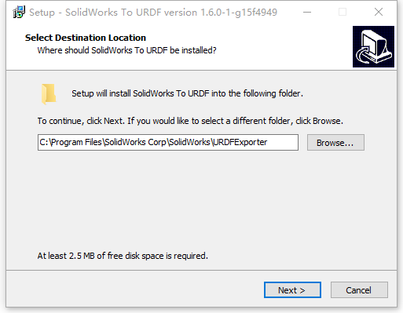

2. 打开 solidworks 的一个空白页面 > 齿轮 > 插件

在其他插件中， 在 SW2URDF 前面已经打勾。然后确定

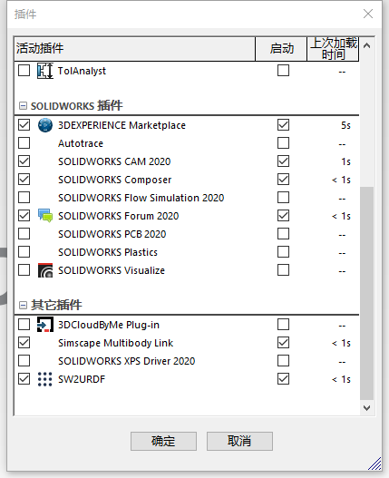

3. 打开一个机器人的模型

我这里打开的是一个机械臂的模型。

点击工具（没有工具的点左上角的 Solidworkds 图标） > Tools > Export as URDF 然后一路确认。之后会出现URDF Exportor 的属性界面：

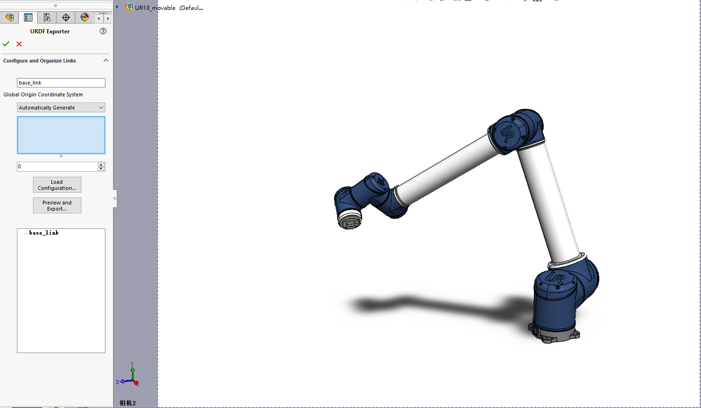

这时我们就需要一些 URDF 的基础知识了，为机器人模型设置 `link` 和 `joint`。

一开始我们要设置一个 `base_link`，这里我选择的是机器人的底座，然后它只有一个子集（其上电机）。设置都用默认的就可以了。

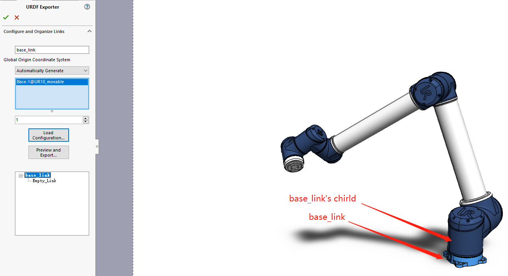

设置完第一个链接后点击下一个链接。

在第二个链接的设置时，出现了一些其他的选项。有关名字的我们自己取就可以了。比较重要的是 `Joint Type`，这里我选择的是 `revolute`（如果不确定这个属性，选择自动检测也可以），然后子集也是只有一个。其他的设置都用默认的就可以了。

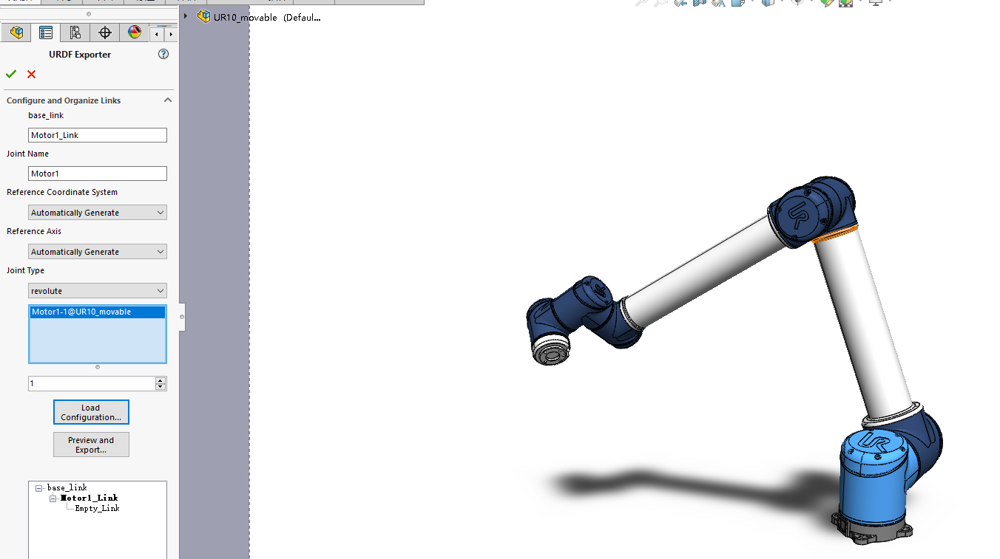

设置完成后再次点击下一个链接，直到最后一个链接。

然后电机 `preview and export` 会出现一个窗口 叫做 `Configure Joint Properties`，在这里可以对于之前的配置做进一步的修正，比如添加关节的限制（弧度制），矫正，运动属性，安全性设置。

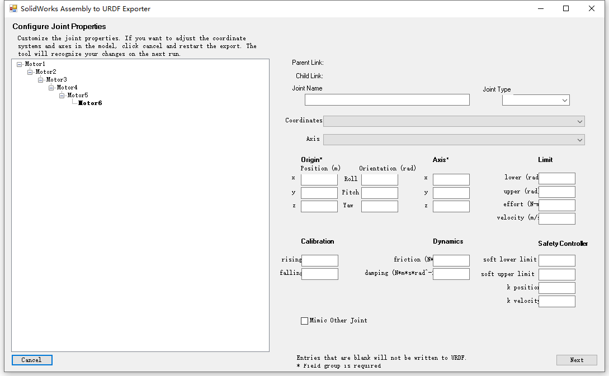

这里我发现我的 `Joint Type` 设置被修改成了 `continuous`，然后我手动改回来了，其他地方没有做改动，直接下一步。

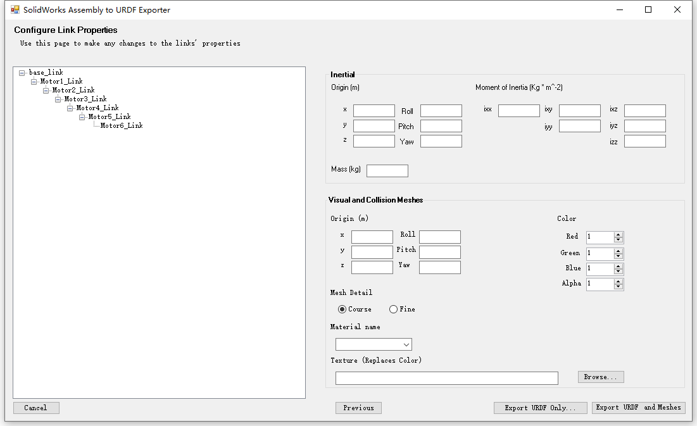

这里我们可以添加机器人每一个 `link` 的物理属性，这里我依然选择默认值（因为我也不会修改）


然后，点击 `Export URDF and Meshes`，修改一下文件夹的名字（主要目的是去掉自动命名的后缀，比如`.SLDASM`）然后选择一个路径就可以了。

进入文件夹，就可以看到下面的东西。

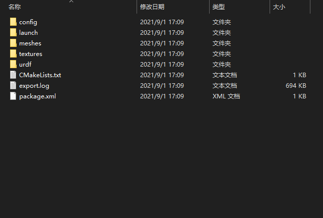

然后我们将这个文件夹复制到我们 Linux 电脑的一个 `ROS` 工作空间的`src`目录下。

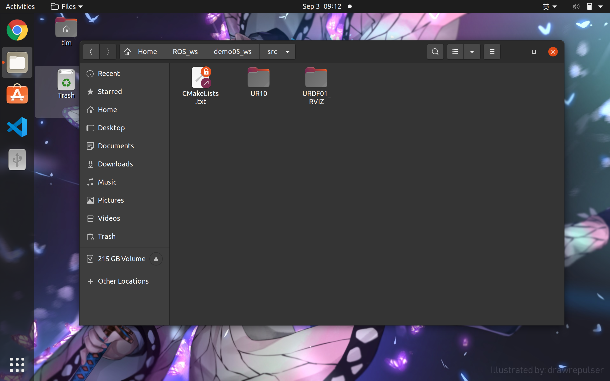

此时，我们复制过来的文件已经是一个功能包了，在此窗口右击在此处打开一个终端，输入下列指令：

```
cd ..
catkin_make
```
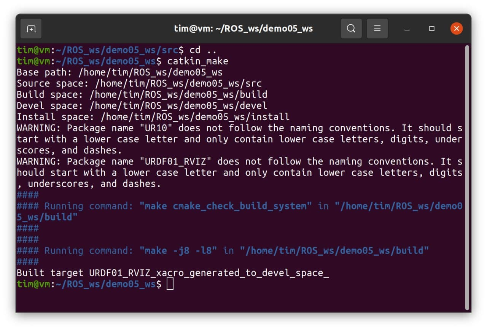

### 6.1.4 URDF工具

再使用这个功能包之前，首先下载一个 `urdf` 的工具，来检查一下我们创建的`urdf`文件是否有问题。

```
sudo apt install liburdfdom-tools
```

然后在 URDF 文件夹内使用命令：

```
urdf_to_graphiz urdf文件
```

然后就会在当前目录下生成一个 pdf 文件，用于展示机器人模型的 `link` 与 `joint` 关系。

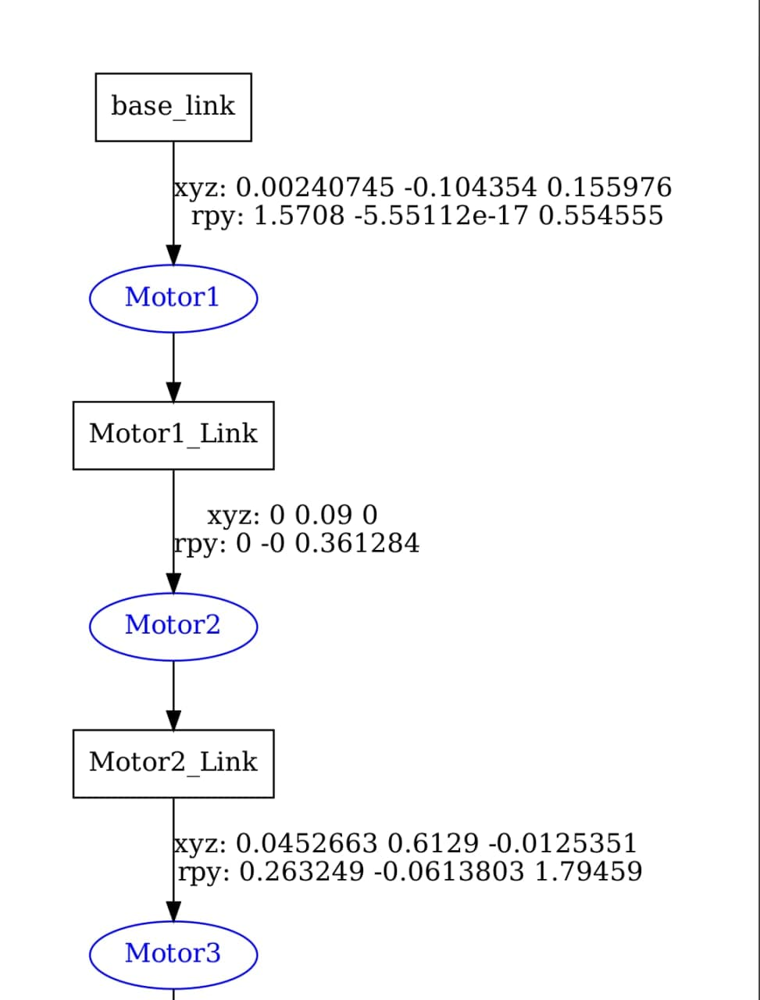

图片较长，我只截取其中一部分。这里的方块是机器人的`link`，椭圆是机器人`joint`，目前看来机器人的`urdf`似乎没有什么问题。

## 6.2 在 rviz 中查看机器人

基于上面的操作，在 ROS 的工作空间下使用下面的指令：

```
source ./devel/setup.bash
roslaunch [包名] display.launch
```

然后就能将`urdf`文件在`rviz`中打开。

刚刚打开的`rviz`只有一个空白的界面，这是正常的，我们需要做一些设置：

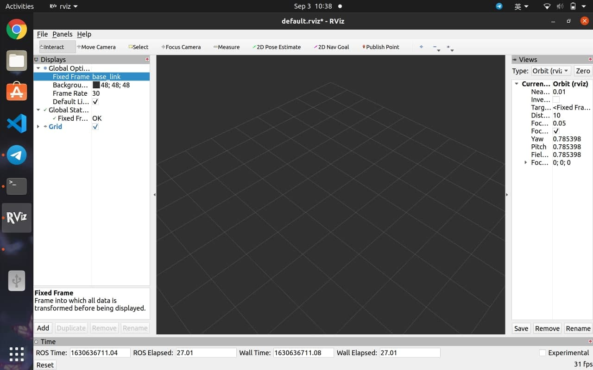

1. 将左边 `fixed frame`修改成`base_link`


2. 点击`add`，添加一个机器人模型`RobotModel`

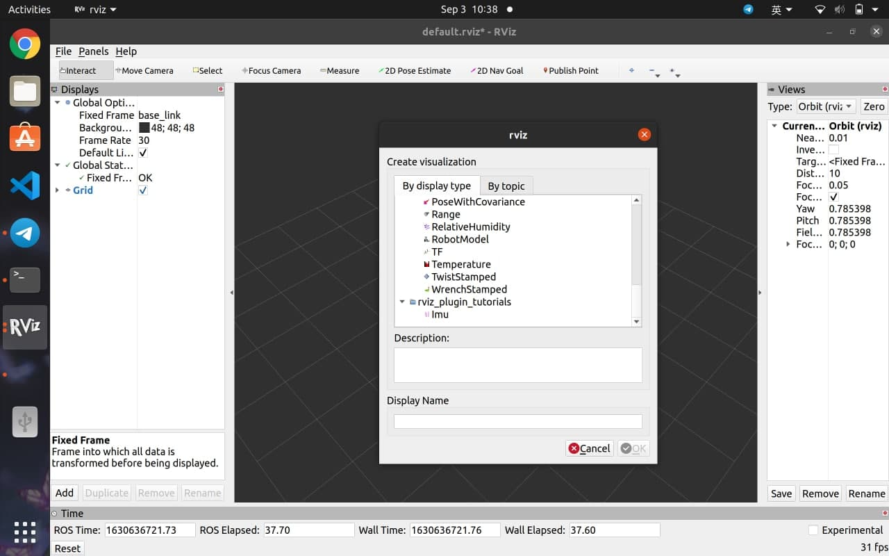

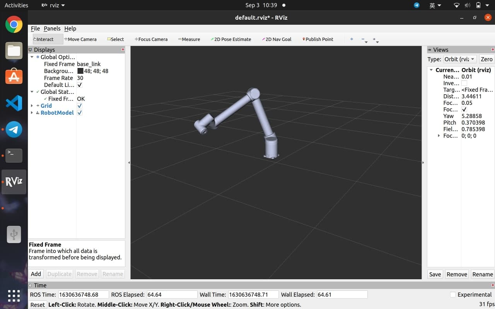

3. file > save configure as

找到当前功能包所在的目录，在`config`文件夹中保存这个配置文件。其名称为`自己命名.rivz`

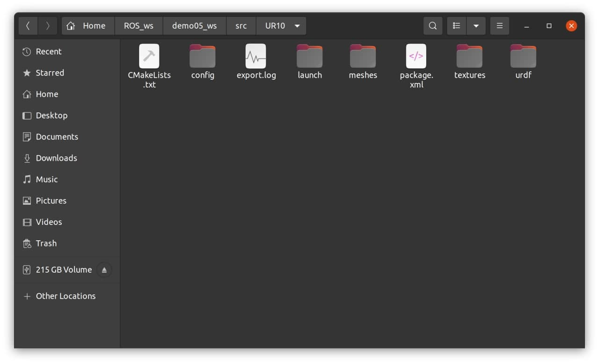

4. 修改`launch`文件，使其包含刚才保存的配置文件

打开在`launch`文件夹下，找到`display.launch`。在其中修改一句话：

原来的代码：
```xml
<node
    name="rviz"
    pkg="rviz"
    type="rviz"
    args="-d $(find UR10)/urdf.rviz" />
```

修改成：
```xml
<node
    name="rviz"
    pkg="rviz"
    type="rviz"
    args="-d $(find 包名)/config/自己命名的.rviz" />
```

然后下次打开就可以看到：

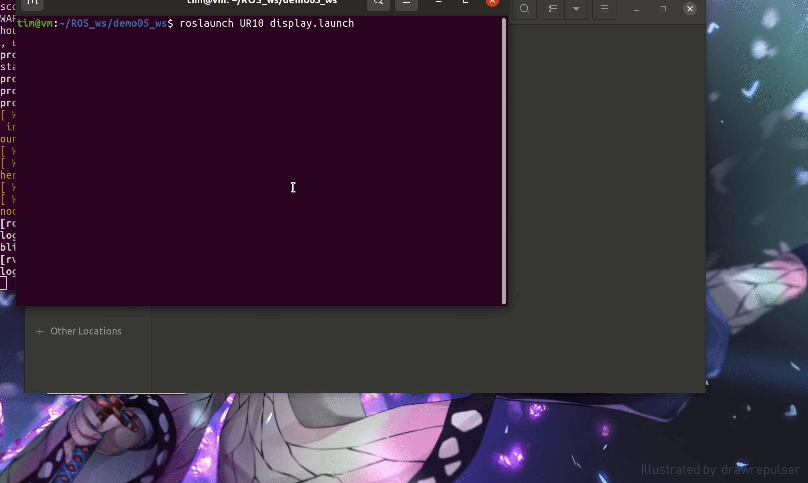

### 6.2.1 机器人运动测试（留坑）

细心的同学可能会发现，我们在打开机器人`rviz`窗口的时候，同时还打开了一个窗口 -- `Joint_state_publisher gui`。

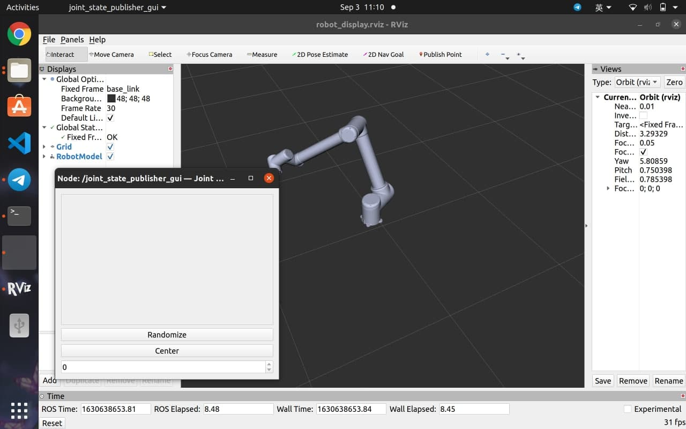

但这个窗口似乎对于机器没有任何的作用。正常情况下这里可以对机器人的关机进行控制的。

但，我也不知是什么情况，在我这里就没啥用。只能等待大佬来解答，工程文件放在文章末尾了。

## 6.3 URDF 集成 Gazebo

>不建议在虚拟机中使用 `Gazebo`，因为虚拟机无法获取电脑的显卡，所以运行`Gazebo`很很卡。建议把`Ubuntu`系统直接安装在 pc 上，或者安装到一个移动硬盘里。

### 6.3.1 URDF 在 Gazebo 中与在 Rviz 中的区别

由于`Gazebo`对于仿真世界物理效果的追求，要求我们创建的 `URDF`必须包含有以下标签，而在 `Rviz` 中则不用：

1. 材料标签用于设置模型在`Gazebo`里的颜色。

```xml
<gazebo reference="base_link">
    <material>Gazebo/Black</material>
</gazebo>
```

如果不设置的话，模型将不会被显示。因为，之前设置看用于在 `Rviz` 中显示颜色的标签在 `Gazebo`中是失效的：

```xml
<material name="yellow">
    <color rgba="0.5 0.3 0.0 1" />
</material>
```

2. 碰撞检测标签 `collision`：

```xml
 <collision>
    <geometry>
        <box size="0.5 0.2 0.1" />
    </geometry>
    <origin xyz="0.0 0.0 0.0" rpy="0.0 0.0 0.0" />
</collision>
```

碰撞检测标签会根据模型的外观，创建边界，用于碰撞检测。

3. 惯性矩标签 `inertial`

```xml
<inertial>
    <origin xyz="0 0 0" />
    <mass value="6" />
    <inertia ixx="1" ixy="0" ixz="0" iyy="1" iyz="0" izz="1" />
</inertial>
```

### 6.3.2 基于 solidworks 的 urdf 

对于使用了 `solidworks` 导出 `urdf` 的同学不用担心这个情况，文件都没问题。只需要使用`launch`文件就可以进入`gazebo`查看机器人了。

使用指令：

```
roslaunch [包名] gazebo.launch
```

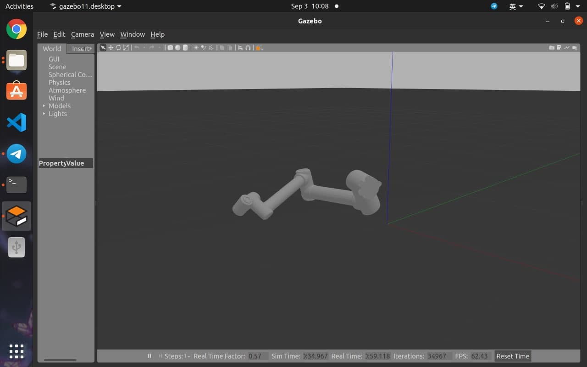

这里我的机器人倒了，原因是地盘并没有固定在地面上，受到重力影响。并无大碍。

>这里补充一个小 tips：
>一般情况下，我们看到的3D模型的坐标系是由 3 种颜色组成的，其 xyz 的对应关系分别是 rgb（红绿蓝）
