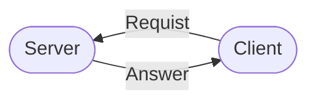
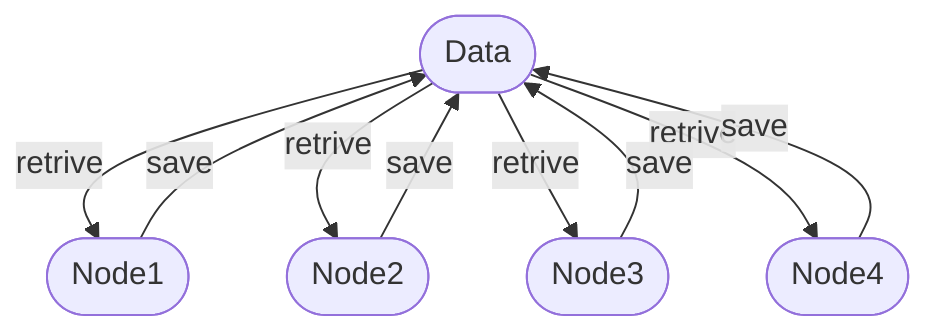
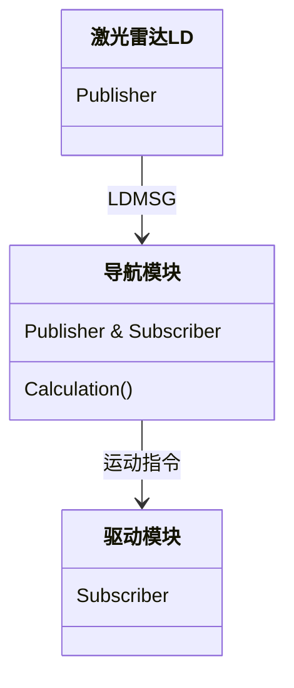
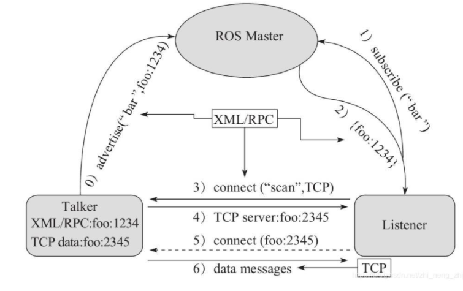
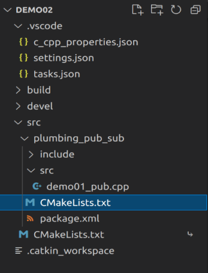
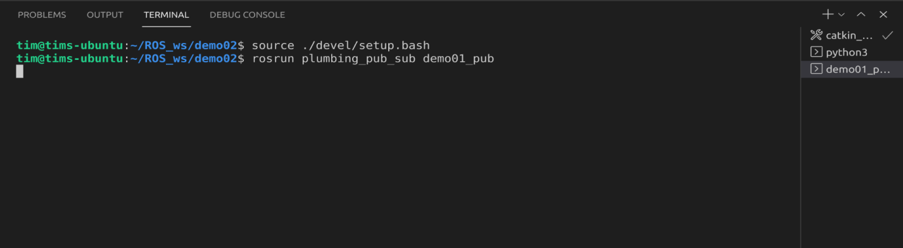
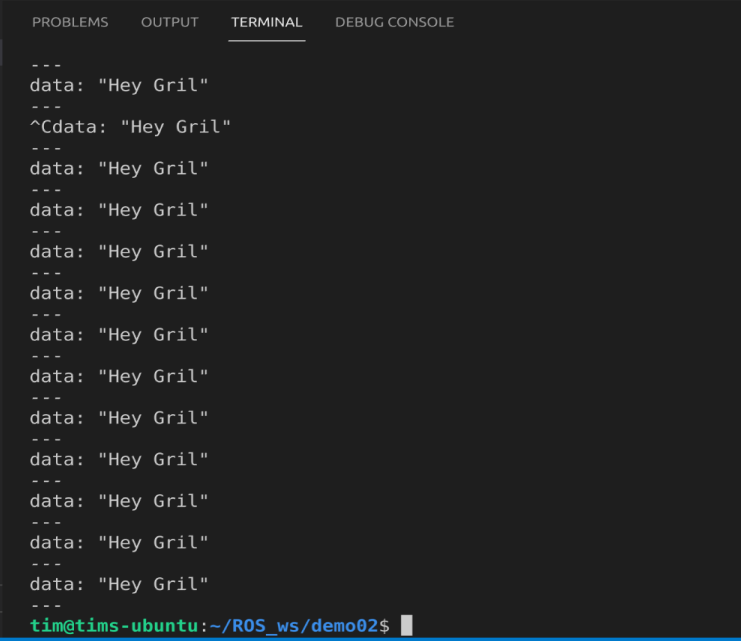
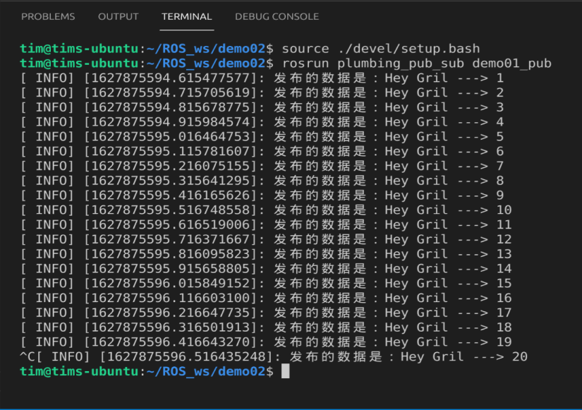
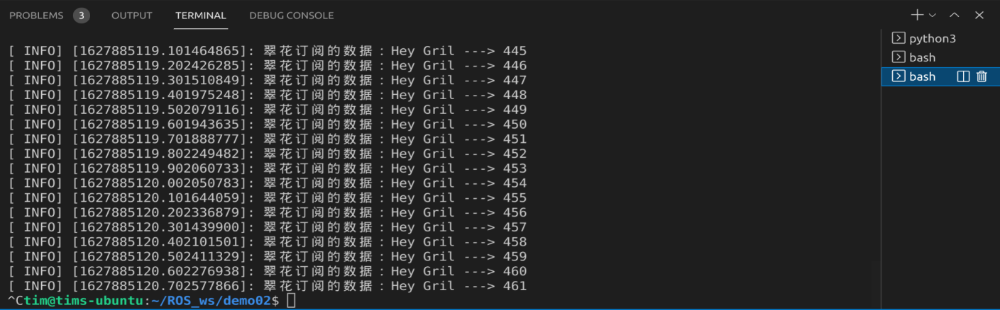
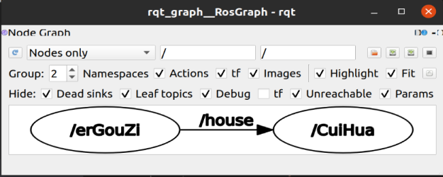

# 第二章 ROS的通信机制（重点）

## 第零节 导论
为了解耦合，ROS中的每一个功能点都是一个单独的进程，每一个进程都是独立进行的。更确切的说，ROS是进程（也称为Nodes）的分布式框架。这些进程深圳ihai可以分布于不同的主机，不同主机协同工作，从而分散计算压力。为了实现这个目的，我们需要介绍ROS的通信机制

* 话题通信（发布订阅模式）


* 服务通信（请求响应模式）


* 参数服务器（参数共享模式）


## 第一节 话题通信
话题通讯是使用频率最高的一种通信模式。以发布订阅方式实现不同节点之间数据交互的通信模式。

### 1.1 应用场景
机器人在执行导航功能时，使用激光雷达作为传感器。机器人会采集激光雷达感知到的信息并进行计算，然后生成运动控制信息驱动机器人底盘运动。



话题通信适用于不断更新，少逻辑处理的数据传输相关的应用场景。

### 1.2 话题通信理论模型：

话题通信实现模型是比较复杂的，该模型如下图所示,该模型中涉及到三个角色:

* ROS Master (管理者)：管理和匹配话题
* Talker (发布者)：
* Listener (订阅者)

其主要流程如下：
1. Talker 向 ROS Master 提交话题和RPC地址；
1. Listener 向 ROS Master 订阅话题；
1. ROS Master 将 Talker 的RPC地址传给 Listener；
1. Listener 通过 RPC 地址与 Talker 通讯；
2. Talker 将其 TCP 地址传给 Listener；
3. Talker 和 Listener 成功建立通信；
4. Talker 将 数据信息发送给 Listener。

注意：
1. 步骤0和步骤1没有顺序关系；
2. Talker 和 Listener 都可以存在多个；
3. Talker 和 Listener 建立连接后， Master 就可以关闭了；
4. 上述流程已经封装了，可以直接调用。

使用时须知：
1. 设置话题；
2. 关注发布者实现；
3. 关注订阅者实现；
4. 关注消息载体。

### 1.3 案例
编写发布订阅实现，要求发布方以10HZ(每秒10次)的频率发布文本消息，订阅方订阅消息并将消息内容打印输出。

首先在创建工作空间，`catkin_make`编译，打开 vscode，创建ROS功能包。

进入功能包的`src`，创建一个cpp文件。


#### 1.3.1 编写发布者节点
编写发布者`node`，不过在写代码之前，先修改`c_cpp_properties.json`文件，这样我们写代码的时候才会有提示。
```cpp
#include "ros/ros.h"
#include "std_msgs/String.h"

/*
    发布方实现：
        1. 包含头文件；
           ROS中的文本类型 ---> std_msgs/String.h
        2. 初始化 ROS 节点；
        3. 创建节点句柄；
        4. 创建发布者对象；
        5. 编写发布逻辑并发布数据。
*/
int main(int argc, char *argv[])
{
     //   2. 初始化 ROS 节点；
    ros::init(argc,argv,"erGouZi");
    // 3. 创建节点句柄；
    ros::NodeHandle ad;
    // 4. 创建发布者对象；
    ros::Publisher pub = ad.advertise<std_msgs::String>      ("house", 10);
    //                               ^泛型(被发布消息的类型） ^消息名称 ^ 队列长度
    // 5. 编写发布逻辑并发布数据。
    // 创建被发布的消息：
    std_msgs::String msg;
    // 编写一个循环，循环中发布数据:
    while (ros::ok())
    //      ^直到节点不存在
    {
        msg.data = "Hey girl";
        pub.publish(msg);
    }
    
    return 0;
}
```

**注意：** 我们的头文件除了`ros.h`还有一个`std_msgs/String.h`，这个头文件是 ROS 封装好帮助我们发布文本类数据的库。

然后我们试着编译一下，编译之前，记得修改`CMakeLists.txt`和`tasks.json`文件。

运行文件:


运行结果是啥也没有，这是因为我们没有编写任何输出，也没有编写接收数据。要测试节点是否发布了消息，我们可以使用`rostopic`来查看话题内容，比如我这里使用的是：
```
rostopic echo house
```
结果为：


但我们之前的任务还没有完成，下面我们再补充一下代码，打印10HZ，打印次数的需求：
```cpp
#include "ros/ros.h"
#include "std_msgs/String.h"
#include "sstream"

/*
    发布方实现：
        1. 包含头文件；
           ROS中的文本类型 ---> std_msgs/String.h
        2. 初始化 ROS 节点；
        3. 创建节点句柄；
        4. 创建发布者对象；
        5. 编写发布逻辑并发布数据。
*/
int main(int argc, char *argv[])
{
    // 避免输出是中文是乱码
    setlocale(LC_ALL,"");
    // 2. 初始化 ROS 节点；
    ros::init(argc,argv,"erGouZi");
    // 3. 创建节点句柄；
    ros::NodeHandle ad;
    // 4. 创建发布者对象；
    ros::Publisher pub = ad.advertise<std_msgs::String>      ("house", 10);
    //                               ^泛型(被发布消息的类型） ^消息名称 ^ 队列长度
    // 5. 编写发布逻辑并发布数据。
    // 要求以10HZ的频率发布数据，并且文本后要添加编号
    // 创建被发布的消息：
    std_msgs::String msg;
    // 设置频率
    ros::Rate rate(10);
    // 设置编号
    int count = 0;
    // 编写一个循环，循环中发布数据:
    while (ros::ok())
    //      ^直到节点不存在
    {
        count++;
        // 实现字符串拼接数字
        std::stringstream ss;
        ss << "Hey Gril ---> " << count;
        msg.data = ss.str();
        //              ^ 将ss变量转换成string类型
        pub.publish(msg);
        //添加日志：
        ROS_INFO("发布的数据是：%s",ss.str().c_str());
        // 设计间隔时间
        rate.sleep();
    }
    
    return 0;
}
```
输出结果为：


到此为止，我们已经完成发布者节点的所有内容，并且使用`ROS_INFO`打印出了消息的内容。
接下来，我们来完成订阅方的实现：

#### 1.3.1 编写订阅者节点

订阅方的写法与发布方的写法相似，不同点在于第二步，创建节点名称时需要与发布方不同（若是相同则会将第一次打开的节点终结）。然后是第四步，我们需要使用订阅相关的函数。

此外，订阅需要我们创建一个子函数，帮我们打印出订阅的数据。具体的实现方式如下：
```cpp
#include <ros/ros.h>
#include <std_msgs/String.h>

/*
    订阅方实现：
        1. 包含头文件；
           ROS中的文本类型 ---> std_msgs/String.h
        2. 初始化 ROS 节点；
        3. 创建节点句柄；
        4. 创建订阅者对象；
        5. 处理订阅到的数据。
        6. spin()函数
*/
void receiveMsg(const std_msgs::String::ConstPtr &msg)
{
    //通过msg获取并操作订阅到的数据
    ROS_INFO("翠花订阅的数据：%s",msg->data.c_str());
}

int main(int argc, char *argv[])
{
    setlocale(LC_ALL,"");
    //     2. 初始化 ROS 节点；
    ros::init(argc,argv,"CuiHua");
    //     3. 创建节点句柄；
    ros::NodeHandle ad;
    //     4. 创建订阅者对象；
    ros::Subscriber sub = ad.subscribe("house",10,receiveMsg);
    //     5. 处理订阅到的数据。

    ros::spin();

    return 0;
}
```

代码编写完成后再次修改`CMakeList.txt`：
```
add_executable(Hello_pub
  src/Hello_pub.cpp
)
add_executable(Hello_sub
  src/Hello_sub.cpp
)

target_link_libraries(Hello_pub
  ${catkin_LIBRARIES}
)
target_link_libraries(Hello_sub
  ${catkin_LIBRARIES}
)
```

运行程序，结果如下：


### 1.4 补充
#### 1.4.1 订阅者数据丢失
订阅的时候，即使我们先打开订阅者，后打开发布者，依然会出现数据丢失的情况。这是因为在发送第一条数据的时候，`publisher`未还在`roscore`注册完毕。
解决方法是：注册后，加入休眠`ros::Duration(3.0).sleep();`延迟第一条数据的发送。 

#### 1.4.2 rqt图
使用命令`rqt_graph`，可以查看运行中的节点图片。



