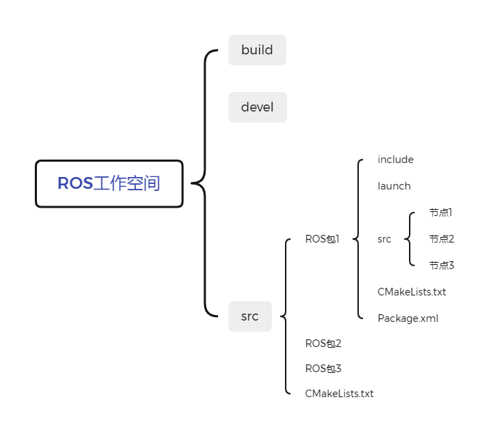
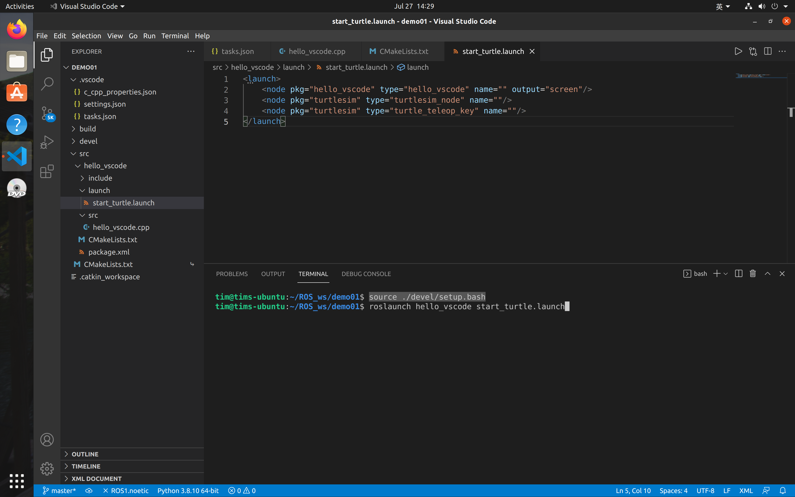
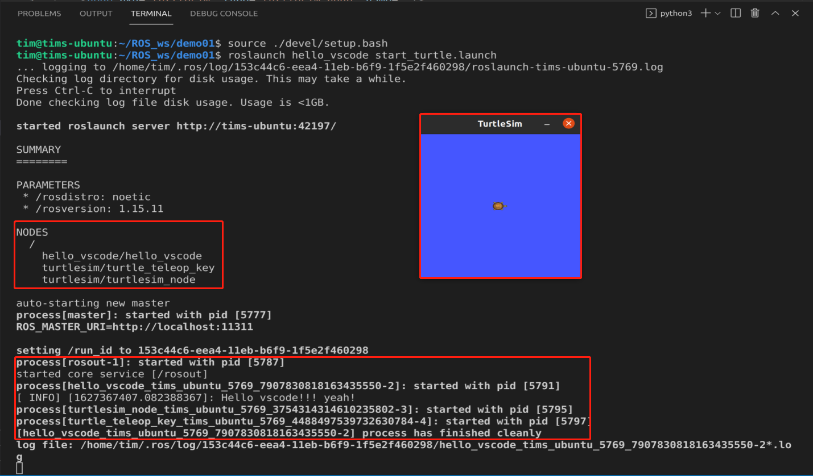

# launch文件的编写

一般大型项目需要一次性启动多个节点，一个一个的启动过于麻烦了，launch文件的用处是可以使我们一次性启动多个节点。

## 一个ROS工作空间里的内容


launch文件就储存在launch文件夹下面

## launch文件的格式
`luanch`文件是用`xml`写的，但命名的时候需要被叫做`xxx.launch`。

其一般格式如下：

```xml
<launch>
<node pkg="包名" type="节点名" name="为节点名称" output="输出地点"/>
</launch>
```

* node ---> 包含的某个节点

* pkg -----> 功能包

* type ----> 被运行的节点文件

* name --> 为节点命名

* output-> 设置日志的输出目标

其中`name`处如果不写，程序也不会报错，运行的时候编译器会自动给节点命名。我个人习惯直接把`type`后面的节点名复制到`name`。

这里我展示一个例程：
```xml
<launch>
    <node pkg="hello_vscode" type="hello_vscode" name="" output="screen"/>
    <node pkg="turtlesim" type="turtlesim_node" name=""/>
    <node pkg="turtlesim" type="turtle_teleop_key" name=""/>
</launch>
```

## 启动launch文件
通过下面的代码启动launch文件：
```
roslaunch 包名 xxx.launch
```

例如我上面展示的那个例程的启动指令为：
```
source ./devel/setup.bash
roslaunch hello_vscode start_turtle.launch
```


out:


process的[ ]中的内容很多，是因为我`name`后面是空的，这个名称是系统自动命名的结果，如果我们自己命名了，这里就会显示我们命名的节点名称。这可以方便我们看launch过程中有哪些节点扑街了。（大型项目中的节点经常扑街，从GitHub上下载一个项目跑跑全是error）。
