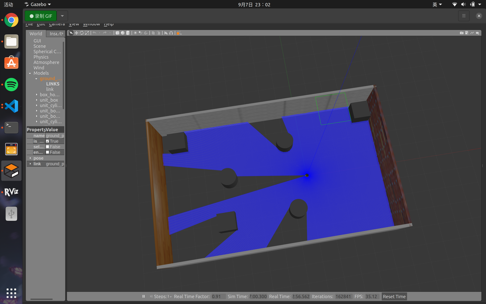
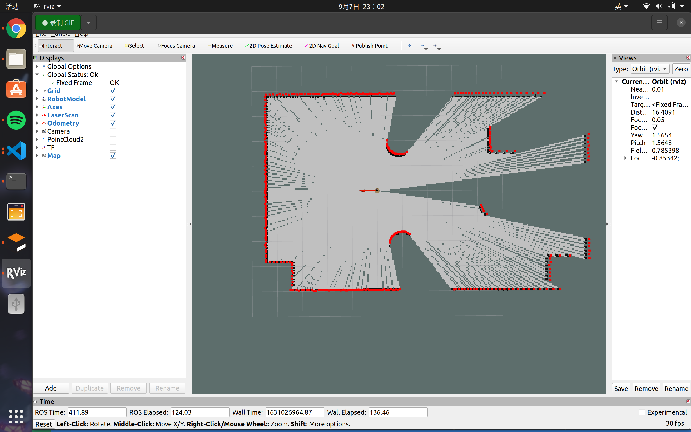
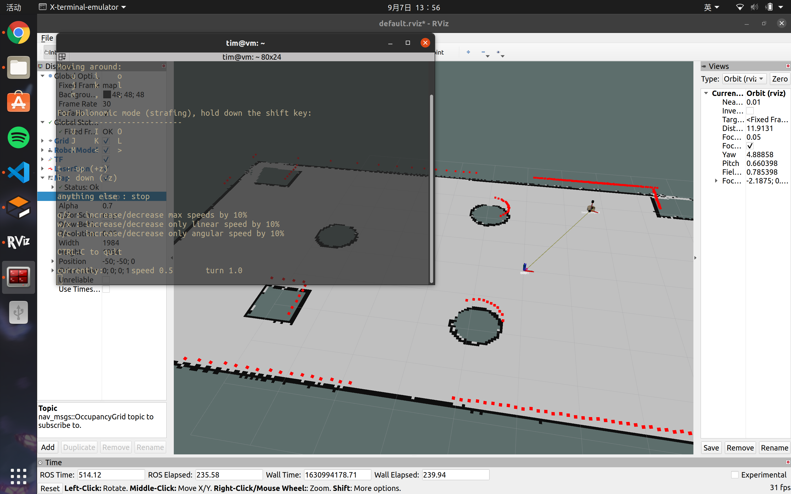
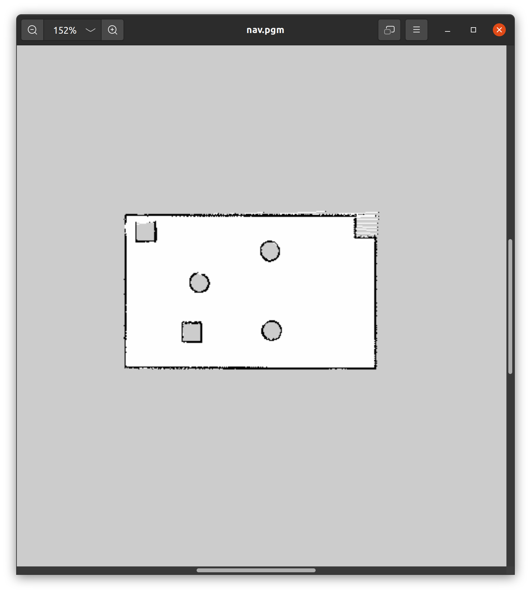
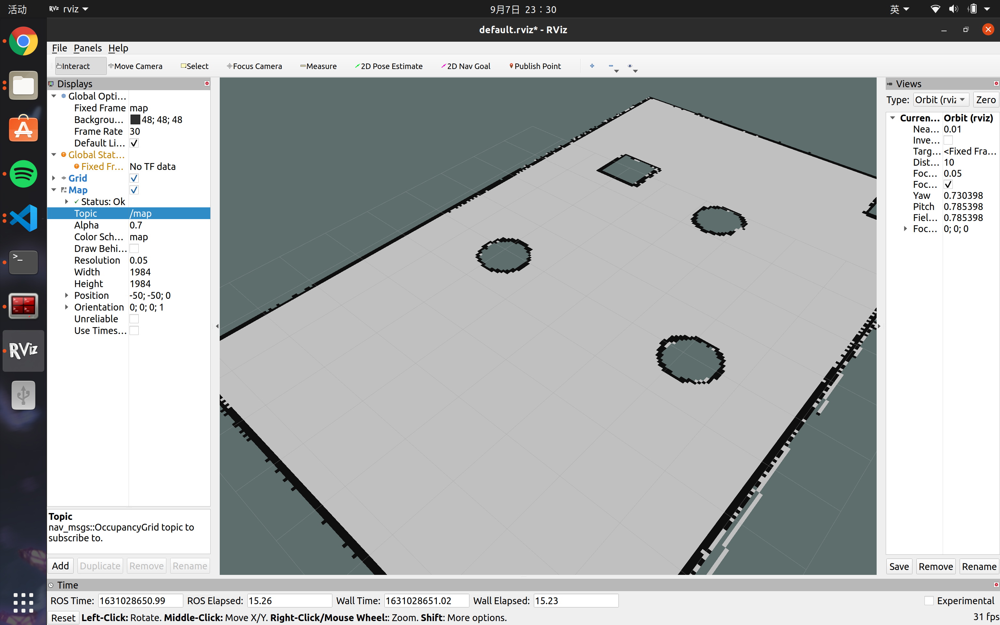

# 基于 ROS 的机器人学习日志 -- 20

# 第九章 导航实现

导航其实是一个很大，很难的话题。但由于目前只是第一次接触，所以将一切都简化，仅仅使用 ROS 里内置的一些功能包来做导航。有关导航的概念性内容，以及具体的算法之类的内容，我将会新建一个专栏单独介绍，这里只记载一下导航功能的实操。

## 第一节 建图、地图服务器

可通过以下链接下载该项目的工程文件：

[我的github仓库](https://github.com/Alexbeast-CN/My_ROS_WS4Study/tree/main/ROS_ws/demo04 "card")

**准备工作：**

需要提前安装与 SLAM 和 地图 相关的功能包。

* 安装 gmapping 包(用于构建地图):`sudo apt install ros-<ROS版本>-gmapping`
* 安装地图服务包(用于保存与读取地图):`sudo apt install ros-<ROS版本>-map-server`
* 安装 navigation 包(用于定位以及路径规划):`sudo apt install ros-<ROS版本>-navigation`

**创建功能包：**

导航功能包所需的依赖为：

```
gmapping map_server amcl move_base
```

**建图节点**

首先创建一个`launch`文件，用于开启地图节点。

文件内容为直接从 `ROS` 官方的 `PR2` 机器人的 `slam` 实现复制而来：

```xml
<launch>
    <param name="use_sim_time" value="true"/>
        <node pkg="gmapping" type="slam_gmapping" name="slam_gmapping" output="screen">
          <remap from="scan" to="scan"/>
          <param name="base_frame" value="base_footprint"/><!--底盘坐标系-->
          <param name="odom_frame" value="odom"/> <!--里程计坐标系-->
          <param name="map_update_interval" value="5.0"/>
          <param name="maxUrange" value="16.0"/>
          <param name="sigma" value="0.05"/>
          <param name="kernelSize" value="1"/>
          <param name="lstep" value="0.05"/>
          <param name="astep" value="0.05"/>
          <param name="iterations" value="5"/>
          <param name="lsigma" value="0.075"/>
          <param name="ogain" value="3.0"/>
          <param name="lskip" value="0"/>
          <param name="srr" value="0.1"/>
          <param name="srt" value="0.2"/>
          <param name="str" value="0.1"/>
          <param name="stt" value="0.2"/>
          <param name="linearUpdate" value="1.0"/>
          <param name="angularUpdate" value="0.5"/>
          <param name="temporalUpdate" value="3.0"/>
          <param name="resampleThreshold" value="0.5"/>
          <param name="particles" value="30"/>
          <param name="xmin" value="-50.0"/>
          <param name="ymin" value="-50.0"/>
          <param name="xmax" value="50.0"/>
          <param name="ymax" value="50.0"/>
          <param name="delta" value="0.05"/>
          <param name="llsamplerange" value="0.01"/>
          <param name="llsamplestep" value="0.01"/>
          <param name="lasamplerange" value="0.005"/>
          <param name="lasamplestep" value="0.005"/>
        </node>
    
        <node 
          pkg="joint_state_publisher" 
          name="joint_state_publisher" 
          type="joint_state_publisher" />

        <node 
          pkg="robot_state_publisher" 
          name="robot_state_publisher" 
          type="robot_state_publisher" />
    
        <node 
          pkg="rviz" 
          type="rviz" 
          name="rviz" 
          args="-d $(find urdf01_rviz)/config/show_urdf.rviz"/>
        <!-- 可以保存 rviz 配置并后期直接使用-->
        <!--
        <node pkg="rviz" type="rviz" name="rviz" args="-d $(find my_nav_sum)/rviz/gmapping.rviz"/>
        -->
    </launch>
```

`gmapping`节点中存在大量的参数，这些参数可以在 `ROS` 的[官方文档](http://wiki.ros.org/gmapping)中找到说明。

**使用**

首先需要启动一个可以在`gazebo`中激光雷达的机器人模型`launch`文件。



然后启动上面的`gmapping` `launch`。

然后添加`robot model`，`laser scan`，`map`，`TF`等类型的消息。



最后启动一个`teleop_twist_keyboard`节点来控制机器人运动。




通过以上操作，我们可以看到一个机器人通过`gmapping`探索出来的地图。

**地图保存**

ROS 中为地图提供了一个`map_server`功能包，使用此功能包中的`map_saver`功能就能将地图保存。

比如：

```
rosrun map_server map_saver -f 文件路径/文件名
```

当然，这个指令也可以写入到一个`launch`文件

**地图文件**

保存好的地图文件会有两个，一个是`.pgm`文件，另一个是`.yaml`文件。

`.pgm`文件就是一张图片，而`.yaml`文件是配置文件。其代码详解如下：

```yaml
# 声明地图图片资源的路径
image: /home/tim/My_ROS/My_ROS_WS4Study/ROS_ws/demo04/src/nav_demo/map/nav.pgm
# 图片的分辨率，单位是 （米/像素）
resolution: 0.050000
# 地图的位姿信息（相对于rviz中的原点的位姿）
# 按照右手坐标系，地图右下角相对于rviz中的原点的位姿
# 值1： x方向的偏移量
# 值2： y方向的偏移量
# 值3： 地图的偏航角度（单位是弧度）
origin: [-50.000000, -50.000000, 0.000000]

# 地图中的障碍物判断：
# 最终地图结果：白色是可通行区，黑色是障碍物，蓝灰三未知区域
# 判断规则：
# 1. 地图中的每个像素都有取值【0，255】 白色：255 黑色：0
# 2. 根据像素值计算一个比例： p = (255-x)/255 白色: 0 黑色: 1 灰色介于 0 - 1 之间
# 3. 判断是否是障碍物，如果: 
#     p > occupied_thresh 则是障碍物
#     p < free_thresh 则是可通行区域

# 是否取反（取反后黑白颠倒）
negate: 0
# 占用阈值（地图上白色的部分）
occupied_thresh: 0.65
# 空闲阈值（地图上黑色的部分）
free_thresh: 0.196
```

**导入地图**

一般我们来说，地图都是由`map_server`服务器来处理的。因此我们所说的导入地图，也是导入到`map_server`中。

具体实现可以通过一个`launch`文件是实现：

```xml
<launch>

    <arg
        name = "map"
        default="nav.yaml"/>

    <node
        pkg="map_server"
        type="map_server"
        name="map_server"
        args="$(find nav_demo)/map/$(arg map)"/>
</launch>
```

然后再打开一个`rviz`添加一个`map`就可以看到地图了。




