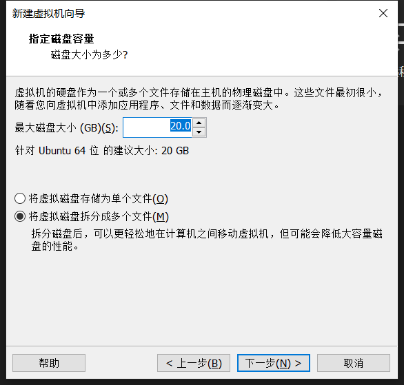

#! https://zhuanlan.zhihu.com/p/407109082
# 使用虚拟机创建 ubuntu 启动盘

> 1. 解决 gazebo 在虚拟机里运行时卡的问题
> 2. 别人写的实在不太行，只好自己写

## 1. 准备

* 下载虚拟机
* 下载 ubuntu.io

首先虚拟机，我使用的是 `VMwares Workstation`，直接从[VMwares官网](https://www.vmware.com/cn/products/workstation-pro/workstation-pro-evaluation.html)下载正版，输入激活码（需要的可以私我）。

下载 [ubuntu](https://cn.ubuntu.com/download/desktop)，我选择的是 20.04 LTS。

## 2. 创建 ubuntu 虚拟机

打开 `VMware`，点击创建新的虚拟机

选择经典 -> 下一步

稍后安装 -> 下一步

Linux -> ubuntu 64 位 -> 下一步

选一个安装位置 -> 下一步

默认 -> 下一步

自定义硬件 -> 下一步

CD/DVD -> 使用 ISO 镜像 -> 浏览 （找到刚刚下载的 ubuntu 镜像）

USB控制器 -> USB 兼容性 -> USB 3.1 -> 关闭 -> 完成

查看电脑的启动方式，使用快捷键`win` + `R`输入`msinfo32`

>我的启动方式为 `UEFI`，如果是 `BOIS` 的同学可以退出了，下面的方法都基于`UEFI`。

编辑虚拟机设置 -> 下一步

选项 -> 高级 -> UEFI -> 确定 -> 开启虚拟机

## 3. 制作启动盘

### 3.1 设置硬盘分区

登录 ubuntu

选择语言 -> try ubuntu

在桌面右键调节一下分辨率

插入 U 盘

VM 会截获这个u盘，并问你这个 u 盘要连接到哪个设备。选择虚拟机 -> ubuntu64 -> 确定

点击左下角的9个点，找到 `GParted`

选择自己的 u 盘 `(dev/sdb)`

在未分配的地方右键 -> 新建 -> 新大小 -> 文件格式

共要创建 3 个分区（如果磁盘比较大，可以创建一个ntfs，当作普通的 u 盘使用），格式和大小分别如图：

点击绿色勾勾 -> 关闭

### 3.2 安装 ubuntu

回到桌面，点击图标 `安装 ubuntu`

语言 -> 继续

选择键盘布局 -> 继续

默认就可以 -> 继续

其他选项 -> 继续

在这里为移动硬盘设置分区：

右键更改 -> 用于（格式）-> 挂载点（有的没有）

将刚才创建的3个分区分别设置为下图样式，并且设置启动引导设备为`sdb1`（忽略ntfs）：

然后点击现在安装

选择区域，我在华东所以选择上海 -> 继续

用户设置 -> 继续

开始安装，慢慢等待，安装完成后启动盘就做好了。

## 4. 进入 ubuntu

在插入 u盘的状态下启动电脑。上网查一下自己的电脑怎么进入 `bios`

进去后选择 ubuntu 再回车就能进入了。
