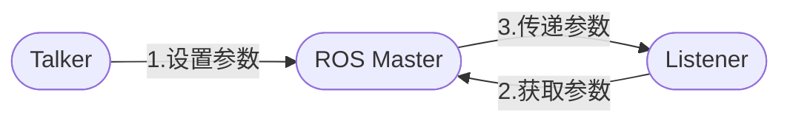

# ROS学习笔记 

> 前言：
> 本学习笔记基于赵虚左老师的教程资源在下方列表

* [赵老师B站视频连接](https://www.bilibili.com/video/BV1Ci4y1L7ZZ?from=search&seid=12959207388855423868)
* [讲义文稿](http://www.autolabor.com.cn/book/ROSTutorials/)
* [硬件购买](http://www.autolabor.com.cn/)
* [我个人在github上 上传的笔记](https://github.com/Alexbeast-CN/Notes2ROS)

---
## 目录： 
- [ROS学习笔记](#ros学习笔记)
  - [目录：](#目录)
- [第一章 ROS概述](#第一章-ros概述)
  - [第一节 我的第一个ROS程序](#第一节-我的第一个ros程序)
    - [1. 创建一个ROS工作空间:](#1-创建一个ros工作空间)
    - [2. 创建 ROS 包](#2-创建-ros-包)
    - [3. 写一个 Hello World 程序](#3-写一个-hello-world-程序)
    - [4. 编辑 Cmakelist.txt 文件](#4-编辑-cmakelisttxt-文件)
    - [5. 编译](#5-编译)
    - [6. 执行](#6-执行)
  - [第二节 Code in VSCode](#第二节-code-in-vscode)
    - [2.1 下载 vscode](#21-下载-vscode)
    - [2.2 搭建 ROS 的开发环境](#22-搭建-ros-的开发环境)
    - [2.3 开始写cpp程序](#23-开始写cpp程序)
  - [第三节 launch文件的编写](#第三节-launch文件的编写)
    - [3.1 一个ROS工作空间里的内容](#31-一个ros工作空间里的内容)
    - [3.2 launch文件的格式](#32-launch文件的格式)
    - [3.3 启动launch文件](#33-启动launch文件)
- [第二章 ROS的通信机制（重点）](#第二章-ros的通信机制重点)
  - [第零节 导论](#第零节-导论)
  - [第一节 话题通信](#第一节-话题通信)
    - [1.1 应用场景](#11-应用场景)
    - [1.2 话题通信理论模型：](#12-话题通信理论模型)
    - [1.3 案例](#13-案例)
      - [1.3.1 编写发布者节点](#131-编写发布者节点)
      - [1.3.1 编写订阅者节点](#131-编写订阅者节点)
    - [1.4 补充](#14-补充)
      - [1.4.1 订阅者数据丢失](#141-订阅者数据丢失)
      - [1.4.2 rqt图](#142-rqt图)
    - [1.5 话题通讯自定义 msg](#15-话题通讯自定义-msg)
      - [1.5.1 自定义 msg 文件](#151-自定义-msg-文件)
      - [1.5.3 创建可以被调用的 msg 文件](#153-创建可以被调用的-msg-文件)
      - [1.5.4 案例 2](#154-案例-2)
  - [第二节 服务通信](#第二节-服务通信)
    - [2.2.1 理论模型](#221-理论模型)
    - [2.2.2 一个案例](#222-一个案例)
    - [2.2.3 编写 srv 文件](#223-编写-srv-文件)
    - [2.2.4 编写服务端节点](#224-编写服务端节点)
    - [2.2.5 编写客户端节点](#225-编写客户端节点)
    - [2.2.5 优化客户端节点](#225-优化客户端节点)
  - [第三节 参数服务器](#第三节-参数服务器)
    - [2.3.1 参数服务器理论模型](#231-参数服务器理论模型)
    - [2.2.2 一个案例](#222-一个案例-1)
    - [2.2.3 添加和修改](#223-添加和修改)
    - [2.2.4 查询](#224-查询)
    - [2.2.5 删除](#225-删除)
  - [第四节 小海龟控制器](#第四节-小海龟控制器)
    - [4.1 生成多只海龟](#41-生成多只海龟)
    - [4.2 控制海龟画圆](#42-控制海龟画圆)
    - [4.3 创建一个launch file](#43-创建一个launch-file)
---

# 第一章 ROS概述
## 第一节 我的第一个ROS程序
### 1. 创建一个ROS工作空间:
直接在终端使用以下代码,在自定义空间名称处我使用的是ROS_ws

```
mkdir -p 自定义空间名称/src
cd 自定义空间名称
catkin_make
```

之后我们点击左边的文件夹，进入到home，就可以看到我们刚刚创建的 ROS_ws文件夹。


在此文件夹下面我们又可以看到由`catkin_make`创建的3个文件夹。


### 2. 创建 ROS 包
进入src中，右键在终端中打开，然后输入以下指令：
```
catkin_create_pkg 自定义ROS包名 roscpp rospy std_msgs

```
上述命令，会在工作空间下生成一个功能包，该功能包依赖于 roscpp、rospy 与 std_msgs，其中roscpp是使用C++实现的库，而rospy则是使用python实现的库，std_msgs是标准消息库，创建ROS功能包时，一般都会依赖这三个库实现。

由于我们本次的程序就是使用ros输出一个hello world，所以我在自定义ROS包名出命名为：hello_world

这时我们会看到在文件夹中，出现了下面的两个文件：


### 3. 写一个 Hello World 程序
然后我们进入hello_world中，在hello_world的src中右键创建一个文本文件，重命名为：hello_world.cpp

打开hello_world.cpp，在其中输入以下代码后保存文件。
``` cpp
#include "ros/ros.h"

int main(int argc, char *argv[])
{
    //执行 ros 节点初始化
    ros::init(argc,argv,"hello");
    //创建 ros 节点句柄(非必须)
    ros::NodeHandle n;
    //控制台输出 hello world
    ROS_INFO("hello world!");

    return 0;
}
```

### 4. 编辑 Cmakelist.txt 文件
然后退回到上一级文件目录，打开CMakeLists.txt文件，找到第136和第149-151行。其内容为：

```
add_executable(任意名称
  src/步骤3的源文件名.cpp
)
target_link_libraries(任意名称
  ${catkin_LIBRARIES}
)
```
删除#号键，取消注释，并成以下内容，任意名称处我使用的是haha。

```
## Declare a C++ executable
## With catkin_make all packages are built within a single CMake context
## The recommended prefix ensures that target names across packages don't collide
 add_executable(haha src/hello_world.cpp)

## Rename C++ executable without prefix
## The above recommended prefix causes long target names, the following renames the
## target back to the shorter version for ease of user use
## e.g. "rosrun someones_pkg node" instead of "rosrun someones_pkg someones_pkg_node"
# set_target_properties(${PROJECT_NAME}_node PROPERTIES OUTPUT_NAME node PREFIX "")

## Add cmake target dependencies of the executable
## same as for the library above
# add_dependencies(${PROJECT_NAME}_node ${${PROJECT_NAME}_EXPORTED_TARGETS} ${catkin_EXPORTED_TARGETS})

## Specify libraries to link a library or executable target against
 target_link_libraries(haha
   ${catkin_LIBRARIES}
 )

 ```


### 5. 编译
进入工作空间

``` 
cd 自定义的空间名称
catkin_make
```

生成 `build devel`

### 6. 执行

首先我们需要打开一个ROS Master：
在终端输入：

```
roscore
```

然后`ctrl`+`alt`+`t`打开另外一个终端，输入：

```
cd 工作空间
source ./devel/setup.bash
rosrun 包名 C++节点
```

为了省事，在终端输入：
```
echo "source ~/工作空间/devel/setup.bash" >> ~/.bashrc
```
下一次就不用再输入`source ./devel/setup.bash`

结果如下：


## 第二节 Code in VSCode

### 2.1 下载 vscode
下载vscode的方式有很多种，其中比较简单是直接从ubuntu software里下载


如果在ubuntu software中找不到vscode，可以从官网下载.deb包。


下载好后，在`.deb`包所在的目录处，打开终端输入:


```
$ sudo dpkg -i code_1.58.2-1626302803_amd64.deb
```

之后就可以在应用里看到vscode了，右键可以将其添加到左边的收藏夹。


### 2.2 搭建 ROS 的开发环境
进入VSCode后可以下载如图所示的一些插件。


其中Jupyter 和 Pylance 非必须。

有了插件后还需要修改配置文件，但在这之前我们先创建一个工作空间。

```
mkdir -p xxx_ws/src
cd xxx_ws
catkin_make
```


完成后再使用
```
code .
```
打开vscode

然后我们可以在src处右键 创建一个catkin的包


随后两步是命名和创建包的依赖


包的依赖就是上一节讲的` roscpp`, `rospy`, `std_msgs`。

这时会生成一个`.xml`文件，其中包含了我们刚刚创建的包的信息。

然后我们使用快捷键`ctrl`+`shift`+`b`，点击catkin_make:build 后面的齿轮，进入配置文件。


初始的配置文件如图：


我们需要把它替换为其他的代码：

```json
{
// 有关 tasks.json 格式的文档，请参见
    // https://go.microsoft.com/fwlink/?LinkId=733558
    "version": "2.0.0",
    "tasks": [
        {
            "label": "catkin_make:debug", //代表提示的描述性信息
            "type": "shell",  //可以选择shell或者process,如果是shell代码是在shell里面运行一个命令，如果是process代表作为一个进程来运行
            "command": "catkin_make",//这个是我们需要运行的命令
            "args": [],//如果需要在命令后面加一些后缀，可以写在这里，比如-DCATKIN_WHITELIST_PACKAGES=“pac1;pac2”
            "group": {"kind":"build","isDefault":true},
            "presentation": {
                "reveal": "always"//可选always或者silence，代表是否输出信息
            },
            "problemMatcher": "$msCompile"
        }
    ]
}
```

然后我们再使用快捷键`ctrl`+`shift`+`b`编译一下我们刚刚创建的包，出现以下结果则创建成功，这也意味这我们的ROS环境搭建成功。


如果报错了也不要慌，那可能是我们的依赖写错了，正确的3个依赖名称是:`rospy`, `roscpp`, `std_msgs`。我们只需要将`CMakeLists.txt`和`package.xml`文件中的全部错误依赖名称修改为正确的就可以了。

### 2.3 开始写cpp程序
在src下创建一个叫`hello_vscode.cpp`的文件。写入一个输出代码：
```cpp
#include "ros/ros.h"

int main(int argc, char *argv[])
{
    // 初始化ros
    ros::init(argc,argv,"hello");
    // 输出信息
    ROS_INFO("Hello_vscode");
    return 0;
}
```
在写的过程中我们会发现，在写与`ros`有关的代码的时候，编辑器并不会出现提示，这是因为我们选择的编译器有点老了，我们需要在修改`.vscode`文件夹中的`c_cpp_properties.json`文件。修改或添加`"cppStandard": "c++20"`就可以了。


此时，我们再编写就会出现提示了。

代码写好后，我们还需要修改`CMakeLists.txt`文件。方法和之前一样，但多了我们可以使用快捷键`ctrl`+`/`来取消`#`注释了。

```
add_executable(任意名称
  src/步骤3的源文件名.cpp
)
target_link_libraries(任意名称
  ${catkin_LIBRARIES}
)
```


然后我们用`ctrl`+`shift`+`b`编译文件。如图所示就是成功了。


然后，我们可以在vscode中之间使用快捷键`ctrl`+`shift`+`~`新建终端，vscode中的终端与我们在ubuntu系统中创建的终端使用相同。
现开一个ros master:
```
roscore
```
然后`source`我们的包：
```
source ./devel/setup.bash 
```
最后`rosrun`：
```
rosrun 包名 节点名
```
out：
```
[ INFO] [1627223101.571287843]: Hello_vscode
```


## 第三节 launch文件的编写

一般大型项目需要一次性启动多个节点，一个一个的启动过于麻烦了，launch文件的用处是可以使我们一次性启动多个节点。

### 3.1 一个ROS工作空间里的内容


launch文件就储存在launch文件夹下面

### 3.2 launch文件的格式
`luanch`文件是用`xml`写的，但命名的时候需要被叫做`xxx.launch`。

其一般格式如下：

```xml
<launch>
<node pkg="包名" type="节点名" name="为节点名称" output="输出地点"/>
</launch>
```

* node ---> 包含的某个节点

* pkg -----> 功能包

* type ----> 被运行的节点文件

* name --> 为节点命名

* output-> 设置日志的输出目标

其中`name`处如果不写，程序也不会报错，运行的时候编译器会自动给节点命名。我个人习惯直接把`type`后面的节点名复制到`name`。

这里我展示一个例程：
```xml
<launch>
    <node pkg="hello_vscode" type="hello_vscode" name="" output="screen"/>
    <node pkg="turtlesim" type="turtlesim_node" name=""/>
    <node pkg="turtlesim" type="turtle_teleop_key" name=""/>
</launch>
```

### 3.3 启动launch文件
通过下面的代码启动launch文件：
```
roslaunch 包名 xxx.launch
```

例如我上面展示的那个例程的启动指令为：
```
source ./devel/setup.bash
roslaunch hello_vscode start_turtle.launch
```


out:


process的[ ]中的内容很多，是因为我`name`后面是空的，这个名称是系统自动命名的结果，如果我们自己命名了，这里就会显示我们命名的节点名称。这可以方便我们看launch过程中有哪些节点扑街了。（大型项目中的节点经常扑街，从GitHub上下载一个项目跑跑全是error）。

# 第二章 ROS的通信机制（重点）

## 第零节 导论
为了解耦合，ROS中的每一个功能点都是一个单独的进程，每一个进程都是独立进行的。更确切的说，ROS是进程（也称为Nodes）的分布式框架。这些进程深圳ihai可以分布于不同的主机，不同主机协同工作，从而分散计算压力。为了实现这个目的，我们需要介绍ROS的通信机制

* 话题通信（发布订阅模式）
  


* 服务通信（请求响应模式）
  


* 参数服务器（参数共享模式）
  


## 第一节 话题通信
话题通讯是使用频率最高的一种通信模式。以发布订阅方式实现不同节点之间数据交互的通信模式。

### 1.1 应用场景
机器人在执行导航功能时，使用激光雷达作为传感器。机器人会采集激光雷达感知到的信息并进行计算，然后生成运动控制信息驱动机器人底盘运动。


话题通信适用于不断更新，少逻辑处理的数据传输相关的应用场景。

### 1.2 话题通信理论模型：


话题通信实现模型是比较复杂的，该模型如下图所示,该模型中涉及到三个角色:

* ROS Master (管理者)：管理和匹配话题
* Talker (发布者)：
* Listener (订阅者)

其主要流程如下：
1. Talker 向 ROS Master 提交话题和RPC地址；
1. Listener 向 ROS Master 订阅话题；
1. ROS Master 将 Talker 的RPC地址传给 Listener；
1. Listener 通过 RPC 地址与 Talker 通讯；
2. Talker 将其 TCP 地址传给 Listener；
3. Talker 和 Listener 成功建立通信；
4. Talker 将 数据信息发送给 Listener。

注意：
1. 步骤0和步骤1没有顺序关系；
2. Talker 和 Listener 都可以存在多个；
3. Talker 和 Listener 建立连接后， Master 就可以关闭了；
4. 上述流程已经封装了，可以直接调用。

使用时须知：
1. 设置话题；
2. 关注发布者实现；
3. 关注订阅者实现；
4. 关注消息载体。

### 1.3 案例
编写发布订阅实现，要求发布方以10HZ(每秒10次)的频率发布文本消息，订阅方订阅消息并将消息内容打印输出。

首先在创建工作空间，`catkin_make`编译，打开 vscode，创建ROS功能包。

进入功能包的`src`，创建一个cpp文件。


#### 1.3.1 编写发布者节点
编写发布者`node`，不过在写代码之前，先修改`c_cpp_properties.json`文件，这样我们写代码的时候才会有提示。
```cpp
#include "ros/ros.h"
#include "std_msgs/String.h"

/*
    发布方实现：
        1. 包含头文件；
           ROS中的文本类型 ---> std_msgs/String.h
        2. 初始化 ROS 节点；
        3. 创建节点句柄；
        4. 创建发布者对象；
        5. 编写发布逻辑并发布数据。
*/
int main(int argc, char *argv[])
{
     //   2. 初始化 ROS 节点；
    ros::init(argc,argv,"erGouZi");
    // 3. 创建节点句柄；
    ros::NodeHandle ad;
    // 4. 创建发布者对象；
    ros::Publisher pub = ad.advertise<std_msgs::String>      ("house", 10);
    //                               ^泛型(被发布消息的类型） ^消息名称 ^ 队列长度
    // 5. 编写发布逻辑并发布数据。
    // 创建被发布的消息：
    std_msgs::String msg;
    // 编写一个循环，循环中发布数据:
    while (ros::ok())
    //      ^直到节点不存在
    {
        msg.data = "Hey girl";
        pub.publish(msg);
    }
    
    return 0;
}
```

**注意：** 我们的头文件除了`ros.h`还有一个`std_msgs/String.h`，这个头文件是 ROS 封装好帮助我们发布文本类数据的库。

然后我们试着编译一下，编译之前，记得修改`CMakeLists.txt`和`tasks.json`文件。

运行文件:


运行结果是啥也没有，这是因为我们没有编写任何输出，也没有编写接收数据。要测试节点是否发布了消息，我们可以使用`rostopic`来查看话题内容，比如我这里使用的是：
```
rostopic echo house
```
结果为：


但我们之前的任务还没有完成，下面我们再补充一下代码，打印10HZ，打印次数的需求：
```cpp
#include "ros/ros.h"
#include "std_msgs/String.h"
#include "sstream"

/*
    发布方实现：
        1. 包含头文件；
           ROS中的文本类型 ---> std_msgs/String.h
        2. 初始化 ROS 节点；
        3. 创建节点句柄；
        4. 创建发布者对象；
        5. 编写发布逻辑并发布数据。
*/
int main(int argc, char *argv[])
{
    // 避免输出是中文是乱码
    setlocale(LC_ALL,"");
    // 2. 初始化 ROS 节点；
    ros::init(argc,argv,"erGouZi");
    // 3. 创建节点句柄；
    ros::NodeHandle ad;
    // 4. 创建发布者对象；
    ros::Publisher pub = ad.advertise<std_msgs::String>      ("house", 10);
    //                               ^泛型(被发布消息的类型） ^消息名称 ^ 队列长度
    // 5. 编写发布逻辑并发布数据。
    // 要求以10HZ的频率发布数据，并且文本后要添加编号
    // 创建被发布的消息：
    std_msgs::String msg;
    // 设置频率
    ros::Rate rate(10);
    // 设置编号
    int count = 0;
    // 编写一个循环，循环中发布数据:
    while (ros::ok())
    //      ^直到节点不存在
    {
        count++;
        // 实现字符串拼接数字
        std::stringstream ss;
        ss << "Hey Gril ---> " << count;
        msg.data = ss.str();
        //              ^ 将ss变量转换成string类型
        pub.publish(msg);
        //添加日志：
        ROS_INFO("发布的数据是：%s",ss.str().c_str());
        // 设计间隔时间
        rate.sleep();
    }
    
    return 0;
}
```
输出结果为：


到此为止，我们已经完成发布者节点的所有内容，并且使用`ROS_INFO`打印出了消息的内容。
接下来，我们来完成订阅方的实现：

#### 1.3.1 编写订阅者节点

订阅方的写法与发布方的写法相似，不同点在于第二步，创建节点名称时需要与发布方不同（若是相同则会将第一次打开的节点终结）。然后是第四步，我们需要使用订阅相关的函数。

此外，订阅需要我们创建一个子函数，帮我们打印出订阅的数据。具体的实现方式如下：
```cpp
#include <ros/ros.h>
#include <std_msgs/String.h>

/*
    订阅方实现：
        1. 包含头文件；
           ROS中的文本类型 ---> std_msgs/String.h
        2. 初始化 ROS 节点；
        3. 创建节点句柄；
        4. 创建订阅者对象；
        5. 处理订阅到的数据。
        6. spin()函数
*/
void receiveMsg(const std_msgs::String::ConstPtr &msg)
{
    //通过msg获取并操作订阅到的数据
    ROS_INFO("翠花订阅的数据：%s",msg->data.c_str());
}

int main(int argc, char *argv[])
{
    setlocale(LC_ALL,"");
    //     2. 初始化 ROS 节点；
    ros::init(argc,argv,"CuiHua");
    //     3. 创建节点句柄；
    ros::NodeHandle ad;
    //     4. 创建订阅者对象；
    ros::Subscriber sub = ad.subscribe("house",10,receiveMsg);
    //     5. 处理订阅到的数据。

    ros::spin();

    return 0;
}
```

代码编写完成后再次修改`CMakeList.txt`：
```
add_executable(Hello_pub
  src/Hello_pub.cpp
)
add_executable(Hello_sub
  src/Hello_sub.cpp
)

target_link_libraries(Hello_pub
  ${catkin_LIBRARIES}
)
target_link_libraries(Hello_sub
  ${catkin_LIBRARIES}
)
```

运行程序，结果如下：


### 1.4 补充
#### 1.4.1 订阅者数据丢失
订阅的时候，即使我们先打开订阅者，后打开发布者，依然会出现数据丢失的情况。这是因为在发送第一条数据的时候，`publisher`未还在`roscore`注册完毕。
解决方法是：注册后，加入休眠`ros::Duration(3.0).sleep();`延迟第一条数据的发送。 

#### 1.4.2 rqt图
使用命令`rqt_graph`，可以查看运行中的节点图片。


### 1.5 话题通讯自定义 msg
ROS 通过 `std_msgs` 封装了一些数据类型，比如：`String`, `Int32`, `Int64`, `Char`, `Bool`, `Empty`...但是这些数据一般只包含了一个`data`字段，结构单一，在传输一些复杂的数据，比如：激光雷达的信息时，`std_msgs`由于描述性比较差二显得力不从心，因此我们需要使用自定义的消息类型。

#### 1.5.1 自定义 msg 文件
自定义的 msg 文件类似于cpp中的结构体，比如：`Person.msg`
```cpp
string name
uint16 age
float64 height
```
自定义 msg 可以使用的数据类型有：
* int8, int16, int32, int64 (或者无符号类型：uint*)
* float32, float64
* string
* time, duration
* other msg files
* varible-length array[] and fiexd-length array[C]
ROS 中还有一种特殊的类型： `header`，标头包含时间戳和ROS中常用的坐标帧信息。

#### 1.5.3 创建可以被调用的 msg 文件
**流程：**
**1.** 定义 msg 文件
  在功包下创建`msg`文件夹，创建文件`Person.msg`
  ```
  string name
  uint16 age
  float64 height
  ```
**2.** 编辑配置文件
在`package.xml`中添加编译依赖与执行依赖：
```
<build_depend>message_generation</build_depend>
<exec_depend>message_runtime</exec_depend>
```


在`CMakeLists.txt`中编辑`msg`相关配置

```xml
find_package(catkin REQUIRED COMPONENTS
  roscpp
  rospy
  std_msgs
  message_generation
)
# 需要加入 message_generation,必须有 std_msgs
## 配置 msg 源文件
add_message_files(
  FILES
  Person.msg
)
# 生成消息时依赖于 std_msgs
generate_messages(
  DEPENDENCIES
  std_msgs
)
#执行时依赖
catkin_package(
#  INCLUDE_DIRS include
#  LIBRARIES demo02_talker_listener
  CATKIN_DEPENDS roscpp rospy std_msgs message_runtime
#  DEPENDS system_lib
)
```


>因为屏幕大小，无法全部截图

**3.** 编译
编译后会在(.../工作空间/devel/include/包名/xxx.h)路径下生成在C++中可以包含的`Person.h`头文件。


在包含这个头文件之前，我们需要在`c_cpp_properties.json`中添加`Person.h`文件的路径


#### 1.5.4 案例 2

使用之前的`Talker & Listener`模型，传输自定义`msg`。首先按照前文的方法创建`msg`文件。

然后开始编写发布者节点，此程序的编写与之前案例中的发布者类似，区别比较大的地方是在创建发布者对象和被发布的数据的时候，这部分内容由`std_msgs`变成了我们自定义的`person`。

```cpp
#include "ros/ros.h"
#include "plumbing_pub_sub/Person.h"

/*
    发布方：发布人的消息
        1. 包含头文件；
        2. 初始化ros节点；
        3. 创建ros的节点句柄；
        4. 创建发布者对象；
        5. 编写发布逻辑，并且发布数据。
*/
int main(int argc, char *argv[])
{   
    setlocale(LC_ALL,"");
    ROS_INFO("这是消息的发布方");
    //     2. 初始化ros节点；
    ros::init(argc,argv,"Faburen");
    //     3. 创建ros的节点句柄；
    ros::NodeHandle nh;
    //     4. 创建发布者对象；
    ros::Publisher pub = nh.advertise<plumbing_pub_sub::Person>("Info",10);
    //     5. 编写发布逻辑，并且发布数据。
    //        5-1. 创建被发布的数据
    plumbing_pub_sub::Person person;
    person.name = "章三";
    person.age = 1;
    person.height = 0.3;

    //        5-2. 设置发布频率
    ros::Rate rate(1);
    //        5-3. 循环发布数据 
    while (ros::ok())
    {
        person.age++;
        person.height += 0.1;
        // 核心发布数据
        pub.publish(person);
        ROS_INFO("发布的消息:%s,%d,%.2f",person.name.c_str(),person.age,person.height);
        rate.sleep();
        // 建议添加
        ros::spinOnce();
    }

    return 0;
}
```
编译前修改`CMakeLists.txt`：
需要添加`add_dependencies`用以设置所依赖的消息相关的中间文件。


运行发布者节点：


然后开始编写接收者节点,与之前案例 1 的订阅者节点依然没有很大区别，也是将`std_msgs`修改成了我们自定义的`msg`文件。
```cpp
#include "ros/ros.h"
#include "plumbing_pub_sub/Person.h"

/*
    订阅方：订阅消息
        1. 包含头文件；
            #include "plumbing_pub_sub/Person.h"
        2. 初始化ros节点；
        3. 创建ros的节点句柄；
        4. 创建订阅者对象；
        5. 编写一个回调函数，处理订阅的数据；
        6. 调用spin()函数。
*/
void doPerson(const plumbing_pub_sub::Person::ConstPtr& person)
{
    ROS_INFO("订阅到的信息:%s,%d,%.2f",person->name.c_str(),person->age,person->height);
}

int main(int argc, char  *argv[])
{
    setlocale(LC_ALL,"");
    ROS_INFO("这是订阅方：");
    //     2. 初始化ros节点；
    ros::init(argc,argv,"Jieshouren");
    //     3. 创建ros的节点句柄；
    ros::NodeHandle nh;
    //     4. 创建订阅者对象；
    ros::Subscriber sub = nh.subscribe("Info",10,doPerson);
    //     5. 编写一个回调函数，处理订阅的数据；
    //      回调函数在上面
    //     6. 调用spin()函数。
    ros::spin();

    return 0;
}
```
编译前修改`CMakeLists.txt`：


运行：


## 第二节 服务通信

服务通信时基于**请求响应**模式的，是一种应答机制。也就是一个节点A向另外一个节点B发送请求，B接收处理请求并产生相应结果返回给A。比如下面的应用场景：

>机器人巡逻过程中，控制系统分析传感器数据发现可疑物体或人... 此时需要拍摄照片并留存。

在上述场景中，就使用到了服务通信。一个节点需要向相机节点发送拍照请求，相机节点处理请求，并返回处理结果。

与上述应用类似的，服务通信更适用于对实时性有要求、具有一定逻辑处理的应用场景。

### 2.2.1 理论模型

模型中包含3个角色：

* Master    ---> 管理者
* Server    ---> 服务端
* Client    ---> 客户端

框图：

)

其主要流程如下：

1. 服务端注册自身信息；
2. 客户端请求服务；
3. 管理者匹配话题，并把服务端的地址给客户端；
4. 客户端与客户端建立连接，请求数据；
5. 服务端产生相应。

注意：

1. 保证顺序，客户端发起请求时，服务端必须已启动。
2. 客户端和服务端都可以存在多个。
   
关注点：

1. 流程已经被封装了，直接调用就可以了；
2. 话题；
3. 服务端；
4. 客户端；
5. 数据载体。

### 2.2.2 一个案例

需求：编写服务通信，客户端提交两个整数至服务端，服务端求和并响应结果到客户端。

### 2.2.3 编写 srv 文件

1. **为案例创建一个功能包：**

这个不多介绍了。

2. **在功能包下创建一个`srv`文件夹，并在其中创建`xxx.srv`文件。**

)

3. **修改配置文件：**

在`package.xml`中添加`srv`（也是`msg`）相关的编译依赖和执行依赖：

```xml
<build_depend>message_generation</build_depend>
<exec_depend>message_runtime</exec_depend>
```
在`CMakeLists.txt`中添加`srv`相关配置：

```xml
find_package(catkin REQUIRED COMPONENTS
  roscpp
  rospy
  std_msgs
  message_generation
)
# 需要加入 message_generation,必须有 std_msgs
add_service_files(
  FILES
  AddInts.srv
)
generate_messages(
  DEPENDENCIES
  std_msgs
)
```

4. **编译文件：**

编译后在(.../工作空间/devel/include/包名/xxx.h)路径下会自动生成一些中间文件。

)

到这里，我们自定义的一个`srv`就完成了。

### 2.2.4 编写服务端节点

5. **编写服务端节点：**

```cpp
#include "ros/ros.h"
#include "plumbing_server_client/Addints.h"

/* 
    服务端实现：解析客户端提交的数据，并运算再产生响应
        1. 包含头文件；
        2. 初始化ROS节点；
        3. 创建节点句柄；
        4. 创建一个服务对象；
        5. 处理请求并产生相应；
        6. spin()
*/
bool doNums(plumbing_server_client::Addints::Request &request,
            plumbing_server_client::Addints::Response &response)
{
    // 1. 处理请求
    int num1 = request.num1;
    int num2 = request.num2;
    ROS_INFO("收到的数据是:num1 = %d, num2 = %d", num1, num2);
    // 2. 组织响应
    int sum = num1 + num2;
    response.sum = sum;
    ROS_INFO("求和结果是：sum = %d", sum);

    return true;
}

int main(int argc, char *argv[])
{   
        setlocale(LC_ALL,"");
        // 2. 初始化ROS节点；
        ros::init(argc,argv,"Heishui"); // 节点名称需要保证唯一
        // 3. 创建节点句柄；
        ros::NodeHandle nh;
        // 4. 创建一个服务对象；
        ros::ServiceServer server = nh.advertiseService("Addints",doNums);
        ROS_INFO("服务器启动");
        // 5. 处理请求并产生相应；

        // 6. spin()
        ros::spin();
    return 0;
}
```

6. **修改`CMakeLists.txt`：**

老生常谈的修改方式，把节点和功能包添加到`CMakeList.txt`


7. **编译 + 运行：**

`ctrl` + `shift` + `B` 编译。然后运行节点。

首先`roscore`

然后打开一个新的终端，运行服务端节点：

```
source ./devel/setup.bash 
rosrun plumbing_server_client demo01_service 
```

(https://github.com/Alexbeast-CN/Notes2ROS/tree/main/Notes/Cominication/pics/4.png)

8. **使用ROS指令来接收服务：**

首先，右击`terminal`将其页面分割成两个，方便我们同时查看客户端和服务端。

(https://github.com/Alexbeast-CN/Notes2ROS/tree/main/Notes/Cominication/pics/5.png)


然后，在新的`terminal`中输入:

```
source ./devel/setup.bash 
rosservice call Addints [tab]
```

上面的代码中`Addints`是我命名的服务端节点，输入完按键盘上的`tab`键自动补齐，然后就出现了我们的请求服务端是需要输入的两个数字。

(https://github.com/Alexbeast-CN/Notes2ROS/tree/main/Notes/Cominication/pics/6.png)

终端里可以的两个数字可以自行修改（Ubuntu的终端不能直接用鼠标点，需要用键盘的左右方向键）

(https://github.com/Alexbeast-CN/Notes2ROS/tree/main/Notes/Cominication/pics/7.png)

**看到这个，我们就可以确定服务端编写成功！**

### 2.2.5 编写客户端节点

9. **编写用户端：**

对照着服务端进行编写就可以了：

```cpp
#include "ros/ros.h"
#include "plumbing_server_client/Addints.h"

/* 
    客户端：提交两个整数，并处理相应的结果。

        1. 包含头文件；
        2. 初始化ROS节点；
        3. 创建节点句柄；
        4. 创建一个客户端对象；
        5. 提交请求并处理响应； 
*/

int main(int argc, char *argv[])
{
    setlocale(LC_ALL,"");
    //     2. 初始化ROS节点；
    ros::init(argc,argv,"Dabao");
    //     3. 创建节点句柄；
    ros::NodeHandle nh;
    //     4. 创建一个客户端对象；
    ros::ServiceClient client = nh.serviceClient<plumbing_server_client::Addints>("Addints");
    //     5. 提交请求并处理响应； 
    plumbing_server_client::Addints ai;
    //     5-1. 组织请求
    ai.request.num1 = 100;
    ai.request.num2 = 200;
    //     5-2. 处理响应
    bool flag = client.call(ai);
    if (flag)
    {
        ROS_INFO("响应成功！");
        // 获取结果
        ROS_INFO("两数之和是：%d",ai.response.sum);
    }
    else
        ROS_INFO("处理失败！");
    return 0;
}
```

10. **修改`CMakeLists.txt`：**
    
11. **编译 + 运行：**

这里之间放运行结果：
(https://github.com/Alexbeast-CN/Notes2ROS/tree/main/Notes/Cominication/pics/8.png)

### 2.2.5 优化客户端节点

1. **要让命令输入的时候可以传参，就要用到`main()`括号中的`argc, argv`了那么我们在客户端主函数体的最前面写入：**

```cpp
// 优化实现，获取命令中的参数：
    if(argc != 3)
    {
        ROS_INFO("提交的参数数量不正确！");
        return 1;
    }
```

这一部分是要求命令必须传入3个参数，否则之间就返回了。着三个参数分别是： 节点名，`num1`和`num2`。

写完后，我们把后面的组织请求处修改一下：

```cpp
//     5-1. 组织请求
ai.request.num1 = atoi(argv[1]);
ai.request.num2 = atoi(argv[2]);
```

让请求的`ai`的两个值分别传入两个参数。

我们输入下次命令，看一下结果：

```
rosrun plumbing_server_client demo01_client 1 5
```
和
```
rosrun plumbing_server_client demo01_client
```


2. **我们之前说过，在服务通信的方式中，一定要先启动服务器，但是有时我们使用`launch` 启动一堆节点的时候，先后顺序也许就不对了，为了避免之间报错，我们需要再次优化客户端节点**

在ROS中，有2个函数可以做到让客户端启动后挂起，等待服务器启动。
```cpp
//     函数1
client.waitForExistence();
//     函数2
ros::service::waitForService("服务器的节点名称");
```

这两个函数选择其中一个就可以了，位置是放在判断响应之前。那么这个完整的服务器函数就如下：
```cpp
#include "ros/ros.h"
#include "plumbing_server_client/Addints.h"

/* 
    客户端：提交两个整数，并处理相应的结果。

        1. 包含头文件；
        2. 初始化ROS节点；
        3. 创建节点句柄；
        4. 创建一个客户端对象；
        5. 提交请求并处理响应； 

    实现参数的动态提交：
        1. 格式： rosrun xxx xxx 12 32
        2. 节点执行时，需要获取命令中的参数，并组织进 request

    问题：
        如果先启动客户端，那么就会请求异常
    需求：
        如果先启动客户端，不要直接抛出异常，而是挂起，等在服务器启动后再正常请求
    解决：
        ROS中的内置函数可以让客户端启动后挂起，等待服务器启动。
*/

int main(int argc, char *argv[])
{
    setlocale(LC_ALL,"");
    // 优化实现，获取命令中的参数：
    if(argc != 3)
    {
        ROS_INFO("提交的参数数量不正确！");
        return 1;
    }

    //     2. 初始化ROS节点；
    ros::init(argc,argv,"Dabao");
    //     3. 创建节点句柄；
    ros::NodeHandle nh;
    //     4. 创建一个客户端对象；
    ros::ServiceClient client = nh.serviceClient<plumbing_server_client::Addints>("Addints");
    //     5. 提交请求并处理响应； 
    plumbing_server_client::Addints ai;
    //     5-1. 组织请求
    ai.request.num1 = atoi(argv[1]);
    ai.request.num2 = atoi(argv[2]);
    //     5-2. 处理响应
    //     调用判断服务器状态的函数
    //     函数1
    //client.waitForExistence();
    //     函数2
    ros::service::waitForService("Addints");
    bool flag = client.call(ai);
    if (flag)
    {
        ROS_INFO("响应成功！");
        // 获取结果
        ROS_INFO("两数之和是：%d",ai.response.sum);
    }
    else
        ROS_INFO("处理失败！");
    return 0;
}
```

当我们先启动客户端后启动服务端的结果是：


## 第三节 参数服务器

参数服务器在ROS中主要用于实现不同节点之间的数据共享。参数服务器相当于是独立于所有节点的一个公共容器，可以将数据存储在该容器中，被不同的节点调用，当然不同的节点也可以往其中存储数据，关于参数服务器的典型应用场景如下:

导航实现时，会进行路径规划，比如: 全局路径规划，设计一个从出发点到目标点的大致路径。本地路径规划，会根据当前路况生成时时的行进路径

上述场景中，全局路径规划和本地路径规划时，就会使用到参数服务器：

路径规划时，需要参考小车的尺寸，我们可以将这些尺寸信息存储到参数服务器，全局路径规划节点与本地路径规划节点都可以从参数服务器中调用这些参数
参数服务器，一般适用于存在数据共享的一些应用场景。

### 2.3.1 参数服务器理论模型

模型中包含3个角色：

* Master    ---> 管理者
* Talker    ---> 发布方
* Listener  ---> 获取方

框图：



其主要流程如下：

1. Talker 设置参数

Talker 通过 RPC 向参数服务器发送参数(包括参数名与参数值)，ROS Master 将参数保存到参数列表中。

2. Listener 获取参数

Listener 通过 RPC 向参数服务器发送参数查找请求，请求中包含要查找的参数名。

3. ROS Master 向 Listener 发送参数值

ROS Master 根据步骤2请求提供的参数名查找参数值，并将查询结果通过 RPC 发送给 Listener。

参数可使用的类型：

* 32-bit integers

* booleans

* strings

* doubles

* iso8601 dates （日期/时间格式）

* lists

* base64-encoded binary data

* 字典 （双列表格）

### 2.2.2 一个案例

需求:实现参数服务器参数的增删改查操作。

### 2.2.3 添加和修改

实现增改需求可以通过两个API来完成：
* ros::NodeHandle

* ros::param

具体操作：

1. 创建功能包


2. 新建节点文件
```cpp
#include "ros/ros.h"

    /* 
        需要实现参数的新增和修改：
        需求：首先设置机器人的共享参数，类型、半径（0.15m）
             再修改半径（0.2m）
        实现：
            ros::NodeHandle
                setParam
            ros::param
                set
    */

int main(int argc, char *argv[])
{
    // 初始化ros节点
    ros::init(argc,argv,"set_param_c");

    // 创建ROS节点句柄
    ros::NodeHandle nh;
    // 参数增加-------------------------
    // 方案1：nh
    nh.setParam("type","XiaoHuang");
    nh.setParam("raduis",0.15);
    // 方案2：ros::param
    ros::param::set("name","XiaoBai");
    ros::param::set("r",0.15);
    // 参数修改-------------------------
    // 方案1：nh
    nh.setParam("raduis",0.2);
    // 方案2：ros::param
    ros::param::set("r",0.2);
    return 0;
}
```
3. 修改`CMakeList.txt`


4. 编译并运行


运行需要用到3个终端

1号终端
```
roscore
```

2号终端
```
source ./devel./setup.bash
rosrun plumbing_param_server demo01_para
```

3号终端，首先来查看一下我们有哪些参数名称
```
rosparam list
```
然后用`rosparam <参数名称>`来获取具体的参数值


### 2.2.4 查询

5. 创建一个新的`cpp`文件，用于编写搜索节点，我这里的文件名称是`demo01_param_get.cpp`

6. 修改`CMakeList.txt`


7. 编写节点文件的框架

```cpp
#include "ros/ros.h"
/*
    演示参数查询

*/
int main(int argc, char *argv[])
{
    // 设置编码
    setlocale(LC_ALL,"");
    // 初始化节点
    ros::init(argc,argv,"get_param_C");
    // 创建节点句柄
    ros::NodeHandle nh;

 return 0;   
}
```

8. 可用的查询函数：

在 roscpp 中提供了两套 API 实现参数操作

(1) `ros::NodeHandle`

* `param(键,默认值) `
            存在，返回对应结果，否则返回默认值

* `getParam(键,存储结果的变量)`
            存在,返回 true,且将值赋值给参数2
            若果键不存在，那么返回值为 false，且不为参数2赋值

* `getParamCached键,存储结果的变量)`--提高变量获取效率
            存在,返回 true,且将值赋值给参数2
            若果键不存在，那么返回值为 false，且不为参数2赋值

* `getParamNames(std::vector<std::string>)`
            获取所有的键,并存储在参数 vector 中 

* `hasParam(键)`
            是否包含某个键，存在返回 true，否则返回 false

* `searchParam(参数1，参数2)`
            搜索键，参数1是被搜索的键，参数2存储搜索结果的变量

(2) `ros::param` ----- 与 NodeHandle 类似

具体方法如下:

在`main()`中逐个添加以下内容：

```cpp
    // 1. param
    double r = nh.param("r",0.5);
    ROS_INFO("r = %.2f",r);
    // 利用nh.param是直接查看是否有这个输入的键，有则输出参数服务器里的值，
    // 没有的话会输出我们初始化的值
```

```cpp
    // 2. getParam
    double r2 = 0.0;
    bool result = nh.getParam("r",r2);
    if (result)
        ROS_INFO("获取的半径是：%.2f",r2);
    else
        ROS_INFO("查询值不存在！");
    // 功能与1类似，但是会返回一个布尔值，
    // 参数服务器对应键的值会被储存到第二个输入的参数中
```

```cpp
    // 3. getParamCached(先找缓存区，再看RPC)，性能比getParam高，功能与getParam类似。
    double r3 = 0.0;
    bool result2 = nh.getParamCached("ra",r3);
    if (result2)
        ROS_INFO("获取的半径是：%.2f",r3);
    else
        ROS_INFO("查询值不存在！");
    ROS_INFO("----------------------------\n");
    // getParamCached 与 2 类似
```

```cpp
    // 4. getParamNames
    std::vector<std::string> param_names1;
    nh.getParamNames(param_names1);
    ROS_INFO("获取到的信息有：");
    for (auto &&name : param_names1)
    {
        ROS_INFO("%s",name.c_str());        
    }
    ROS_INFO("----------------------------\n");
    // getParamNames 将会遍历所有的参数服务器中的键名
```

```cpp
    // 5. hasParam(键)
    bool flag1 = nh.hasParam("radius");
    bool flag2 = nh.hasParam("r2");
    ROS_INFO("radius 存在吗？ %d",flag1);
    ROS_INFO("r2 存在吗？ %d",flag2);
    // 功能是查询是否存在对应的键名，存在则返回1, 不存在返回0。
```

```cpp
    // 6. searchParam
    std::string key;
    nh.searchParam("name",key);
    ROS_INFO("搜索结果是：%s",key.c_str());
    // 搜索对应的键名，并且返回其名称。
```

9. 将以上内容添加到`main()`后，编译输出：


10. API2 与上面的方法类似，函数名称也类似，这里不再演示。

### 2.2.5 删除

11. 编写删除节点

```cpp
#include "ros/ros.h"

/* 
    演示参数的删除：

    实现：
        ros::NodeHandle
            deleteParam()
        ros::param
            del()

*/
int main(int argc, char *argv[])
{
    setlocale(LC_ALL,"");
    ros::init(argc,argv,"Delete");
    ros::NodeHandle nh;

    bool flag1 = nh.deleteParam("r");
    if (flag1)
        ROS_INFO("删除成功！");
    else
        ROS_INFO("删除失败！");
    // 删除：NodeHandle ----------------------
    // 删除：ros::param ----------------------

    return 0;
}
```

12. 修改`CMakeList.txt`

13. 编译、运行


从红框里可以出键`/r`已经被删除了

14. 另外一种删除方法：
```cpp
// 删除：ros::param ----------------------
    bool flag2 = ros::param::del("name");
    if (flag2)
        ROS_INFO("删除成功！");
    else
        ROS_INFO("删除失败！");
```

15. 运行结果：
    


在第二次运行节点的时候，先输出了删除失败，后输出删除成功。这是因为前面一个`/r`，在第一次运行的时候已经被删除了，所以返回的布尔值是0，随后成功删除`/name`。

## 第四节 小海龟控制器

这一节是对之前的内容的一次练习，使用话题通信，服务通信和参数服务器对海归模拟器`turtlesim`进行自定义的控制。

**<font color = orange>需求：</font>**

在海归模拟器中生成5只小海龟，并且控制海归在模拟器中画出5个圆。

### 4.1 生成多只海龟

首先在终端中打开`roscore`和`turtlesim_node`节点。

然后使用ros的指令，查找与生成海龟相关的消息类型或者服务类型。

通过下面的指令获取到了服务类型：
```
rosservice list
rosservice type <service>
rossrv show <srv>
rosservice call <service> <tab>
```


我们发现想要生成一只小海龟需要输入以下参数：

```cpp
float32 x       // 海龟的 x 坐标
float32 x       // 海龟的 y 坐标
float32 theta   // 海龟的朝向角度
string name     // 海龟的名字
```

然后通过:
```
rostopic echo /turtle1/pose
```

获取到了中间那个小海龟的位姿信息;
```
x: 5.544444561004639
y: 5.544444561004639
theta: 0.0
linear_velocity: 0.0
angular_velocity: 0.0
```

获取到类型后就可以开始创建我们所需要的功能包了

我们要为功能包添加的依赖有：
```
roscpp rospy std_msgs turtlesim geometry_msgs
```

其中`turtlesim`是4.1中就需要的一个依赖，它包含了我们所需要的srv信息。而`geometry_msgs`是以后需要的依赖

创建后就可以开始写代码了：

代码如下：

```cpp
/* 
需求：
    生成5只小乌龟，
    小乌龟之间的间距相同
    

实现：
    通过命令行查询到，生成小乌龟使用了：服务通讯
    turtlesim_node自动生成的小乌龟处在（5.54，5.54）
    通过获取的消息信息可知，生成小乌龟需要使用以下的输入参数：

    float32 x
    float32 y
    float32 theta
    string name
            
*/

#include "ros/ros.h"
#include "turtlesim/Spawn.h"

int main(int argc, char *argv[])
{
    setlocale(LC_ALL,"");
    ros::init(argc,argv,"turtle_spawn");
    ros::NodeHandle nh;

    // 创建 service 的客户端
    ros::ServiceClient client = nh.serviceClient<turtlesim::Spawn>("/spawn");
    // 等待服务启动：
    ros::service::waitForService("/spawn");

    std::string str1 = "turtle";
    // 发送请求：
    for (int i = 0; i < 5; i++)
    {
        std::string str2 = std::to_string(i+1);
        std::string turtle_name = str1 + str2;
        turtlesim::Spawn spawn;
        spawn.request.x = 5.54 - i;
        spawn.request.y = 5.54 - i;
        spawn.request.theta = 0;
        spawn.request.name = turtle_name;
        bool flag = client.call(spawn);

    // 处理响应结果
        if (flag)
        {
            ROS_INFO("新的乌龟生成,名字:%s",spawn.response.name.c_str());
        } else {
            ROS_INFO("乌龟生成失败！！！");
        }
    }

    return 0;
}
```

完成后修改`CMakeList.txt`，然后编译，运行：

```
1. roscore
```

```
2. rosrun turtlesim turtlesim_node 

```

```
3. source ./devel./setup.bash
   rosrun Turtle_Draw turtle_spawn
```


很好，我们成功生成了5只小乌龟。


### 4.2 控制海龟画圆

在创建画圆节点之前，我们先用`rostopic`看一看创建了5只海龟后我们都有哪些话题在运行：


原来我们在用`spawn`创建小海龟的时候，函数自动帮我们生成了很多话题。每一个海龟都有`color_sensor`, `pose`, `cmd_vel`。这为我们控制小海龟画圆创造了很大的便捷。

OK，接下来再查看话题中的消息类型：

```
1. rostopic info /turtle1/cmd_vel
```

```
2. rosmsg show geometry_msgs/Twist
```

通过查看，我们知道了，要控制海龟，其消息类型如下：
```
geometry_msgs/Vector3 linear
  float64 x
  float64 y
  float64 z
geometry_msgs/Vector3 angular
  float64 x
  float64 y
  float64 z
```


接下来开始写代码：

```cpp
/*
    需求：让5只海龟画圆

    实现：对每一个海龟循环发布运动信息，消息类型是：

    geometry_msgs/Vector3 linear
    float64 x
    float64 y
    float64 z
    geometry_msgs/Vector3 angular
    float64 x
    float64 y
    float64 z
*/
#include "ros/ros.h"
#include "geometry_msgs/Twist.h"

int main(int argc, char *argv[])
{
    setlocale(LC_ALL,"");
    ros::init(argc,argv,"turtle_move");
    ros::NodeHandle nh;
    // 创建消息列
    geometry_msgs::Twist msg[5];
    // 创建发布者对象列
    ros::Publisher pub[5];

    // 分别为5只海龟设置控制
    for (int i = 0; i < 5; i++)
    {
        std::string str1 = "/turtle";
        std::string str2 = "/cmd_vel";
        std::string str3 = std::to_string(i+1);
        std::string topic_name = str1 + str3 + str2;

        // 创建发布者对象
        pub[i] = nh.advertise<geometry_msgs::Twist>(topic_name,100);
        // 组织消息
        
        msg[i].linear.x = 1.0;
        msg[i].linear.y = 0.0;
        msg[i].linear.z = 0.0;

        msg[i].angular.x = 0.0;
        msg[i].angular.y = 0.0;
        msg[i].angular.z = 1.0;

        //设置发送频率
        ros::Rate r(1);

    }

    //循环发送
    while (ros::ok())
    {
        for (int j = 0; j < 5; j++)
            pub[j].publish(msg[j]);

        ros::spinOnce();
    }
return 0;
}
```

写好后配置、编译、运行，结果如下：


### 4.3 创建一个launch file


至此，功能基本实现了。最后一步写一个`launch file`一次性启动所有节点。

首先在功能包下创建一个`launch`文件夹，文件夹下创建`xxx.launch`文件。

我们要启动的节点有：

* turtlesim_node
* turtle_spawn
* turtle_move

`launch file`的内容如下：

```xml
<launch>
    
    <node pkg="turtlesim" type="turtlesim_node" name="turtlesim_node"/>
    <node pkg="Turtle_Draw" type="turtle_spawn" name="urtle_spawn" output="screen"/>
    <node pkg="Turtle_Draw" type="turtle_move" name="urtle_move" output="screen"/>

</launch>
```


运行结果如下：
