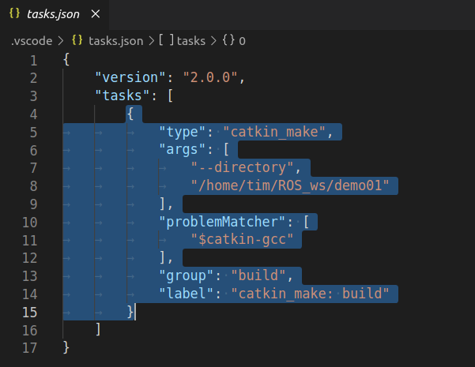

# Code in VSCode

## 1. 下载 vscode
下载vscode的方式有很多种，其中比较简单是直接从ubuntu software里下载


如果在ubuntu software中找不到vscode，可以从官网下载.deb包。


下载好后，在`.deb`包所在的目录处，打开终端输入:


```
$ sudo dpkg -i code_1.58.2-1626302803_amd64.deb
```

之后就可以在应用里看到vscode了，右键可以将其添加到左边的收藏夹。


## 2. 搭建 ROS 的开发环境
进入VSCode后可以下载如图所示的一些插件。


其中Jupyter 和 Pylance 非必须。

有了插件后还需要修改配置文件，但在这之前我们先创建一个工作空间。

```
mkdir -p xxx_ws/src
cd xxx_ws
catkin_make
```


完成后再使用
```
code .
```
打开vscode

然后我们可以在src处右键 创建一个catkin的包


随后两步是命名和创建包的依赖


包的依赖就是上一节讲的` roscpp`, `rospy`, `std_msgs`。

这时会生成一个`.xml`文件，其中包含了我们刚刚创建的包的信息。

然后我们使用快捷键`ctrl`+`shift`+`b`，点击catkin_make:build 后面的齿轮，进入配置文件。


初始的配置文件如图：




我们需要把它替换为其他的代码：

```json
{
// 有关 tasks.json 格式的文档，请参见
    // https://go.microsoft.com/fwlink/?LinkId=733558
    "version": "2.0.0",
    "tasks": [
        {
            "label": "catkin_make:debug", //代表提示的描述性信息
            "type": "shell",  //可以选择shell或者process,如果是shell代码是在shell里面运行一个命令，如果是process代表作为一个进程来运行
            "command": "catkin_make",//这个是我们需要运行的命令
            "args": [],//如果需要在命令后面加一些后缀，可以写在这里，比如-DCATKIN_WHITELIST_PACKAGES=“pac1;pac2”
            "group": {"kind":"build","isDefault":true},
            "presentation": {
                "reveal": "always"//可选always或者silence，代表是否输出信息
            },
            "problemMatcher": "$msCompile"
        }
    ]
}
```

然后我们再使用快捷键`ctrl`+`shift`+`b`编译一下我们刚刚创建的包，出现以下结果则创建成功，这也意味这我们的ROS环境搭建成功。


## 3. 开始写cpp程序
在src下创建一个叫`hello_vscode.cpp`的文件。

